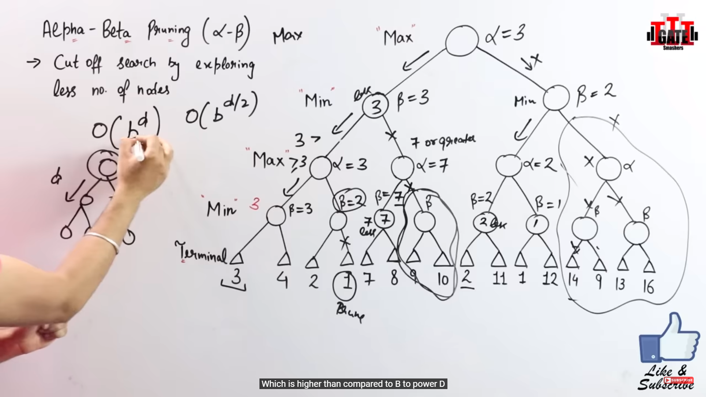
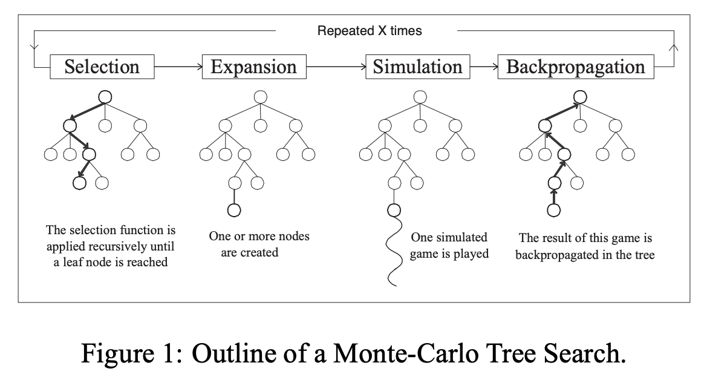

# Adversarial Search and Games


### Q1.List all problem solving strategies. What is backtracking, explain with n queen problem

In the context of artificial intelligence, problem-solving strategies are essential techniques used to find solutions to complex problems. 

1. **State Space Search**:
    - Involves exploring all possible states of a problem to find a solution.
    - Each state represents a configuration of the problem.
    - The search begins at an initial state and moves through a series of intermediate states to reach a goal state.

2. **Problem Reduction**:
    - Decomposes a complex problem into smaller, more manageable sub-problems.
    - Each sub-problem is solved individually, and their solutions are combined to solve the original problem.

3. **Heuristic Search Algorithms**:
    - Uses heuristics, which are strategies or guidelines, to direct the search towards the goal more efficiently.
    - **Informed/Directed Heuristic Search**:
        - **Hill Climbing**: Continuously moves towards the highest value neighbor state, aiming to find the peak (optimal solution).
        - **Branch and Bound**: Involves branching out to explore possible solutions and using bounds to eliminate suboptimal solutions.
    - **Uninformed/Blind Heuristic Search**:
        - **Breadth-First Search (BFS)**: Explores all nodes at the present depth level before moving on to nodes at the next depth level.
        - **Depth-First Search (DFS)**: Explores as far down a branch as possible before backtracking and exploring other branches.


**Backtracking:**

Backtracking is a search algorithm used to solve problems incrementally by trying out different solutions and eliminating those that do not meet the required criteria. It is a systematic method of exploring all possible configurations to find a solution to a given problem, particularly useful in constraint satisfaction problems such as puzzles, mazes, and combinatorial optimization problems.

**Key Concepts of Backtracking:**

1. **Recursive Search**: Backtracking is typically implemented using recursion, where the algorithm tries to build a solution incrementally.
2. **Decision Tree**: The process can be visualized as a decision tree where each node represents a partial solution, and branches represent decisions or extensions of the partial solution.
3. **Pruning**: At each step, the algorithm checks whether the current partial solution can possibly lead to a valid solution. If not, it "backtracks" by discarding the current path and returns to the previous step to try a different path.
4. **Feasibility Check**: Before extending the solution, the algorithm checks whether the current partial solution is still valid under the given constraints.
5. **Completeness**: If a solution exists, a backtracking algorithm will find it. However, the efficiency can vary, and in the worst case, it may require exponential time.

The N-Queens problem is a classic combinatorial problem in which the goal is to place (N) chess queens on an (N  X  N\) chessboard so that no two queens threaten each other. This means no two queens can share the same row, column, or diagonal. The problem has a rich history in computer science and artificial intelligence due to its complexity and the way it exemplifies the use of backtracking algorithms.

### N-Queens Problem Explained:

1. **Chessboard Layout**: An \(N \times N\) grid where \(N\) queens must be placed.
2. **Constraints**: Queens cannot attack each other, which translates to the following rules:
   - No two queens can be in the same row.
   - No two queens can be in the same column.
   - No two queens can be on the same diagonal (both main diagonals and anti-diagonals).

### Backtracking in N-Queens:

Backtracking is an algorithmic technique for solving constraint satisfaction problems like the N-Queens problem. It incrementally builds candidates to the solutions and abandons a candidate as soon as it determines that the candidate cannot possibly lead to a valid solution.

#### Backtracking Algorithm Steps:

1. **Start with an empty board**.
2. **Place a queen in the first row**.
3. **Move to the next row**:
   - Try placing a queen in each column one by one.
   - Check if placing the queen in a column is safe (i.e., no other queen can attack).
   - If safe, place the queen and move to the next row.
   - If not safe, move to the next column in the same row.
4. **Repeat until either all queens are placed** (solution found) or no safe columns are available in the current row (trigger backtracking).
5. **Backtrack**:
   - If no valid position is found in a row, remove the last placed queen (backtrack) and move to the previous row.
   - Try the next possible position in the previous row and continue.

---

### Q2. Define Game theroy, differentiate between stochastic and partial games with examples.
- Game theory, branch of applied mathematics that provides tools for analyzing situations in which parties, called players, make decisions that are interdependent.
- This interdependence causes each player to consider the other player's possible decisions, or strategies, and to evaluate the consequences of their decisions.
- It provides a framework for analyzing situations in which the outcome for each participant or "player" depends not only on their own decisions but also on the decisions made by others.
- The primary goal of game theory is to determine the optimal strategies for players to maximize their payoffs given the strategies chosen by others.

**Key Concepts:**

- **Game**: A structured scenario involving multiple players making decisions that affect each other’s outcomes.
- **Rules**: The formal guidelines that define the allowable actions, sequence of play, and how outcomes are determined in a game.
- **Strategy**: A comprehensive plan detailing a player's actions in every possible situation within the game.
- **Move**: A specific action taken by a player at a particular point in the game.
- **Payoff**: The reward or outcome a player receives based on the combination of strategies chosen by all players.


### Stochastic Games
**Stochastic Games** are games where the outcome and transitions between game states are influenced by random events. Players must make decisions considering the probabilistic nature of these events.

### Partial Games
**Partial Games** are games where players have incomplete information about the game state or other players' actions. Players must make decisions based on limited knowledge and often rely on inference and deduction.

### Stochastic Games (5 Points)

1. **Random Events:**  The core element is the presence of random events that influence the outcome. These events are typically governed by probability distributions (e.g., dice rolls, card draws).
2. **Complete Information:**  Despite randomness, players have full knowledge of the game's state (board configuration, player positions, etc.) and available actions at each turn.
3. **Deterministic After Randomness:**  Once the random event resolves (dice stop rolling, card gets revealed), the outcome of the action becomes deterministic based on the game's rules.
4. **Strategic with Chance:**  While there's an element of chance, players can employ strategies that consider probabilities and make informed decisions to maximize their expected rewards. 
5. **Applications:**  Stochastic games are used in various fields like economics (modeling market fluctuations), AI (training bots for games with random elements), and  reliability engineering (analyzing systems with random failures).
6. **Example:** Imagine a game of Backgammon. You know all the legal moves and the board state, but the outcome of your turn depends on the dice roll (a random event).

### Partially Observable Games (5 Points)

1. **Limited Information:**  Players don't have a complete picture of the game's state. They rely on observations (e.g., sensor readings, opponent's actions) to infer the hidden information.
2. **Focus on Observation:**  A key aspect is analyzing observations to build a mental model of the hidden state and update it as new information becomes available.
3. **Uncertainty and Decision Making:**  Due to limited knowledge, players face uncertainty when making decisions.  Strategies often involve balancing exploration (gathering information) and exploitation (using current knowledge for gain). 
4. **Information Asymmetry:**  In some partially observable games, players might have different levels of information. This asymmetry can be a crucial strategic element. 
5. **Applications:**  Partially observable games are relevant in robotics (planning actions with limited sensor data), security (detecting intrusions based on partial observations), and  real-time strategy games (fog of war limitations).
6. **Example:** Imagine a hide-and-seek game. The seeker knows the rules and the playing area, but they don't know the hider's exact location (limited information).

---

### Q3. Explain limitations of game search algorithm


1. **Computational Complexity**: The search space grows exponentially with the number of moves, making it computationally intensive.
2. **Limited Lookahead**: Algorithms can only look ahead a limited number of moves due to resource constraints, potentially missing better long-term strategies.
3. **Heuristic Evaluation**: Heuristic functions are approximations and might not accurately reflect the true value of game states.
4. **Handling Uncertainty**: Dealing with stochastic elements and partial information in games adds complexity to the algorithms.
5. **Scalability Issues**: Real-time decision-making requirements can exceed the capabilities of search algorithms, making them impractical for some applications.
6. **Opponent Modeling**: Predicting an opponent's moves accurately is challenging, especially if the opponent uses unpredictable or adaptive strategies.

---

### Q4. Write Minimax search algorithm fro two players. How use of alpha and beta cutoffs will improve performance     

### Minimax Search Algorithm

The Minimax algorithm is a recursive decision-making strategy used in two-player games such as chess, checkers, or tic-tac-toe. It aims to find the optimal move for a player assuming that the opponent also plays optimally. The algorithm operates under the following principles:

1. **Game Tree Representation**:
    - The game is represented as a tree where each node represents a game state.
    - The root node is the current game state.
    - The children of each node are possible game states resulting from legal moves.

2. **Players**:
    - **Maximizing Player (Max)**: This player aims to maximize their score.
    - **Minimizing Player (Min)**: This player aims to minimize the maximizing player's score.

3. **Recursive Process**:
    - **Base Case**: The recursion terminates when a terminal state (end of the game) or a predefined depth is reached. The terminal state is evaluated to return a score.
    - **Maximizing Player’s Turn**: The algorithm selects the move with the highest score. It recursively evaluates each possible move and chooses the maximum score.
    - **Minimizing Player’s Turn**: The algorithm selects the move with the lowest score. It recursively evaluates each possible move and chooses the minimum score.

4. **Algorithm Steps**:
    1. **Generate the Game Tree**: Create a tree of all possible moves from the current state.
    2. **Evaluate Terminal States**: Assign scores to terminal states based on the outcome (win, lose, draw).
    3. **Backpropagate Scores**:
        - For each node, if it’s the maximizing player’s turn, select the maximum score from the children.
        - If it’s the minimizing player’s turn, select the minimum score from the children.
    4. **Choose Optimal Move**: From the root, the maximizing player chooses the move corresponding to the maximum score among the children.

5. **Alpha-Beta Pruning (Optimization)**:
    - **Alpha**: The best score that the maximizing player can guarantee.
    - **Beta**: The best score that the minimizing player can guarantee.
    - As the algorithm progresses, it updates alpha and beta values and prunes branches of the game tree that cannot influence the final decision, thus reducing the number of nodes evaluated.

### Alpha-Beta Pruning

Alpha-Beta Pruning is an optimization technique for the Minimax algorithm that reduces the number of nodes evaluated in the search tree. It keeps track of two values, alpha and beta, which represent the minimum score that the maximizing player is assured of and the maximum score that the minimizing player is assured of, respectively.

- **Alpha**: The best value that the maximizing player can guarantee.
- **Beta**: The best value that the minimizing player can guarantee.

### Alpha-Beta Pruning Algorithm

1. **Initialization**:
    - Initialize alpha to negative infinity.
    - Initialize beta to positive infinity.

2. **Alpha and Beta Updates**:
    - During the maximizing player’s turn, update alpha.
    - During the minimizing player’s turn, update beta.

3. **Pruning**:
    - If the current node's value is worse than the best option for the opponent, stop evaluating that branch (prune it).

### How Alpha-Beta Pruning Improves Performance

1. **Reduces Number of Nodes Evaluated**: By pruning branches that won't affect the final decision, the algorithm skips unnecessary evaluations, thereby reducing the number of nodes it needs to process.

2. **Increases Efficiency**: Alpha-beta pruning allows the Minimax algorithm to search deeper in the game tree within the same amount of time, potentially finding better moves.

3. **Maintains Optimality**: Alpha-beta pruning does not affect the final result of the Minimax algorithm. It guarantees the same optimal move as the unpruned Minimax algorithm but in a more efficient manner.

4. **Practical Impact**: In complex games like chess, where the number of possible moves is vast, alpha-beta pruning can significantly reduce computation time, making it feasible to run the algorithm within reasonable time limits.

By incorporating alpha-beta pruning, the Minimax algorithm becomes much more practical for real-world applications, especially in games with large search spaces.

**Example:**




### Q4. Define is constraint satisfaction problem, State the types of consistencies. Solve the following Crypt Arithmetic Problem.
SEND
+ MORE
MONEY


A Constraint Satisfaction Problem (CSP) is a computational problem where the goal is to find a solution that satisfies a set of constraints. It typically involves:
- A set of variables, each of which must be assigned a value from a specific domain.
- Constraints that define allowable combinations of values for subsets of variables.

In a CSP, the challenge is to find an assignment of values to variables such that all constraints are satisfied. CSPs arise in various fields, including artificial intelligence, operations research, and combinatorial optimization.

### Components of a CSP:

1. **Variables**: Represent entities that need to be assigned values to satisfy constraints.
2. **Domains**: Each variable has a domain, which is the set of possible values it can take.
3. **Constraints**: Rules that specify permissible combinations of values for subsets of variables.

### Characteristics of a CSP:

1. **Solution Space**: The set of all possible assignments of values to variables.
2. **Feasible Solutions**: Assignments of values to variables that satisfy all constraints.
3. **Optimal Solutions**: Feasible solutions that optimize an objective function (if present).
4. **Complexity**: CSPs can be challenging to solve due to the combinatorial explosion of possible assignments.

### Types of Consistencies

1. **Node Consistency**: Each variable's domain satisfies its unary constraints (constraints involving only one variable).
2. **Arc Consistency**: Each variable's domain satisfies its binary constraints (constraints involving two variables).
3. **Path Consistency**: Extends arc consistency to enforce consistency over multiple variables simultaneously.
4. **k-Consistency**: Generalization of arc consistency to enforce consistency over subsets of k variables.

- The graph coloring problem is a classic example of a Constraint Satisfaction Problem (CSP). In this problem, the goal is to assign colors to the vertices of a graph in such a way that no two adjacent vertices share the same color. 

### Explain any two types of Constrains in detail


### Unary Constraints:

Unary constraints involve a single variable and impose restrictions on its possible values. These constraints are typically inherent properties of the variable itself and don't involve other variables.

**Example:**
Consider a CSP where we have a variable representing the temperature (Temp) of a room. The unary constraint might be that the temperature must be within a certain range, say between 18°C and 25°C.

**Explanation:**
- **Variable**: Temp (representing the temperature).
- **Domain**: The possible values for Temp (18, 19, ..., 25).
- **Unary Constraint**: Temp must be within the range [18, 25].

**Role in CSPs:**
Unary constraints help in reducing the search space by limiting the possible values a variable can take, thereby simplifying the problem-solving process.

### Binary Constraints:

Binary constraints involve two variables and specify relationships between them. These constraints restrict the combinations of values that can be assigned to the variables simultaneously.

**Example:**
Consider a CSP where we have two variables representing the colors of adjacent regions on a map. The binary constraint might be that adjacent regions must have different colors.

**Explanation:**
- **Variables**: Color1, Color2 (representing the colors of adjacent regions).
- **Domain**: Possible colors (e.g., Red, Green, Blue).
- **Binary Constraint**: Color1 ≠ Color2 (adjacent regions must have different colors).

**Role in CSPs:**
Binary constraints play a crucial role in modeling relationships between variables. They help in guiding the search process by eliminating inconsistent assignments and guiding towards valid solutions.


### Example:

Consider the following graph: Graph Coloring Example

```
      A
     / \
    B---C
   / \ / \
  D---E---F
```

We need to assign colors to the vertices (A, B, C, D, E, F) so that no adjacent vertices have the same color.

### Formulation:

1. **Variables**: Each vertex represents a variable. For example, A, B, C, D, E, F are variables.
2. **Domains**: The domain for each variable is the set of possible colors. Let's assume the colors are {Red, Green, Blue}.
3. **Constraints**: The constraints ensure that no two adjacent vertices have the same color.

### Constraints:

- A ≠ B, A ≠ C
- B ≠ A, B ≠ C, B ≠ D, B ≠ E
- C ≠ A, C ≠ B, C ≠ E, C ≠ F
- D ≠ B, D ≠ E
- E ≠ B, E ≠ C, E ≠ D, E ≠ F
- F ≠ C, F ≠ E

### Solution:

By applying constraint satisfaction techniques, we can find a solution to the graph coloring problem. One possible solution for the given graph is:

```
      A (Red)
     / \
    B---C (Green)
   / \ / \
  D---E---F (Blue)
```

In this solution, no adjacent vertices share the same color, satisfying all constraints. This assignment is valid for the graph coloring problem.

### Cryptarithmetic Problem Solution

To solve the cryptarithmetic problem SEND + MORE = MONEY, we'll follow these steps:

1. Assign domains to variables: {0, 1, 2, 3, 4, 5, 6, 7, 8, 9}.
2. Apply constraints:
    - Each letter represents a unique digit.
    - The leftmost letters (S, M) cannot be 0.
    - The sum of digits in corresponding positions should match.
3. Apply consistency techniques if necessary.
4. Search for a solution satisfying all constraints.

Let's solve it:

```
  S E N D
+ M O R E
---------
M O N E Y
```

We start with brute force:

- M can't be 0, so M must be 1.
- Now we try different values for D, N, E, Y, O, R, and S to satisfy the equation:
  - S = 9, E = 5, N = 6, D = 7, O = 0, R = 8, Y = 2.

The solution is:
```
  9 5 6 7
+ 1 0 8 5
---------
1 0 6 5 2
```

So, SEND + MORE = 9567 + 1085 = 10652 (MONEY).

---

To solve the cryptarithmetic problem BASE + BALL = GAMES, we'll follow these steps:

1. Assign domains to variables: {0, 1, 2, 3, 4, 5, 6, 7, 8, 9}.
2. Apply constraints:
    - Each letter represents a unique digit.
    - The leftmost letters (B, G) cannot be 0.
    - The sum of digits in corresponding positions should match.
3. Apply consistency techniques if necessary.
4. Search for a solution satisfying all constraints.

Let's solve it:

```
  B A S E
+ B A L L
---------
G A M E S
```

We start with brute force:

- B and G can't be 0, so they must be 1.
- Now we try different values for A, S, E, L, M, and E to satisfy the equation:
  - A = 2, S = 3, E = 4, L = 6, M = 7, and G = 1.

The solution is:
```
  1 2 3 4
+ 1 2 6 6
---------
1 4 9 0 8
```

So, BASE + BALL = 1234 + 1266 = 24908 (GAMES).


------------------------------------------------------


### Q5. What are the issues that need to be addressed for solving CSP efficiently? Explain the solutions of them.

Constraint Satisfaction Problems (CSPs) can be computationally expensive to solve, especially for large and complex problems. Here are some key issues that hinder efficient solving and their corresponding solutions:

1. **Problem Size and Complexity:**

   * **Issue:** The number of variables and constraints significantly impacts the search space for solutions. Exploring all possibilities becomes time-consuming for large problems.
   * **Solutions:**
      * **Problem Decomposition(Slice and Dice):** Break down the problem into smaller, more manageable subproblems. Solve these subproblems independently or hierarchically and combine the solutions.
      * **Variable and Constraint Ordering(Focus on What Matters):** Prioritize exploring variables or evaluating constraints that have the most significant impact on reducing the search space. 

2. **Getting Stuck in Dead Ends:**

   * **Problem:** Sometimes, our solving method hits a dead end, and we waste time backtracking.
   * **Solutions:**
      * **Look Ahead:** Before making a move, check if it might cause problems down the road. If so, don't do it and backtrack right away.
      * **Spread the Word:** When we make a move, see what it means for other parts of the puzzle. If it messes things up elsewhere, we know to back off.


3. **Incompleteness of Information:**

   * **Problem:** Sometimes, we don't have all the rules we need to solve the problem.
   * **Solutions:**
      * **Use What We Know:** Even if we don't have all the rules, we can still use our best guesses and hunches to get closer to the solution.
      * **Learn from Mistakes:** When we hit a dead end, figure out why it happened. Then, we'll know what to avoid next time.

4. **Assigning the Wrong Values:**

   * **Problem:** Giving the wrong values to variables messes things up and makes the problem harder to solve, increasing backtracking and computation time
   * **Solution:**
      * **Keep Things Consistent:** Make sure that every time we assign a value, it doesn't break any of the rules we've set so far.
      * **Maintaining Arc Consistency:** Enforce consistency between pairs of variables throughout the search process. This ensures that no pair of variable assignments violates any constraints.


By addressing these issues and applying the corresponding solutions, Constraint Satisfaction Problem solvers can achieve significant efficiency gains. The specific techniques chosen will depend on the characteristics of the particular CSP being tackled.


### Q6. Explain heuristic function that can be used in cutting off search in detail.

In the context of search algorithms, a heuristic function is used to estimate the cost or value of a particular state or node. Heuristics help in making decisions about which paths to explore further and which to prune or cut off, significantly improving search efficiency.

### Key Concepts of Heuristic Functions

1. **Evaluation Function (Heuristic Function):**
   - Provides an estimate of the "goodness" of a node.
   - Helps in deciding the best move or path in search algorithms.

2. **Cutoff Heuristic:**
   - A condition that stops the search early based on the heuristic function's value.

### Examples of Heuristic Functions

1. **Informed Search Algorithms:**
   - **A* Search Algorithm:** Uses a heuristic function ( h(n) ) combined with the path cost  g(n) to evaluate nodes. The function  f(n) = g(n) + h(n)  guides the search towards the goal efficiently.
   - **Greedy Best-First Search:** Uses  h(n)  alone to prioritize nodes closest to the goal.

2. **Game Playing Algorithms:**
   - **Minimax with Alpha-Beta Pruning:** Although primarily a pruning technique, heuristics can be integrated to enhance decision-making.
   - **Evaluation Functions in Games:** Functions that estimate the value of a game state, like the material balance in chess (counting the value of pieces).

### How Heuristic Functions Cut Off Search

1. **Depth Limitation:**
   - **Depth Limit Cutoff:** Limit the search to a certain depth. Use a heuristic evaluation to estimate the value of nodes at this depth, cutting off deeper exploration.

2. **Threshold Cutoff:**
   - **Alpha-Beta Pruning:** Use α (alpha) and β (beta) values as thresholds. If the current node's heuristic value exceeds these thresholds, prune the subtree.

3. **Dynamic Cutoff:**
   - **Quiescence Search:** In game algorithms, avoid cutoff in "unstable" positions. Continue searching until a "quiet" position is reached.
   - **Adaptive Depth:** Dynamically adjust the depth based on the heuristic evaluation of the current node.


### Q7.Write a short note on Monte Carlo Tree search and list its limitations. How Al technique is used to solve tic-tac-toe problem.

Monte Carlo Tree Search (MCTS) is a powerful algorithm used for decision-making in games, simulations, and other applications where perfect information  isn't available. It balances exploration (finding new possibilities) and exploitation (leveraging what's already known) through a series of simulations. Here's a breakdown of the key steps involved:



**1. Selection:**

* The algorithm starts at the root node representing the initial game state.
* It uses a selection policy (like Upper Confidence Bound Applied to Trees - UCT) to choose the most promising child node to explore further. This policy balances visiting frequently successful nodes (exploitation) with exploring less-visited nodes that might hold potential (exploration).

**2. Expansion:**

* If the chosen child node isn't fully expanded (has unexplored child states), a new child node representing a possible next action is created. This expands the tree and allows for exploration of new possibilities.

**3. Simulation:**

* From the newly expanded node (or an existing unexplored child), a simulation of the game or process is run. This simulation can be random or incorporate some heuristics.
* The simulation continues until a terminal state (end of the game or decision point) is reached.

**4. Backpropagation:**

* The outcome of the simulation (win/loss/reward) is propagated back up the tree, updating the win/loss statistics of all nodes along the path. Nodes that led to successful outcomes (wins in a game) are "rewarded," while those leading to failures are "penalized."

**5. Iteration:**

* Steps 1-4 are repeated for a predefined number of iterations. This allows the algorithm to explore different branches of the tree and gather information about the potential outcomes of various actions.

**Example: Tic-Tac-Toe**

Imagine you're playing Tic-Tac-Toe (X's turn) and the board looks like this:

```
| X |   |   |
|---|---|---|
|   | O |   |
```

1. **Selection:** Starting from the root node (empty board), MCTS uses UCT to choose the most promising move. It might explore frequently successful moves like placing X in the center or corners, while also considering less explored options.
2. **Expansion:** If a chosen child node represents a board state where X hasn't placed their turn yet, the algorithm expands that node by creating child nodes for each possible legal move X can make (e.g., placing X in the top left corner, top right corner, etc.).
3. **Simulation:** From each newly created child node (representing a board state with X's move), the algorithm simulates the rest of the game using random moves (or incorporating heuristics to prioritize winning moves). This simulation continues until someone wins or the board is full (a draw).
4. **Backpropagation:** The outcome of each simulation (win/loss/draw) is propagated back up the tree. If X wins in a simulation starting from a specific child node, the win count for that node and its parent nodes increases. Similarly, losses or draws update the statistics accordingly.
5. **Iteration:** Steps 1-4 are repeated for many iterations. As the algorithm explores and simulates more, it builds a better understanding of which moves tend to lead to more favorable outcomes for X (winning or drawing).

By the end of the iterations, MCTS will likely favor moves that have statistically led to better results in the simulations, guiding you towards a strategically strong move for your next turn.

**Benefits of MCTS:**

* **Balances Exploration and Exploitation:** 
* **Adapts to Unknown Environments:**
* **Strong Performance in Complex Games:** 

**Limitation of MCTS**

**High Computational Cost:** MCTS can be computationally intensive, especially for games or problems with large state spaces and deep trees

**Memory Consumption:** MCTS can consume a significant amount of memory to store the search tree.

**Slow Convergence:** MCTS can converge slowly to optimal solutions, particularly in complex or highly strategic games.
