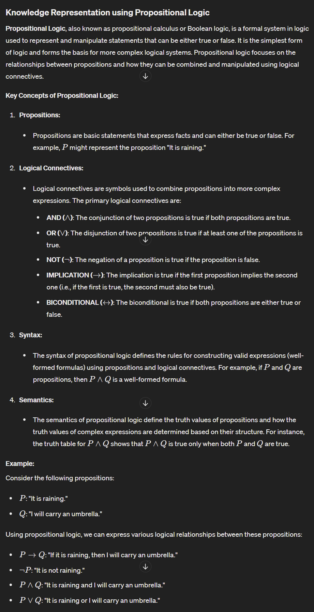
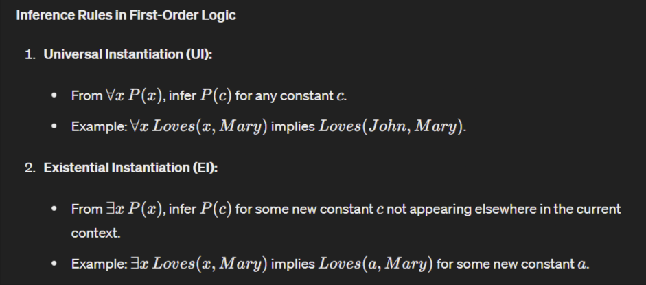

# Knowledge

### Q1. What is an agent name any 5 agents around you Explain knowledge based agent with wumpus world. List and explain in short the various steps of knowledge engineering process.

### Agents in AI

An **agent** in AI is an entity that perceives its environment through sensors and acts upon that environment through actuators based on a set of goals or tasks. Here are five types of agents commonly encountered:

1. **Autonomous Vehicle (Self-Driving Car)**
   - **Sensors:** Cameras, LIDAR, radar, GPS
   - **Actuators:** Steering wheel, accelerator, brake

2. **Personal Assistant (e.g., Siri, Alexa)**
   - **Sensors:** Microphone, sometimes cameras
   - **Actuators:** Speaker, possibly display screen

3. **Robotic Vacuum Cleaner (e.g., Roomba)**
   - **Sensors:** Bump sensors, infrared sensors, cameras
   - **Actuators:** Wheels, vacuum motor

4. **Smart Thermostat (e.g., Nest)**
   - **Sensors:** Temperature sensors, humidity sensors, motion sensors
   - **Actuators:** Heating and cooling system controls

5. **Spam Filter**
   - **Sensors:** Email content
   - **Actuators:** Classifying emails into spam or inbox

### Knowledge-Based Agent with Wumpus World

A **knowledge-based agent** uses a knowledge base (KB) to store information about the world and uses logical reasoning to make decisions. The Wumpus World is a classic example used to illustrate how such an agent works.

#### Wumpus World Overview:
- The Wumpus World is a grid-based environment where:
  - The agent moves through a cave consisting of rooms.
  - There is a Wumpus that the agent should avoid.
  - Pits are also present, and falling into them results in death.
  - There is gold that the agent aims to find and pick up.
  - The agent perceives stenches near the Wumpus, breezes near pits, and glitter when the gold is nearby.

#### Knowledge-Based Agent in Wumpus World:
1. **Perception:**
   - The agent perceives its environment using sensors (e.g., detecting stench, breeze, glitter).

2. **Knowledge Base (KB):**
   - The agent has a KB where it stores rules and facts (e.g., "If there is a stench in the current room, there might be a Wumpus in an adjacent room").

3. **Inference:**
   - Using logical reasoning, the agent deduces new information from its KB (e.g., "If there is no stench in the current room, there is no Wumpus in adjacent rooms").

4. **Action:**
   - Based on its reasoning, the agent decides on actions (e.g., move to a safe room, pick up gold).

### Knowledge Engineering Process

The knowledge engineering process involves several steps to develop a knowledge-based system:

1. **Identify the Task:**
   - Define the problem to be solved and the goals of the agent. For instance, in the Wumpus World, the task is to navigate safely, avoid hazards, and find gold.

2. **Assemble the Relevant Knowledge:**
   - Gather domain-specific knowledge necessary for solving the problem. This could involve expert input, data collection, and research.

3. **Choose a Knowledge Representation:**
   - Select how to represent the knowledge formally. Common representations include logic (first-order logic), frames, semantic networks, and rules.

4. **Implement the Knowledge Base:**
   - Encode the gathered knowledge into the chosen representation within the knowledge base. For example, encoding facts and rules about the Wumpus World environment.

5. **Test and Refine the Knowledge Base:**
   - Validate the knowledge base by running tests to ensure it behaves as expected. Iteratively refine the knowledge base by adding, modifying, or removing knowledge based on test results and feedback.

6. **Maintain the Knowledge Base:**
   - Regularly update and maintain the knowledge base to adapt to new information or changes in the environment.

By following these steps, knowledge engineers create robust and efficient knowledge-based agents capable of reasoning and acting in complex environments, such as the Wumpus World.

---
Consider the following axioms:

If a triangle is isosceles, then its two sides AB and AC are equal, If AB and AC are equal, then angle B and C are equal

ABC is an equilateral triangle,

Represent these facts in predicate logic
---

### Q2. What is knowledge representation using propositional logic ? List the inferences rules used in prepositional logic.

Here are the common inference rules used in propositional logic:

**1. Modus Ponens (M.P.)**

- Form: If P implies Q, and P is true, then Q is true.
- Symbolism: P → Q, P ∴ Q

This is one of the most fundamental rules. It states that if we have a rule (P implies Q) and we know the first part (P) is true, then we can logically infer that the second part (Q) must also be true.

**2. Modus Tollens (M.T.)**

- Form: If P implies Q, and Q is false, then P is not true (or equivalently, P is false).
- Symbolism: P → Q, ¬Q ∴ ¬P

This rule works by assuming the opposite of the conclusion (¬Q) and showing it leads to a contradiction (P implying something false). Since the initial implication (P → Q) must be true, the only way to avoid this contradiction is for the first part (P) to be false (¬P).

**3. Hypothetical Syllogism (H.S.)**

- Form: If P implies Q, and Q implies R, then P implies R.
- Symbolism: P → Q, Q → R ∴ P → R

This rule allows us to chain implications together. If P leads to Q, and Q leads to R, then we can infer that P ultimately leads to R.

**4. Disjunctive Syllogism (D.S.)**

- Form: If P or Q is true, and P is false, then Q must be true.
- Symbolism: P ∨ Q, ¬P ∴ Q

This rule deals with disjunctions (OR). If we know one or the other possibility (P or Q) is true, and we can eliminate one (P is false), then the remaining option (Q) must be true.

**5. Addition (Rule of Affirmation)**

- Form: If P is true, then P or Q is true.
- Symbolism: P ∴ P ∨ Q

This rule might seem trivial, but it's useful for building more complex expressions. If we know P is true, then we can add another proposition (Q) to form a disjunction (P or Q), even if we don't necessarily know anything about Q itself.

**6. Simplification**

- Form: If both P and Q are true, then P is true.
- Symbolism: P ∧ Q ∴ P

Similar to addition, this rule might seem redundant. However, it allows us to extract a single proposition (P) from a conjunction (P and Q) when we know both are true.

These are the core inference rules used in propositional logic. By applying them systematically, we can derive new propositions from a given set of starting statements (axioms) and arrive at logical conclusions.

### Q3. Explain First Order Logic with syntax semantics? List the inferences rules used in FOL.

## First-Order Logic (FOL)

First-Order Logic (FOL), also known as Predicate Logic or Quantified Logic, is a more expressive language than propositional logic for representing knowledge in Artificial Intelligence (AI). It allows us to reason about objects, relationships between them, and general statements about those objects.

### Syntax

The syntax of FOL defines the building blocks and rules for constructing well-formed formulas (sentences). Here are the key components:

* **Constants:** Represent specific objects (e.g., John, Mary, Book1).
* **Variables:** Represent any object in a domain (e.g., x, y, z).
* **Predicates:** Represent properties of objects or relationships between them (e.g., IsRed(x), Loves(John, Mary), Bigger(y, x)). They take arguments (objects or variables) and return true or false.
* **Functions:** Represent mappings from objects to objects (e.g., Father(x), CapitalOf(y)).
* **Connectives:** Similar to propositional logic, FOL uses connectives like AND (∧), OR (∨), NOT (¬), and implication (→) to combine formulas.
* **Quantifiers:** These are the key addition in FOL. They allow us to make statements about all or some objects in a domain:
    * Universal quantifier (∀): "For all" (e.g., ∀x IsRed(x) means "Everything is red").
    * Existential quantifier (∃): "There exists" (e.g., ∃x Loves(John, x) means "John loves someone").

**Example:**

"All birds fly" can be expressed in FOL as: ∀x (Bird(x) → Flies(x)). Here, Bird(x) and Flies(x) are predicates, x is a variable representing any bird, and the implication arrow (→) connects them. The universal quantifier (∀x) states that this implication holds true for all objects (birds) in the domain.

### Semantics

Semantics defines the meaning of formulas in FOL by interpreting them in a specific domain. It involves:

* **Domain:** A collection of all objects the logic is reasoning about (e.g., all animals in a zoo).
* **Interpretation:** An assignment of meaning to the symbols in the language.
    * Constants refer to specific objects in the domain.
    * Variables can range over the entire domain or a subset.
    * Predicates and functions are assigned truth values or specific outputs based on their arguments.

**Example:**

Consider a domain of animals. The interpretation for Bird(x) might be true if x refers to a robin or a penguin, but false if x refers to a dog. The interpretation for Flies(x) might be true for birds but false for dogs.

The truth value of a formula depends on the interpretation and the specific objects involved.

- Consider all inferences of propositional logic

### Q4. Detail the algorithm for deciding entailment in prepositional

I'd be glad to provide the explanation of deciding entailment in propositional logic using the truth table method:

**Deciding Entailment in Propositional Logic**

In propositional logic, entailment refers to the relationship between a set of propositions (premises) and another proposition (conclusion). A set of premises entails a conclusion if, whenever all the premises are true, the conclusion must also be true. In other words, the premises logically guarantee the truth of the conclusion.

There are several methods to determine entailment, but the **truth table method** is a fundamental and widely used algorithm. It works by systematically evaluating the truth values of all possible combinations of propositions.

**Truth Table Method for Entailment**

Here's a step-by-step explanation of the algorithm:

1. **Identify Propositions:**
   - List all the unique propositional variables involved in both the premises and the conclusion. These are the building blocks of your propositions.

2. **Determine Possible Truth Assignments:**
   - Calculate the total number of possible truth assignments for the identified propositions. This number depends on the number of variables (n). The formula is `2^n`, where `n` is the number of variables. Each assignment represents a unique combination of true (T) or false (F) values for all the variables.

3. **Construct the Truth Table:**
   - Create a table with the following columns:
      - Columns for each propositional variable (P, Q, R, etc.)
      - Additional columns for compound statements (premises) or the conclusion (if needed)
      - A final column for "Conclusion (Q)" or whichever proposition you're checking for entailment
   - Each row in the truth table represents one possible truth assignment for the variables.

4. **Evaluate Premises and Conclusion:**
   - For each row in the truth table:
      - Fill in the truth values for each variable based on the assigned combination.
      - Evaluate the truth values of the premises (compound statements) based on the truth values of their individual variables and the logical connectives involved (AND, OR, NOT, etc.).
      - Evaluate the truth value of the conclusion using the same approach, if applicable.

5. **Check Entailment:**
   - Identify the rows where all premises are true (have a truth value of T).
   - In these rows, check the truth value of the conclusion.
   - If the conclusion is always true (T) in every row where all premises are true, then the premises entail the conclusion. This means the truth of the premises guarantees the truth of the conclusion.
   - However, if there exists even a single row where all premises are true but the conclusion is false (F), then the premises **do not** entail the conclusion. In this case, there's a scenario where the premises hold true, yet the conclusion doesn't.

**Example: Does the set of premises {P → Q, P} entail the conclusion Q?**

1. Identify Propositions: P and Q

2. Determine Possible Truth Assignments: 2^2 = 4 possible truth assignments (T, T), (T, F), (F, T), (F, F)

3. Construct the Truth Table:

| P | Q | P → Q | P | Conclusion (Q) |
|---|---|--------|---|---|
| T | T | T      | T | T                |
| T | F | F      | T | F                |
| F | T | T      | F | T                |
| F | F | T      | F | F                |

4. Evaluate Premises and Conclusion: Fill in the table based on the truth values for each combination and the rules of implication and other connectives (if any).

5. Check Entailment:
   - Look at the rows where P → Q and P are both true (T). This occurs only in the first row (P = T, Q = T).
   - In this row, the conclusion (Q) is also true (T).
   - Since there are no rows where the premises are true and the conclusion is false, the premises {P → Q, P} **entail** the conclusion Q. This means whenever "if P then Q" (P → Q) and "P is true" (P) hold, then "Q is true" (Q) must also be true.

**Conclusion**

The truth table method is a straightforward approach for entailment in propositional logic. Its strength lies in its systematic exploration of all possible scenarios. However, as the number of propositions increases, the number of truth assignments grows exponentially, making it impractical for larger problems. In such cases, other methods like the resolution method or model checking might be more efficient.

### Q5. Explain knowledge representation structure and compare them.

Knowledge representation in artificial intelligence (AI) is the method used to encode information about the world into a form that a computer system can utilize to solve complex tasks. Several structures are used for knowledge representation, each with its strengths and weaknesses. Here’s an overview of common knowledge representation structures and a comparison of their features:

### 1. Semantic Networks

#### Structure:
- Semantic networks use graph structures to represent knowledge.
- Nodes represent concepts or entities.
- Edges represent relationships between these concepts.

#### Example:
- Nodes: Dog, Animal, Has, Tail
- Edges: Dog → IsA → Animal, Dog → Has → Tail

#### Strengths:
- Intuitive and visual representation of relationships.
- Suitable for representing hierarchical structures and inheritance.

#### Weaknesses:
- Can become complex and unwieldy for large knowledge bases.
- Limited expressiveness for representing complex relationships and rules.

### 2. Frames

#### Structure:
- Frames are data structures for representing stereotyped situations.
- Each frame consists of slots (attributes) and fillers (values).

#### Example:
- Frame: Dog
  - Slots: Type, Color, Owner
  - Fillers: Mammal, Brown, John

#### Strengths:
- Well-suited for representing structured objects with attributes.
- Easy to understand and use for representing typical scenarios.

#### Weaknesses:
- Less effective for representing dynamic changes and complex relationships.
- Inheritance and default values can become cumbersome to manage.

### 3. Production Rules

#### Structure:
- Production rules represent knowledge as a set of condition-action pairs (if-then rules).
- Used in expert systems and rule-based systems.

#### Example:
- If (animal is a dog) and (dog is barking), then (warn owner).

#### Strengths:
- Good for procedural knowledge and control mechanisms.
- Modularity allows easy updates and additions of rules.

#### Weaknesses:
- Can lead to rule conflicts and difficulties in managing large rule sets.
- Not ideal for representing declarative knowledge.

### 4. Logic-Based Representations (Propositional and Predicate Logic)

#### Structure:
- Logic-based representations use formal logic to represent knowledge.
- Propositional logic uses propositions and logical connectives.
- Predicate logic extends this with quantifiers and predicates for more expressiveness.

#### Example (Predicate Logic):
- ∀x (Dog(x) → Animal(x))
- ∃x (Dog(x) ∧ Color(x, Brown))

#### Strengths:
- Highly expressive and precise.
- Well-suited for formal reasoning and proofs.

#### Weaknesses:
- Can be computationally expensive to process.
- Requires a strong understanding of formal logic.

### Q6. Compare propositional and predicate logic.Compare propositional and first order logic

1. **Expressive Power:**

   - **Propositional Logic:** Limited to expressing relationships between whole propositions. It cannot express statements about individual objects or their properties. For example, you cannot say "There is a red car" or "All birds fly" using propositional logic alone.
   - **Predicate Logic (FOL):** More expressive; it can handle statements about objects, their properties, and the relationships between them. FOL includes variables, predicates, and quantifiers, allowing you to represent complex knowledge. For instance, you can express "There exists a red car" (∃x Car(x) ∧ Red(x)) or "All birds fly" (∀x Bird(x) → Flies(x)) in FOL.

2. **Components:**

   - **Propositional Logic:** Deals with propositions, which are basic statements that can be true or false. Examples include "It is raining" (P) or "The light is on" (Q).
   - **Predicate Logic:** Includes additional elements:
      - **Variables:** Represent objects in a domain. Examples include x, y, and z. They can refer to anything, like people, places, or objects.
      - **Predicates:** Represent properties of objects or relationships between them. They take variables as arguments and return true or false. Examples include P(x) meaning "x is a person" or R(x, y) meaning "x is taller than y."
      - **Quantifiers:** Specify how many objects in the domain a statement applies to.
         - **Universal Quantifier (∀):** Indicates that a statement applies to all objects in the domain. Example: ∀x P(x) means "For all x, x is a person."
         - **Existential Quantifier (∃):** Indicates that there exists at least one object in the domain for which the statement is true. Example: ∃x P(x) means "There exists an x such that x is a person."

3. **Example Expressions:**

   - **Propositional Logic:** A simple expression might be P ∧ Q, which means "It is raining (P) and the light is on (Q)".
   - **Predicate Logic:** A more complex expression could be ∀x (Bird(x) → Flies(x)), which means "For all things (x), if it is a Bird(x), then it Flies(x)".

4. **Inference Rules:**

   - **Propositional Logic:** Uses basic inference rules like Modus Ponens (if P implies Q and P is true, then Q must be true) and Modus Tollens (if P implies Q and Q is false, then P cannot be true).
   - **Predicate Logic:** Employs more complex inference rules that can handle quantifiers and predicates. Examples include Universal Instantiation (if a statement is universally quantified, we can infer a specific instance), Existential Elimination (if we can prove something holds for a specific object and the variable isn't essential, we can infer the statement without the existential quantifier), and others. These rules allow for complex reasoning based on the knowledge represented in FOL.

**Example Comparison:**

- **Propositional Logic:**
   - Statements: P: "It is raining."
   - Compound statement: P → Q: "If it is raining, then I will carry an umbrella." (This only expresses a relationship between two propositions, not about specific locations.)
- **Predicate Logic:**
   - Statements: R(x): "It is raining in location x."
   - Compound statement: ∀x (R(x) → C(x)): "For all locations x, if it is raining in x, then I will carry an umbrella in x." (This expresses a general rule about rain and carrying an umbrella in any location.)
