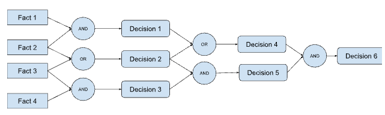
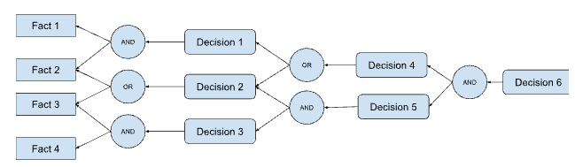

# Reasoning

### Q1. Explain Unification algorithm with suitable example

The unification algorithm is a fundamental process in logic programming and automated reasoning. It is used to find a substitution that makes two logical expressions identical. This process is essential for various tasks, such as pattern matching, theorem proving, and resolution in logic-based systems like Prolog. The unification algorithm takes two terms as input and attempts to find a substitution that makes them syntactically identical.

### Unification Algorithm

The unification algorithm operates recursively, handling different types of terms and applying substitution recursively until a complete substitution is found or until the unification fails. Here's a step-by-step explanation of the unification algorithm:

1. **Start with two terms to unify.**
2. **If both terms are constants, variables, or the same atom, unify them trivially.**
3. **If one term is a variable, assign the other term to that variable.**
4. **If both terms are complex (i.e., compound terms), unify their components recursively.**

### Example:

Let's unify two terms \( t_1 \) and \( t_2 \):

\[ t_1 = f(X, g(Y, a)) \]

\[ t_2 = f(h(Z), g(b, Z)) \]

#### Step 1: Start unification

We start by unifying \( f(X, g(Y, a)) \) and \( f(h(Z), g(b, Z)) \).

#### Step 2: Unify compound terms

The top-level function symbols are the same, so we proceed to unify their arguments.

1. Unify \( X \) with \( h(Z) \).
- This results in the substitution \( \{X/h(Z)\} \).

2. Unify \( g(Y, a) \) with \( g(b, Z) \).
- Unify \( Y \) with \( b \).
   - This results in the substitution \( \{Y/b\} \).
- Unify \( a \) with \( Z \).
   - This results in the substitution \( \{Z/a\} \).

#### Step 3: Combine substitutions

Combine the substitutions from the unifications:
\[ \{X/h(Z), Y/b, Z/a\} \]

#### Step 4: Apply substitutions

Apply the combined substitution to one of the terms. Let's apply it to \( t_1 \):
\[ t_1 = f(h(a), g(b, a)) \]

Now, both terms are syntactically identical.

### Conclusion:

The unification algorithm systematically applies substitution to unify terms. In this example, we demonstrated how the algorithm unifies two complex terms by recursively unifying their components and combining the resulting substitutions. The final substitution provides a mapping that makes the terms identical. Unification failure occurs when it's not possible to find a substitution that makes the terms identical, indicating that they cannot be unified. 

### Q2. Explain Reasoning patterns in proportional logic

In propositional logic, reasoning patterns refer to systematic methods for deriving new propositions (conclusions) based on a set of existing propositions (premises). These patterns rely on the truth values (true or false) of the propositions and the logical connectives (AND, OR, NOT, etc.) that connect them. Here are some fundamental reasoning patterns in propositional logic:

**1. Modus Ponens:**

This is one of the most fundamental rules of inference. It states:

* If P implies Q (P → Q) is true (premise)
* And P is true (premise)

Then, Q must be true (conclusion).

In simpler terms, if "whenever P is true, then Q is also true" holds, and P is indeed true, then we can logically conclude that Q must also be true.

**Example:**

* Premise 1: If it is raining (P), then the ground is wet (Q) (P → Q)
* Premise 2: It is raining (P)
* Conclusion: Therefore, the ground is wet (Q)

**2. Modus Tollens:**

This is another essential rule and is the converse of Modus Ponens. It states:

* If P implies Q (P → Q) is true (premise)
* And Q is false (premise)

Then, P cannot be true (conclusion).

Here, we have the same implication, but if the conclusion (Q) of the implication turns out to be false, then the original statement (P) cannot be true.

**Example:**

* Premise 1: If the car is parked outside (P), then the alarm is off (Q) (P → Q)
* Premise 2: The alarm is on (not Q)
* Conclusion: Therefore, the car cannot be parked outside (not P)

**3. Contradiction:**

This reasoning pattern relies on identifying a contradiction. It states:

* If both P and not P (¬P) are true (premises)

Then, any proposition (Q) can be concluded (conclusion).

This is because having both a statement and its negation be true creates a logical contradiction. In such a scenario, any proposition can be inferred as the logic system breaks down due to the inconsistency.

**Example:**

* Premise 1: It is sunny (P)
* Premise 2: It is not sunny (¬P)

Based on the contradiction, we can infer anything (Q), but it doesn't necessarily hold true in the real world. 

**4. Disjunctive Syllogism:**

This pattern deals with situations where we have a disjunction (OR) between two propositions. It states:

* If P or Q (P ∨ Q) is true (premise)
* And we know that not P (¬P) is true (premise)

Then, Q must be true (conclusion).

Here, if we have a choice between two possibilities (P or Q), and we eliminate one (not P), then the remaining option (Q) must be true.

**Example:**

* Premise 1: The car is either red (P) or blue (Q) (P ∨ Q)
* Premise 2: The car is not red (¬P)
* Conclusion: Therefore, the car must be blue (Q) 

These are some core reasoning patterns in propositional logic. By applying these rules to a set of premises, we can systematically derive new propositions (conclusions) and evaluate their truth values based on the logical relationships between the statements. It's important to note that these patterns only work within the well-defined framework of propositional logic and may not always translate directly to real-world scenarios with additional complexities.

---

### ### Q3. Explain  forward chaining algorithm with advantage and disadvantage.

Forward chaining is a reasoning method used in rule-based systems and expert systems to derive conclusions from a set of initial facts or data by applying a set of production rules. It is a data-driven approach where the system starts with known facts and repeatedly applies production rules to generate new facts until no more can be inferred. Here's an explanation of the forward chaining algorithm along with its advantages and disadvantages:

### Forward Chaining Algorithm:

1. **Initialization**:
   - Start with a set of initial facts or data.

2. **Applying Production Rules**:
   - Repeat the following steps until no new facts can be inferred:
     - Evaluate each production rule.
     - If the conditions of a rule (antecedents) match the available facts, execute the rule's action (consequent) to generate new facts.
     - Add the new facts to the set of available facts.

3. **Termination**:
   - Terminate the process when no new facts are generated, or when a specific termination condition is met.

### Example:

Consider a simple expert system for diagnosing diseases:

- Initial Facts: Patient has a fever and cough.
- Rules:
  1. If patient has a fever, consider the possibility of flu.
  2. If patient has a cough, consider the possibility of cold.
  3. If patient has a fever and cough, consider the possibility of pneumonia.

#### Forward Chaining:

1. **Initialization**: Start with the initial facts.

2. **Applying Production Rules**:
   - Rule 1: Fever → Flu (applies)
   - Rule 2: Cough → Cold (applies)
   - Rule 3: Fever ∧ Cough → Pneumonia (applies)

3. **Termination**: No more rules can be applied.

### Advantages:

1. **Efficiency**: Forward chaining only evaluates rules when their conditions match, making it efficient for large knowledge bases.
2. **Incremental Reasoning**: It provides results incrementally as new facts are inferred, allowing for real-time decision-making.
3. **Easy to Understand**: The process is intuitive and easy to understand, making it suitable for building rule-based systems by domain experts.

### Disadvantages:

1. **Limited Reasoning Power**: Forward chaining can only deduce conclusions that can be reached from the initial facts through the application of production rules. It may miss indirect or complex deductions.
2. **Inferential Loop**: If the production rules are not properly designed, it may lead to an infinite loop where new facts keep being generated without termination.
3. **Inefficiency in Some Cases**: In certain scenarios, especially where the reasoning involves backtracking or considering multiple hypotheses, forward chaining may not be the most efficient method.
   
### Conclusion:

Forward chaining is a simple and effective reasoning method for deriving conclusions from a set of initial facts in rule-based systems. It is particularly suitable for data-driven applications with a large number of rules. However, its effectiveness depends on the quality of the rules and the structure of the knowledge base. Careful design and optimization are necessary to ensure efficient and correct reasoning.

### Q4. Explain  backward chaining algorithm with advantage and disadvantage.

Backward chaining is a reasoning method used in rule-based systems and expert systems to reach a goal by recursively applying production rules backward from the goal. Unlike forward chaining, which starts with known facts and generates new facts, backward chaining starts with a goal and works backward to find the conditions that must be true for the goal to be achieved. Here's an explanation of the backward chaining algorithm along with its advantages and disadvantages:

### Backward Chaining Algorithm:

1. **Initialization**:
   - Start with a goal to be achieved.

2. **Applying Production Rules**:
   - Determine which production rules can contribute to achieving the goal.
   - For each applicable rule, recursively apply backward chaining to its antecedents (conditions) to check if they can be satisfied.

3. **Termination**:
   - Terminate when:
     - The goal is directly supported by known facts.
     - No more applicable production rules can be found.
     - A specific termination condition is met.

### Example:

Consider a simple expert system for diagnosing diseases:

- Goal: Determine if the patient has pneumonia.
- Rules:
  1. If patient has a fever, consider the possibility of flu.
  2. If patient has a cough, consider the possibility of cold.
  3. If patient has a fever and cough, consider the possibility of pneumonia.

#### Backward Chaining:

1. **Initialization**: Start with the goal of determining if the patient has pneumonia.

2. **Applying Production Rules**:
   - Rule 3: Fever ∧ Cough → Pneumonia
     - Check if there is evidence of fever and cough.
     - If not, recursively apply backward chaining to the antecedents (fever and cough).

   - Rule 1: Fever → Flu
     - Check if there is evidence of fever.
     - If not, recursively apply backward chaining to the antecedent (fever).

3. **Termination**:
   - If evidence of fever and cough is found, the goal of determining pneumonia is achieved.
   - If no evidence of fever or cough is found, the goal cannot be achieved.

### Advantages:

1. **Focused Reasoning**: Backward chaining focuses on reaching a specific goal, which can be more efficient than forward chaining when only certain conclusions are needed.
2. **Controlled Search**: It provides control over the search process by starting with a specific goal and recursively searching backward, potentially reducing the search space.
3. **Suitability for Complex Goals**: Backward chaining is well-suited for complex goals with multiple dependencies, as it allows the system to break down the problem into smaller sub-goals.

### Disadvantages:

1. **Potential Inefficiency**: In some cases, backward chaining may lead to redundant or inefficient searches, especially if there are multiple paths to achieve the goal.
2. **Complexity in Rule Design**: Designing production rules for backward chaining can be more complex compared to forward chaining, as it requires careful consideration of goal dependencies and conditions.
3. **Backtracking Overhead**: Backward chaining may involve significant backtracking when exploring multiple paths or when encountering loops in the rule network, leading to computational overhead.

### Conclusion:

Backward chaining is a powerful reasoning method for reaching specific goals in rule-based systems and expert systems. It provides control over the search process and is well-suited for complex goals with multiple dependencies. However, its effectiveness depends on the quality of the rule base and the structure of the problem domain. Careful design and optimization are necessary to ensure efficient and effective backward chaining.

### Q5. Write a note on Categories and Object

Categories and objects are fundamental concepts in knowledge representation, particularly in ontology engineering and semantic modeling. They play a crucial role in organizing and structuring knowledge in a way that is understandable and usable by both humans and machines. Here's a note on categories and objects:

### Categories:

- **Definition**: Categories represent groupings or classes of objects that share common characteristics, properties, or behaviors. They provide a way to organize and classify knowledge into meaningful groups.

- **Purpose**:
  - **Classification**: Categories help classify and organize objects based on their similarities and differences.
  - **Abstraction**: They allow for the abstraction of common features shared by objects within the same category, simplifying the representation and reasoning process.
  - **Generalization**: Categories facilitate generalization, where knowledge about a category can be applied to all objects belonging to that category.
  - **Inference**: Categories enable inference by providing a structured framework for reasoning about objects and their relationships.

- **Examples**:
  - In a medical ontology, categories could include "Diseases," "Symptoms," "Treatments," etc.
  - In a biological taxonomy, categories could include "Mammals," "Birds," "Reptiles," etc.

### Objects:

- **Definition**: Objects are individual entities or instances that belong to a specific category. They represent concrete entities in the world that can be described, identified, and manipulated.

- **Characteristics**:
  - **Identity**: Each object has a unique identity that distinguishes it from other objects.
  - **Attributes**: Objects have properties or attributes that describe their characteristics, such as color, size, weight, etc.
  - **Relations**: Objects can be related to other objects or categories through various relationships or associations.

- **Purpose**:
  - **Representation**: Objects represent real-world entities or concepts in a structured format that can be processed by computers.
  - **Interoperability**: They facilitate interoperability by providing a common language for communicating and exchanging information between different systems.
  - **Reasoning**: Objects enable reasoning and inference by providing the building blocks for logical deductions and conclusions.

- **Examples**:
  - In a medical ontology, objects could include "Influenza," "Fever," "Aspirin," etc.
  - In a biological taxonomy, objects could include "Human," "Dog," "Oak Tree," etc.

### Conclusion:

Categories and objects are essential concepts in knowledge representation, providing a structured framework for organizing and understanding information. By categorizing objects into meaningful groups and representing them as individual entities, we can effectively model complex domains, facilitate reasoning and inference, and build intelligent systems that can understand and manipulate knowledge in a meaningful way.