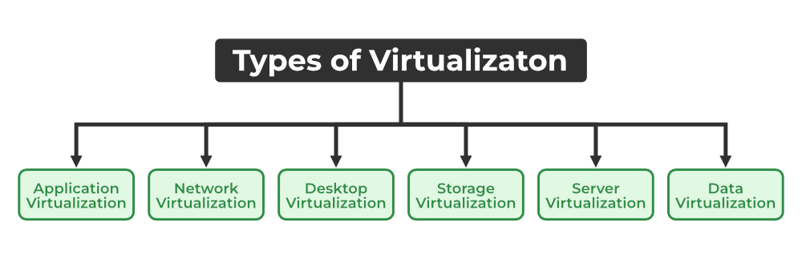

# Virtualization in cloud computing

### Q1. Define virtualizations? Describe the advantages and disadvantages of Virtualization?

- Virtualization is the process of creating a virtual version of a physical resource such as a server, storage device, network, or even an entire computing environment.
- This technology allows multiple virtual instances, or virtual machines (VMs), to run simultaneously on a single physical hardware platform
- Each virtual machine operates as if it is an independent physical device with its own operating system and applications.
- In essence, virtualization creates a layer of abstraction that enables more efficient use of computing resources.
- This abstraction layer is typically managed by software called a hypervisor or virtual machine manager (VMM), which allocates physical resources to each virtual instance and manages their execution.
- It simulates the behavior of a physical device.

**Advantages of Virtualization**

1. **Resource Utilization**: Virtualization allows for higher utilization of physical resources by running multiple virtual machines (VMs) on a single physical server.
2. **Cost Efficiency**: Reduces the need for physical hardware, leading to cost savings in terms of equipment, energy, and space.
3. **Scalability**: Resources can be easily scaled up or down to meet demand without physical hardware changes.
4. **Flexibility**: Provides the ability to quickly create, modify, and delete virtual machines, facilitating agile development and testing environments.
5. **Isolation**: Each VM operates in isolation from others, enhancing security and ensuring that problems in one VM do not affect others.
6. **Enhanced Security**: Easier to implement security policies and monitor compliance in a virtualized environment.
7. **Backup and Recovery**: Virtualization enables easy backup and restoration of entire VMs, improving disaster recovery processes.
8. **High Availability**: Features like live migration allow for minimal downtime during maintenance or failures.

**Disadvantages of Virtualization**

1. **Resource Overhead**: Virtualization introduces an additional layer of software (the hypervisor), which can cause performance overhead and reduced efficiency compared to bare-metal deployments.
2. **Latency**: There may be increased latency in some scenarios due to the extra processing required by the hypervisor.

2. **Complex Management**: Managing a virtualized environment can be complex, requiring specialized skills and knowledge.
3. **Troubleshooting**: Diagnosing and resolving issues can be more complicated in a virtualized setup.

3. **Initial Setup Costs**: Although virtualization reduces hardware costs in the long run, the initial investment in virtualization infrastructure and Software Licensing (e.g., high-capacity servers, storage, and networking) can be significant.

4. **Hypervisor Attacks**: The hypervisor, being a crucial part of the virtualization infrastructure, becomes a potential target for attacks. If compromised, it can affect all VMs on the host.
5. **Complex Security Management**: Ensuring security across multiple virtual machines and networks can be challenging.

6. **Resource Contention(विवाद)**: Multiple VMs running on the same physical hardware can lead to contention for resources (CPU, memory, I/O), potentially causing performance degradation.

7. **Risk of Data:** Hosting data on third-party resources can lead to putting the data at risk, it has the chance of getting attacked by any hacker or cracker very easily.

### Conclusion

Virtualization is a powerful technology in cloud computing, offering numerous benefits such as improved resource utilization, scalability, and enhanced disaster recovery. However, it also comes with challenges such as performance overhead, complexity, and security risks. Proper planning, management, and security measures are essential to maximize the advantages of virtualization while mitigating its disadvantages.

---

### Q2. Define Virtualization? Explain different types of Virtualizations?

### Types of Virtualization

Virtualization encompasses various techniques that abstract different types of physical resources into virtual ones, providing flexibility, efficiency, and scalability. Below are the main types of virtualization in detail:

#### 1. Server Virtualization

**Server virtualization**: Here, the central server (physical server) is divided into multiple different virtual servers by changing the identity number, and processors. So, each system can operate its operating systems in an isolated manner. Where each sub-server knows the identity of the central server. This is achieved using a hypervisor, which can be either Type 1 (bare-metal) or Type 2 (hosted).

- **Type 1 Hypervisor**: Runs directly on the physical hardware, offering better performance and efficiency. Examples include VMware ESXi, Microsoft Hyper-V, and Xen.
- **Type 2 Hypervisor**: Runs on a host operating system, suitable for desktop and development environments. Examples include VMware Workstation and Oracle VirtualBox.

**Advantages:**
- **Resource Utilization**: Increases hardware utilization by running multiple VMs on a single physical server.
- **Isolation**: Each VM is isolated, enhancing security and stability.
- **Scalability**: Easier to scale by adding more VMs as needed.

**Disadvantages:**
- **Performance Overhead**: Can introduce performance overhead due to the hypervisor layer.
- **Complexity**: Requires management tools and expertise to handle multiple VMs effectively.

#### 2. Storage Virtualization

**Storage virtualization** This presents physical storage devices like hard drives and solid-state drives (SSDs) into a storage pool. A storage virtualization layer manages this pool, allowing VMs and applications to access storage independent of the underlying physical devices. Allocate storage dynamically based on needs, reducing wasted capacity. It can Quickly provide storage for VMs without managing individual physical devices. Replicate storage across different physical locations for better data protection.

**Advantages:**
- **Simplified Management**: Centralized management of storage resources.
- **Improved Utilization**: More efficient use of storage resources.
- **Flexibility**: Easier to expand and allocate storage.

**Disadvantages:**
- **Complexity**: Can add complexity to storage management.
- **Performance Overhead**: May introduce latency due to the virtualization layer.

#### 3. Network Virtualization

**Network virtualization** The ability to run multiple virtual networks with each having a separate control and data plan. It co-exists together on top of one physical network. It can be managed by individual parties that are potentially confidential to each other. Network virtualization provides a facility to create and provision virtual networks, logical switches, routers, firewalls, load balancers.It Isolate workloads and improve security by creating separate virtual networks for different purposes.

**Advantages:**
- **Flexibility**: Easy to create and manage virtual networks.
- **Scalability**: Simplifies the deployment and scaling of network services.
- **Automation**: Enables network automation and orchestration.

**Disadvantages:**
- **Complexity**: Can be complex to implement and manage.
- **Security Risks**: Virtual networks can introduce new security challenges.

#### 4. Desktop Virtualization

**Desktop virtualization** allows users to access their desktop environment and applications hosted on a remote server from any device with a network connectionThis can be done through Virtual Desktop Infrastructure (VDI) or Desktop-as-a-Service (DaaS).

- **Remote Desktop Session Hosting (RDSH)**: Multiple users share a single physical desktop instance, each with their own dedicated session.
- **Virtual Desktop Infrastructure (VDI)**: Each user has a dedicated virtual desktop instance with its own operating system and applications.
- **Desktop-as-a-Service (DaaS)**: Provides virtual desktops through a cloud service provider.

**Advantages:**
- **Remote Access**: Users can access their desktop from any device.
- **Centralized Management**: Simplifies desktop management and updates.
- **Security**: Data is stored centrally, reducing the risk of data loss.

**Disadvantages:**
- **Network Dependency**: Requires a stable and fast network connection.
- **Cost**: Can be expensive to implement and maintain.

#### 5. Application Virtualization

**Application virtualization** Application virtualization helps a user to have remote access to an application from a server. It separates applications from the operating system, allowing them to run in an isolated environment. Applications run in isolation, preventing conflicts with other software on the device.

- **Server-Based Application Virtualization**: Applications are hosted on a server and accessed remotely by users. Examples include Microsoft RemoteApp and Citrix XenApp.
- **Client-Based Application Virtualization**: Applications are packaged into a single executable that runs on any compatible device. Examples include VMware ThinApp and Microsoft App-V.

**Advantages:**
- **Compatibility**: Reduces conflicts between applications and the operating system.
- **Simplified Deployment**: Easier to deploy and update applications.

**Disadvantages:**
- **Performance**: May introduce latency due to the isolation layer.
- **Complexity**: Requires management of virtual application packages.

#### 6. Data Virtualization

**Data virtualization** This is the kind of virtualization in which the data is collected from various sources and managed at a single place . It create a single, unified view without moving the data so that it cam be accessed by interested people and stakeholders.

**Advantages:**
- **Real-Time Access**: Provides real-time access to data from multiple sources.
- **Simplified Integration**: Easier to integrate data from disparate systems.

**Disadvantages:**
- **Performance Overhead**: Can introduce latency due to data abstraction.
- **Complexity**: Requires sophisticated tools and expertise to manage.

### Conclusion

Virtualization is a versatile technology that improves resource utilization, flexibility, and scalability across different domains of IT infrastructure. Each type of virtualization addresses specific needs and comes with its own set of advantages and challenges, making it crucial to choose the right approach based on organizational requirements and objectives.

---

### Q3. Discuss Virtualization in Grid and Virtualization in Cloud?

- **Virtualization in Grid Computing**
Grid computing is a technology that enables the sharing of computational resources across multiple administrative domains to solve large-scale problems. Virtualization plays a crucial role in enhancing the capabilities of grid computing by abstracting the underlying physical resources and providing a layer of flexibility and manageability.
- **Virtualization in Cloud Computing**
Cloud Computing is a Client-server computing architecture. In cloud computing, resources are used in centralized pattern and cloud computing is a high accessible service. It is a pay and use business means, in cloud computing, the users pay for the use 

Here is the data presented in a proper tabular format:

| S.NO | Cloud Computing | Grid Computing |
|------|------------------|----------------|
| 1 | Cloud computing is a Client-server computing architecture. | Grid computing is a Distributed computing architecture. |
| 2 | Cloud computing is a centralized executive. | Grid computing is a decentralized executive. |
| 3 | In cloud computing, resources are used in a centralized pattern. | In grid computing, resources are used in a collaborative pattern. |
| 4 | It is more flexible than grid computing. | It is less flexible than cloud computing. |
| 5 | In cloud computing, the users pay for the use. | In grid computing, the users do not pay for use. |
| 6 | Cloud computing is a highly accessible service. | Grid computing is a low accessible service. |
| 7 | It is highly scalable as compared to grid computing. | Grid computing is less scalable in comparison to cloud computing. |
| 8 | It can be accessed through standard web protocols. | It is accessible through grid middleware. |
| 9 | Cloud computing is based on service-oriented architecture. | Grid computing is based on application-oriented architecture. |
| 10 | Cloud computing uses services like IaaS, PaaS, and SaaS. | Grid computing uses services like distributed computing, distributed pervasive, and distributed information. |

This table provides a clear and concise comparison between cloud computing and grid computing.

### Q4. Differentiate between full and para virtualization?

- **Full Virtualization:** It is the first software solution for server virtualization and uses binary translation and direct approach techniques. In full virtualization, guest OS is completely isolated by the virtual machine from the virtualization layer 
- **Paravirtualization:** Paravirtualization is the category of CPU virtualization which uses hypercalls for operations to handle instructions at compile time. In paravirtualization, guest OS is not completely isolated but it is partially isolated by the virtual machine from the virtualization layer and hardware.

| S.No. | Full Virtualization                                                                                                  | Paravirtualization                                                                                                    |
|-------|----------------------------------------------------------------------------------------------------------------------|----------------------------------------------------------------------------------------------------------------------|
| 1.    | In Full virtualization, virtual machines permit the execution of the instructions with the running of unmodified OS in an entirely isolated way. | In paravirtualization, a virtual machine does not implement full isolation of OS but rather provides a different API which is utilized when OS is subjected to alteration. |
| 2.    | Full Virtualization is less secure.                                                                                  | Paravirtualization is more secure than Full Virtualization.                                                           |
| 3.    | Full Virtualization uses binary translation and a direct approach as a technique for operations.                     | Paravirtualization uses hypercalls at compile time for operations.                                                    |
| 4.    | Full Virtualization is slower than paravirtualization in operation.                                                  | Paravirtualization is faster in operation as compared to full virtualization.                                         |
| 5.    | Full Virtualization is more portable and compatible.                                                                 | Paravirtualization is less portable and compatible.                                                                   |
| 6.    | Examples of full virtualization are Microsoft and Parallels systems.                                                 | Examples of paravirtualization are Microsoft Hyper-V, Citrix Xen, etc.                                                |
| 7.    | It supports all guest operating systems without modification.                                                        | The guest operating system has to be modified and only a few operating systems support it.                            |
| 8.    | The guest operating system will issue hardware calls.                                                                | Using the drivers, the guest operating system will directly communicate with the hypervisor.                          |
| 9.    | It is less streamlined compared to paravirtualization.                                                               | It is more streamlined.                                                                                               |
| 10.   | It provides the best isolation.                                                                                      | It provides less isolation compared to full virtualization.                                                           |

---
### Q5. Explain the functionality of hypervisor?

- A hypervisor is a form of virtualization software used in Cloud hosting to divide and allocate the resources on various pieces of hardware.
- The program which provides partitioning, isolation, or abstraction is called a virtualization hypervisor.
- The hypervisor is a hardware virtualization technique that allows multiple guest operating systems (OS) to run on a single host system at the same time.
- A hypervisor is sometimes also called a virtual machine manager(VMM).

In cloud computing, a hypervisor plays a crucial role in enabling virtualization, which is the foundation of cloud infrastructure. Here's a breakdown of its functionality:

1. **Virtualization**: The primary function of a hypervisor is to create and manage virtual machines (VMs) on physical hardware. It abstracts the physical resources of a computer—like CPU, memory, storage, and networking—into virtual equivalents, allowing multiple VMs to run concurrently on a single physical machine.

2. **Resource Allocation**: Hypervisors allocate physical resources among the VMs running on a host system. It ensures fair and efficient distribution of resources based on predefined configurations and dynamic demands. This allocation enables multiple VMs to coexist on the same physical hardware without interfering with each other's operations.

3. **Isolation**: Hypervisors enforce strong isolation between VMs to prevent interference and ensure security. Each VM operates in its own isolated environment, unaware of other VMs running on the same physical machine. This isolation is critical for maintaining security boundaries and protecting sensitive data from unauthorized access.

4. **Hardware Abstraction**: Hypervisors abstract underlying hardware details from VMs, providing a standardized virtual hardware environment. VMs interact with virtualized hardware components, which are managed and controlled by the hypervisor. This abstraction shields VMs from hardware-specific dependencies, making them portable across different physical environments.

5. **Live Migration**: Advanced hypervisors support live migration, allowing VMs to be moved between physical hosts with minimal downtime. Live migration facilitates load balancing, resource optimization, and hardware maintenance without disrupting ongoing operations. It ensures high availability and scalability in cloud environments by enabling dynamic resource allocation and workload management.

5. **Performance Monitoring**: The hypervisor monitors the performance of VMs and the physical hardware.
It can track resource utilization, identify performance bottlenecks, and optimize resource allocation for better overall system performance.

Overall, hypervisors play a critical role in enabling the efficient utilization of physical resources, improving scalability, and ensuring the security and reliability of cloud infrastructure through virtualization technology.

---

### Q6. What is type1 and type 2 hypervisor? Compare Type 1 and Type 2 hypervisor?

- A hypervisor is a form of virtualization software used in Cloud hosting to divide and allocate the resources on various pieces of hardware.
- The program which provides partitioning, isolation, or abstraction is called a virtualization hypervisor.
- The hypervisor is a hardware virtualization technique that allows multiple guest operating systems (OS) to run on a single host system at the same time.
- A hypervisor is sometimes also called a virtual machine manager(VMM).

- **TYPE-1 Hypervisor:** 
The hypervisor runs directly on the underlying host system. It is also known as a “Native Hypervisor” or “Bare metal hypervisor”. It does not require any base server operating system. It has direct access to hardware resources. Examples of Type 1 hypervisors include VMware ESXi, Citrix XenServer, and Microsoft Hyper-V hypervisor.

- Pros: Such kinds of hypervisors are very efficient because they have direct access to the physical hardware resources(like Cpu, Memory, Network, and Physical storage).
- Cons: One problem with Type-1 hypervisors is that they usually need a dedicated separate machine to perform their operation

- **TYPE-2 Hypervisor:** 
A Host operating system runs on the underlying host system. It is also known as ‘Hosted Hypervisor”. Such kind of hypervisors doesn’t run directly over the underlying hardware rather they run as an application in a Host system(physical machine). Basically, the software is installed on an operating system. Hypervisor asks the operating system to make hardware calls. An example of a Type 2 hypervisor includes VMware Player or Parallels Desktop.

Pros: Such kind of hypervisors allows quick and easy access to a guest Operating System alongside the host machine running.
Cons: Here there is no direct access to the physical hardware resources so the efficiency of these hypervisors lags in performance as compared to the type-1 hypervisors

Type 1 and Type 2 hypervisors are both used to create and manage virtual machines (VMs) but they differ in their deployment and architecture. Here's a comparison between the two:

**Type 1 Hypervisor (Bare-Metal Hypervisor):**

* **Installation:** Directly installed on the server hardware, without a host operating system.
* **Focus:** High performance and dedicated virtualization. 
* **Resource Access:** Direct access to physical resources (CPU, memory, storage) for optimal allocation to VMs.
* **Security:** Generally considered more secure due to the lack of a host OS layer that could be vulnerable.
* **Management:** Often requires dedicated management tools or a separate console. 
* **Examples:** VMware ESXi, Microsoft Hyper-V, Citrix XenServer.

**Type 2 Hypervisor (Hosted Hypervisor):**

* **Installation:** Runs on top of an existing operating system like Windows or Linux.
* **Focus:** Lightweight virtualization for development, testing, or personal use.
* **Resource Access:** Negotiates resource allocation with the host OS, potentially leading to less efficient utilization compared to Type 1.
* **Security:** Relies on the security of the underlying operating system, which can introduce additional vulnerabilities.
* **Management:** Easier to manage as it leverages familiar OS tools and interfaces.
* **Examples:** Oracle VirtualBox, VMware Workstation Player, VirtualBox.

---

### Q7. Explain the importance of hypervisor in cloud computing?

- *Importance similar to functionality. Refer 5*

Hypervisors play a pivotal role in cloud computing by enabling virtualization, which is the foundation of cloud infrastructure. Here's why hypervisors are crucial in cloud computing:

1. **Resource Optimization**: Hypervisors facilitate the efficient utilization of physical hardware resources by enabling the creation and management of multiple virtual machines (VMs) on a single physical server. This consolidation of resources helps optimize hardware usage, reducing costs and maximizing the return on investment for cloud providers.

2. **Scalability**: Hypervisors allow cloud environments to scale dynamically in response to changing workloads and resource demands. By provisioning and deprovisioning VMs as needed, hypervisors enable cloud platforms to accommodate fluctuating levels of user demand while ensuring performance and reliability.

3. **Isolation and Security**: Hypervisors enforce strong isolation between VMs, ensuring that each VM operates independently of others on the same physical hardware. This isolation enhances security by preventing unauthorized access and minimizing the impact of security breaches or vulnerabilities in one VM on others.

4. **Hardware Independence**: Hypervisors abstract underlying hardware details from VMs, providing a standardized virtual hardware environment. This abstraction enables VMs to be migrated across different physical hosts seamlessly, without concern for hardware compatibility issues. It also facilitates workload mobility, disaster recovery, and efficient resource allocation in cloud environments.

5. **Live Migration and High Availability**: Advanced hypervisors support live migration, allowing VMs to be moved between physical hosts with minimal downtime. This capability enables cloud providers to perform hardware maintenance, upgrade infrastructure, and balance workloads without disrupting ongoing operations. Additionally, hypervisors facilitate the implementation of high availability strategies by automatically redistributing workloads in the event of hardware failures or outages.

6. **Performance Optimization**: Hypervisors can monitor VM performance and resource utilization. This allows for identification of performance bottlenecks and optimization of resource allocation for improved overall system efficiency.

Overall, hypervisors are essential components of cloud computing architecture, enabling virtualization, resource optimization, scalability, security, and efficient management of cloud infrastructure and services. They provide the foundation for building flexible, resilient, and cost-effective cloud platforms that can meet the evolving needs of businesses and users.

---

### Q8. Describe virtual clustering in cloud computing?

Virtual clustering in cloud computing refers to the practice of creating clusters of virtual machines (VMs) to provide high availability, scalability, and fault tolerance for applications and services running in the cloud. Clustering involves grouping multiple VMs together to work collectively as a single logical unit, sharing resources and distributing workloads among them. Here's how virtual clustering works and its key components:

1. **Cluster Management Software**: Virtual clustering relies on specialized cluster management software that coordinates the activities of individual VMs within the cluster. This software handles tasks such as node discovery, resource allocation, load balancing, and failover management.

2. **Resource Pooling**: Virtual clustering leverages the pooled resources of multiple VMs to deliver greater processing power, memory, storage, and network bandwidth than a single VM could provide. By distributing workloads across multiple VMs, clustering enables applications to scale horizontally, accommodating growing demand without overburdening individual VMs.

3. **High Availability**: Clusters are designed to ensure high availability by replicating application instances across multiple VMs. If one VM or physical host fails, the cluster management software can automatically detect the failure and initiate failover procedures to redirect traffic to healthy VMs, minimizing downtime and maintaining service continuity.

4. **Load Balancing**: Clusters use load balancing algorithms to evenly distribute incoming requests and workloads among the VMs within the cluster. This ensures optimal resource utilization and prevents individual VMs from becoming overloaded, thereby improving performance and responsiveness.

5. **Fault Tolerance**: Virtual clustering provides fault tolerance by replicating data and services across multiple VMs and physical hosts. In the event of hardware failures, software crashes, or network outages, the cluster management software can detect and recover from these failures automatically, preserving data integrity and service availability.

6. **Elasticity and Scalability**: Clusters can dynamically scale up or down in response to changing demand, allowing cloud applications to adapt to fluctuations in workload and user traffic. Virtual clustering enables seamless addition or removal of VMs from the cluster to match resource requirements, ensuring optimal performance and cost efficiency.

7. **Shared Storage and Networking**: Clustering often requires shared storage and networking infrastructure to facilitate data replication, communication between cluster nodes, and coordinated management of resources. Virtualized storage solutions such as distributed file systems or network-attached storage (NAS) are commonly used to provide shared storage for clustered VMs.

Overall, virtual clustering in cloud computing enhances the reliability, scalability, and performance of applications and services by leveraging the collective power of multiple VMs working together as a cohesive unit. It enables cloud providers to deliver resilient, flexible, and cost-effective solutions that meet the evolving needs of businesses and users.

---

### Q9. Describe CPU, Network and Storage Virtualization?

