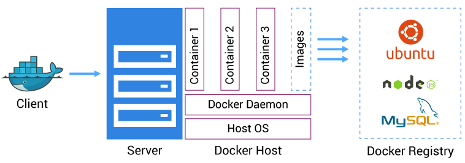
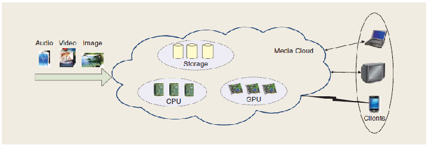
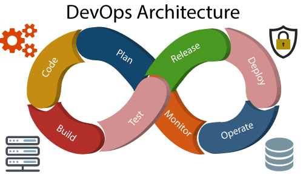
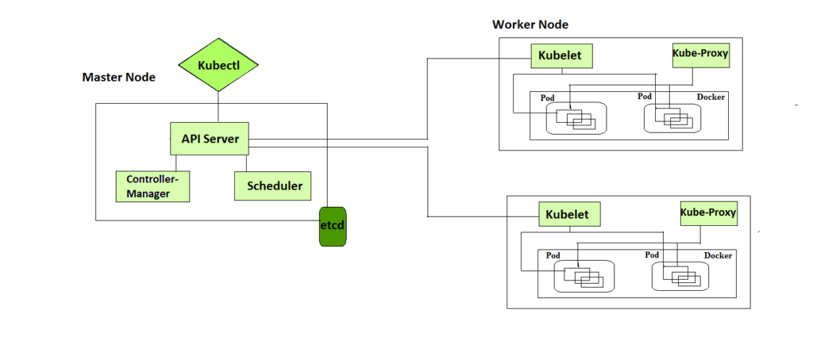

# Advanced Techniques in Cloud Computing 

### Q1. Draw and explain client server architecture of docker.

Docker is a open source platform that enables developers to automate the deployment of applications inside lightweight, portable containers. It uses a client-server architecture, allowing users to interact with containers via a command-line interface, while the Docker daemon manages the containers on the host operating system.

Sure, let's draw and explain the client-server architecture of Docker, incorporating the specified components: Client, Server, Docker Daemon, Docker Objects, Host OS, and Docker Registry.

### Explanation of Components

1. **Client**:
   - The client is the interface through which users interact with Docker. This can be the Docker CLI (Command Line Interface), Docker API, or other tools like Docker Compose.
   - The client sends commands to the Docker Daemon.

2. **Server**:
   - The server hosts the Docker Daemon and manages Docker Objects.
   - It is typically a physical machine or a virtual machine running a Host OS.

3. **Docker Daemon (dockerd)**:
   - The Docker Daemon is a background service running on the server. It listens for Docker API requests and manages Docker Objects such as images, containers, networks, and volumes.
   - It performs the heavy lifting of building, running, and managing Docker containers.

4. **Docker Objects**:
   - **Images**: Read-only templates used to create containers.
   - **Containers**: Runnable instances of images. Containers are isolated environments that run applications.
   - **Networks**: Allow containers to communicate with each other and with other parts of the system.
   - **Volumes**: Persistent storage that is independent of the container lifecycle.

5. **Host OS**:
   - The Host OS is the operating system on which the Docker Daemon runs. Docker uses the Host OS kernel to allocate resources to containers.

6. **Docker Registry**:
   - A Docker Registry is a repository for Docker images. Docker Hub is a public registry, while private registries can be hosted within an organization.
   - Users pull images from the registry to run on their containers, and they can also push images they have built to the registry for storage and distribution.

### Interaction Flow

1. **Client to Docker Daemon**:
   - The user, via the client (e.g., Docker CLI), issues commands such as `docker run`, `docker build`, etc.
   - These commands are sent to the Docker Daemon, which interprets and executes them.

2. **Docker Daemon and Docker Objects**:
   - The Docker Daemon manages the lifecycle of Docker Objects. For example, when a `docker run` command is issued, the daemon creates a container from the specified image.

3. **Docker Daemon and Docker Registry**:
   - When the Docker Daemon needs an image that is not available locally, it pulls the image from a Docker Registry.
   - Users can also push images to the Docker Registry using commands issued from the client.

4. **Containers and Host OS**:
   - Containers are run on the Host OS, sharing its kernel but isolated in terms of processes, file systems, and network interfaces.

This architecture allows Docker to be a flexible and powerful tool for containerizing applications, providing consistent environments for development, testing, and deployment.

---

### Q2. Explain Multimedia cloud in detail

Multimedia cloud computing is an advanced paradigm that integrates cloud computing technologies with multimedia services to provide scalable, on-demand, and cost-effective multimedia applications and services. It leverages the cloud’s powerful computational and storage capabilities to handle the intensive processing and storage requirements of multimedia data, such as video, audio, and images. Here’s a detailed explanation of the components, architecture, benefits, and challenges of multimedia cloud computing.

### Components of Multimedia Cloud Computing

1. **Users/Clients**:
   - **End Users**: Individuals who consume multimedia services (e.g., streaming videos, online gaming).
   - **Service Providers**: Organizations or individuals who offer multimedia services (e.g., Netflix, YouTube).

2. **Multimedia Content**:
   - Includes various forms of media such as video, audio, images, animations, and interactive content.

3. **Cloud Service Providers (CSPs)**:
   - Companies that offer cloud infrastructure, platforms, and software as services (e.g., Amazon Web Services, Google Cloud, Microsoft Azure).

4. **Cloud Infrastructure**:
   - **Storage**: Large-scale storage solutions for multimedia content (e.g., Amazon S3, Google Cloud Storage).
   - **Compute**: Powerful servers and data centers that provide the computational power needed for processing multimedia data.
   - **Networking**: High-speed, reliable networks that facilitate the transfer of large multimedia files.

### Architecture of Multimedia Cloud Computing

1. **Front-End (Client Side)**:
   - Devices and applications used by end-users to access multimedia services. This includes web browsers, mobile apps, smart TVs, and gaming consoles.

2. **Back-End (Server Side)**:
   - **Media Servers**: Handle the storage, encoding, and streaming of multimedia content.
   - **Application Servers**: Manage the application logic and user interactions.
   - **Database Servers**: Store metadata, user data, and other necessary information.
   - **Content Delivery Networks (CDNs)**: Distribute multimedia content efficiently by caching it in multiple locations closer to the end-users to reduce latency and improve delivery speed.

3. **Middleware**:
   - Software that connects the front-end to the back-end, facilitating communication and data exchange. It includes APIs, media processing tools, and service management software.

4. **Cloud Services**:
   - **Infrastructure as a Service (IaaS)**: Provides virtualized computing resources over the internet.
   - **Platform as a Service (PaaS)**: Offers a platform allowing customers to develop, run, and manage applications without the complexity of building and maintaining the infrastructure.
   - **Software as a Service (SaaS)**: Delivers software applications over the internet, on a subscription basis.

### Benefits of Multimedia Cloud Computing

1. **Scalability**:
   - Automatically scales resources to handle large volumes of multimedia data and a high number of concurrent users.

2. **Cost-Effectiveness**:
   - Reduces the need for investing in expensive hardware and infrastructure. Pay-as-you-go models allow for cost savings.

3. **Accessibility**:
   - Provides global access to multimedia content from any device with internet connectivity.

4. **Flexibility**:
   - Supports a wide range of multimedia applications and services, from streaming and gaming to virtual reality and video conferencing.

5. **High Availability**:
   - Ensures that multimedia services are available 24/7, with minimal downtime.

6. **Performance**:
   - Enhances performance through the use of CDNs and powerful cloud infrastructure that can handle high-definition and real-time multimedia applications.

### Challenges of Multimedia Cloud Computing

1. **Latency**:
   - Ensuring low latency for real-time multimedia applications (e.g., live streaming, online gaming) can be challenging.

2. **Bandwidth**:
   - Multimedia applications require significant bandwidth, which can be a limiting factor in areas with poor network infrastructure.

3. **Security and Privacy**:
   - Protecting sensitive multimedia content and user data from unauthorized access and cyber threats is crucial.

4. **Quality of Service (QoS)**:
   - Maintaining consistent quality of service in terms of video/audio quality, buffering times, and availability can be difficult, especially during peak usage times.

5. **Interoperability**:
   - Ensuring compatibility between different multimedia formats, devices, and platforms can be complex.

### Applications of Multimedia Cloud Computing

1. **Video Streaming(IPTV)**:
   - Services like Netflix, YouTube, and Hulu use cloud computing to stream video content to millions of users worldwide.

2. **Online Gaming**:
   - Platforms like Google Stadia and NVIDIA GeForce NOW leverage cloud computing for delivering high-performance gaming experiences.

3. **Virtual Reality and Augmented Reality**:
   - Cloud-based VR and AR applications that require substantial computational power and storage.

4. **Video Conferencing**:
   - Solutions like Zoom, Microsoft Teams, and Google Meet use cloud infrastructure to provide seamless video communication services.

5. **Content Creation and Editing**:
   - Cloud-based tools for video editing, graphic design, and multimedia production (e.g., Adobe Creative Cloud).

6. **Social Media**:
   - Platforms like Instagram, Facebook, and TikTok rely on cloud services to store, process, and deliver multimedia content to users.

In summary, multimedia cloud computing represents a powerful convergence of cloud computing and multimedia services, offering numerous benefits in terms of scalability, cost-efficiency, and performance. However, it also presents challenges that need to be addressed to ensure the delivery of high-quality, secure, and reliable multimedia services.

---

### Q3. Differentiate between distributed cloud computing vs Edge computing

Distributed cloud computing and edge computing are both architectural paradigms designed to optimize computational resources and improve performance, but they have distinct characteristics and serve different purposes. Here’s a detailed differentiation between the two:

### Distributed Cloud Computing

#### Definition
- **Distributed Cloud Computing** refers to the deployment of cloud services across multiple geographic locations. These services are managed centrally by a public or private cloud provider but operate on infrastructure that can be spread across various data centers and even multiple clouds (public, private, hybrid).

#### Key Characteristics
1. **Centralized Management**:
   - Although resources are distributed, they are managed from a central point, ensuring consistent service delivery and governance.
2. **Scalability**:
   - Easily scales across regions to handle varying loads and provide resilience.
3. **Resource Sharing**:
   - Resources like compute, storage, and networking are shared across different locations but managed under a unified framework.
4. **Service Continuity**:
   - High availability and disaster recovery capabilities through geographic distribution of resources.

#### Advantages
1. **High Availability**:
   - Ensures services are available even if one data center fails.
2. **Load Balancing**:
   - Distributes workloads across multiple locations to optimize performance and resource utilization.
3. **Global Reach**:
   - Provides low-latency access to services for users around the world.

#### Challenges
1. **Complex Management**:
   - Managing and orchestrating resources across multiple locations can be complex.
2. **Data Consistency**:
   - Ensuring data consistency and synchronization across distributed sites can be challenging.
3. **Latency**:
   - May still face latency issues for real-time applications due to the distance between distributed data centers and end-users.

### Edge Computing

#### Definition
- **Edge Computing** refers to processing data closer to where it is generated (the "edge" of the network), rather than in a centralized data center or cloud. This reduces latency and bandwidth usage by performing computations locally or on nearby edge servers.

#### Key Characteristics
1. **Proximity**:
   - Computation and data storage are placed near the data source or end-users.
2. **Low Latency**:
   - Significantly reduces the time it takes for data to travel between the source and the processing unit, improving response times for real-time applications.
3. **Bandwidth Efficiency**:
   - Reduces the amount of data transmitted to central data centers, lowering bandwidth usage and costs.
4. **Decentralized Management**:
   - Often involves a decentralized approach to managing resources and services.

#### Advantages
1. **Reduced Latency**:
   - Enables faster data processing and response times, critical for real-time applications.
2. **Improved Bandwidth Utilization**:
   - Decreases the need to send large volumes of data to central data centers, saving on bandwidth costs.
3. **Enhanced Privacy and Security**:
   - Sensitive data can be processed locally, reducing the risk of exposure during transmission.

#### Challenges
1. **Resource Constraints**:
   - Edge devices often have limited computational and storage capacities compared to central data centers.
2. **Management Complexity**:
   - Managing a large number of distributed edge devices can be challenging.
3. **Data Synchronization**:
   - Ensuring data consistency and synchronization between edge devices and central cloud resources can be complex.

### Comparison Summary

| Aspect                 | Distributed Cloud Computing                                       | Edge Computing                                                |
|------------------------|-------------------------------------------------------------------|---------------------------------------------------------------|
| **Location**           | Distributed across multiple data centers                          | Located close to the data source or end-users                  |
| **Management**         | Centrally managed by cloud providers                              | Decentralized, often locally managed                            |
| **Latency**            | Moderate to high latency depending on distance                    | Low latency due to proximity to data source                     |
| **Scalability**        | High scalability across regions and data centers                  | Scalability depends on the number of edge devices               |
| **Bandwidth**          | Requires significant bandwidth for data transmission              | Reduces bandwidth usage by processing data locally              |
| **Use Cases**          | Global applications, disaster recovery, regulatory compliance     | IoT, autonomous vehicles, AR/VR, healthcare                     |
| **Advantages**         | High availability, global reach, load balancing                   | Reduced latency, improved bandwidth efficiency, enhanced privacy|
| **Challenges**         | Complex management, data consistency, potential latency issues    | Resource constraints, management complexity, data synchronization|

In essence, distributed cloud computing is about extending cloud services across multiple locations with centralized control, optimizing for scalability and global availability. Edge computing, on the other hand, focuses on bringing computation closer to the data source to minimize latency and optimize real-time data processing, essential for applications requiring immediate responses.

---

### Q4. Describe the concept of DevOps in detail?

- DevOps is a set of tools that aim to integrate the processes between software development and IT operations teams.
- This integration helps organizations deliver applications and services at high velocity, improving products faster than organizations using traditional software development and infrastructure management processes. 
- DevOps = Development + Operation
- Developing team is responsible for developing, designing and building application
- Operation team is responsible for deployment and testing of application for production
- If there are problems with application operation operation team provides feedback to developing team
- DevOps used in large distributed application such as e-commerce sites etc

### Core Principles of DevOps

1. **Collaboration and Communication**:
   - DevOps emphasizes the importance of communication and collaboration between development (Dev) and operations (Ops) teams. 

2. **Automation**:
   - Automation is crucial in DevOps for repetitive tasks and processes, including testing, integration, deployment, and infrastructure management.

3. **Continuous Integration and Continuous Delivery (CI/CD)**:
   - **Continuous Integration (CI)**: Developers frequently merge their code changes into a central repository where automated builds and tests are run. 
   - **Continuous Delivery (CD)**: Extends CI by automatically deploying the code changes to a staging or production environment. This ensures that the software can be released reliably at any time.

4. **Monitoring and Logging**:
   - Continuous monitoring and logging of applications and infrastructure are vital in a DevOps environment. This practice ensures that performance issues and security vulnerabilities are quickly identified and addressed.

5. **Security**:
   - Known as DevSecOps, integrating security practices within the DevOps workflow ensures that security is a shared responsibility throughout the development lifecycle, rather than being an afterthought.

### DevOps Lifecycle

1. **Plan**:
   - The planning phase involves defining the application and infrastructure requirements. This phase also includes project management activities, where the scope and objectives of the development are established.

2. **Code**:
   - In this phase, developers write and review the code, following best practices. Version control systems like Git are used to manage code versions.

3. **Build**:
   - The build phase involves compiling the code, converting it into executable form, and linking various code modules together. Tools like Jenkins, Travis CI, and CircleCI automate the build process.

4. **Test**:
   - Automated testing is conducted to verify the functionality, performance, and security of the code. This ensures that only quality code progresses to the next stages. Testing tools include Selenium, JUnit, and TestNG.

5. **Release**:
   - In the release phase, the application is deployed to the production environment. This can be automated using CI/CD pipelines to ensure seamless and reliable releases.

6. **Deploy**:
   - Deployment involves making the application available to end-users. Deployment can be to production, staging, or other environments. Tools like Kubernetes, Docker, and AWS CodeDeploy facilitate this process.

7. **Operate**:
   - The operations phase involves managing and monitoring the applications in the production environment. This includes maintaining uptime, managing servers, and handling user traffic. Tools like Prometheus, Nagios, and Datadog are used for monitoring.

8. **Monitor**:
   - Continuous monitoring of the application and infrastructure ensures that performance issues, bugs, and security vulnerabilities are quickly identified and resolved. Logging tools like ELK Stack (Elasticsearch, Logstash, Kibana) and Splunk help in this phase.

### Benefits of DevOps

1. **Faster Delivery**:
2. **Improved Collaboration**:
3. **Higher Quality**:
4. **Enhanced Security**:
5. **Scalability**:
  
In summary, DevOps is a comprehensive approach that integrates development and operations teams to enhance collaboration, automate processes, and improve the delivery and reliability of software products. By adopting DevOps practices, organizations can achieve faster and more efficient software development cycles, better quality, and higher customer satisfaction.

---

### Q5. What are the future trends in cloud computing? Explain in brief.

The future of cloud computing is marked by several emerging trends and technologies that are shaping the way businesses and individuals use cloud services. Here are some key future trends in cloud computing:

### 1. **Edge Computing**
Edge computing involves processing data closer to where it is generated (at the "edge" of the network) rather than relying solely on centralized cloud data centers. This reduces latency, improves response times, and is crucial for applications requiring real-time processing, such as autonomous vehicles, IoT devices, and AR/VR.

### 2. **Serverless Computing**
Serverless computing, also known as Function as a Service (FaaS), allows developers to build and deploy applications without managing the underlying infrastructure. This model automatically scales resources based on demand and charges users only for the execution time of their code, making it cost-effective and efficient for certain workloads.

### 3. **Hybrid and Multi-Cloud Strategies**
Organizations are increasingly adopting hybrid and multi-cloud strategies to leverage the best features of different cloud providers and on-premises environments. This approach offers flexibility, redundancy, and the ability to optimize costs and performance by selecting the most appropriate cloud services for specific tasks.

### 4. **Artificial Intelligence and Machine Learning Integration**
Cloud platforms are increasingly integrating AI and ML capabilities, providing scalable and accessible tools for data analysis, predictive analytics, and automation. These services enable businesses to leverage advanced AI and ML without the need for extensive in-house expertise or infrastructure.

### 5. **Quantum Computing**
Quantum computing, while still in its early stages, is being explored by major cloud providers like IBM, Google, and Microsoft. Quantum computing promises to solve complex problems that are currently intractable for classical computers, offering potential breakthroughs in fields such as cryptography, materials science, and drug discovery.

### 6. **Enhanced Security and Compliance**
As cyber threats evolve, cloud providers are investing in advanced security measures, including zero-trust security models, AI-driven threat detection, and automated compliance tools. These enhancements help protect sensitive data and ensure regulatory compliance across various industries.

### 7. **Internet of Things (IoT)**
The proliferation of IoT devices is driving the need for scalable and efficient cloud solutions to process and store vast amounts of data generated by these devices. Cloud platforms are developing specialized IoT services to manage connectivity, data ingestion, analytics, and device management.

### 8. **Containers and Kubernetes**
Containers and container orchestration tools like Kubernetes continue to gain popularity for their ability to streamline application deployment, scaling, and management. They enable consistent and portable environments, making it easier to develop, test, and deploy applications across different environments.

### 9. **5G and Cloud Integration**
The rollout of 5G networks promises faster and more reliable connectivity, which will enhance cloud computing capabilities, particularly for mobile and edge applications. 5G’s low latency and high bandwidth will support real-time applications and large-scale data processing.

### 10. **Cloud-Native Technologies**
Cloud-native technologies, which include microservices architecture, service mesh, and continuous integration/continuous deployment (CI/CD) pipelines, are becoming the standard for modern application development. These technologies enable organizations to build and manage scalable, resilient, and flexible applications.

### 11. **Sustainability and Green Cloud**
With increasing awareness of environmental impact, cloud providers are focusing on sustainability initiatives. This includes optimizing data center energy efficiency, using renewable energy sources, and developing tools to help customers reduce their carbon footprint.

### 12. **Distributed Cloud**
Distributed cloud refers to the distribution of public cloud services to different physical locations, while the operation, governance, and evolution of the services remain the responsibility of the public cloud provider. This model aims to address issues related to latency, regulatory compliance, and data sovereignty.

### 13. **Cloud-Based Development and Testing Environments**
Cloud platforms are providing more comprehensive development and testing environments, enabling developers to quickly spin up and scale environments as needed. This accelerates the software development lifecycle and improves collaboration and integration within development teams.

In summary, the future of cloud computing is poised to be more distributed, intelligent, secure, and sustainable, driven by advancements in edge computing, AI/ML, quantum computing, and emerging technologies like 5G. Organizations that adopt these trends can expect to achieve greater efficiency, innovation, and competitive advantage in their respective fields.

---

### Q6. Explain architecture and working of kubernetes.

Kubernetes, also known as K8s, is an open source system for automating deployment, scaling, and management of containerized applications.

It provides a robust and scalable environment for running containerized applications. Here's a detailed explanation of the architecture and working of Kubernetes:

**Kubernetes Architecture**

- The Kubectl CLI communicates with the Control Plane and Control Plane manages the Worker Nodes.
- Kubernetes has a client-server architecture and has master and worker nodes, with the master being installed on a single Linux system and the nodes on many Linux workstations.
- It has several key components that interact to manage containerized applications. These components are grouped into two main layers: the Control Plane and the Worker Nodes

#### 1. **Control Plane**
The Control Plane is responsible for managing the Kubernetes cluster. It consists of the following components:

- **API Server (kube-apiserver)**:
  - The API server is a component of the Kubernetes control plane that exposes the Kubernetes API. It is like an initial gateway to the cluster that listens to updates or queries via CLI like Kubectl. Kubectl communicates with API Server to inform what needs to be done like creating pods or deleting pods etc. It also works as a gatekeeper. It generally validates requests received and then forwards them to other processes. No request can be directly passed to the cluster, it has to be passed through the API Server.
  
- **etcd**:
  - It is a key-value store of a Cluster. The Cluster State Changes get stored in the etcd. It acts as the Cluster brain because it tells the Scheduler and other processes about which resources are available and about cluster state changes.

- **Scheduler (kube-scheduler)**:
  - When API Server receives a request for Scheduling Pods then the request is passed on to the Scheduler. It intelligently decides on which node to schedule the pod for better efficiency of the cluster.

- **Controller Manager (kube-controller-manager)**:
  - The controller manager runs various controllers that regulate the state of the cluster, such as the Node Controller, Replication Controller, Endpoints Controller, and others. Each controller monitors the cluster’s state through the API server and makes changes to move the current state toward the desired state.

#### 2. **Worker Nodes**
These are the nodes where the actual work happens. Each Node can have multiple pods and pods have containers running inside them. There are 3 processes in every Node that are used to Schedule and manage those pods.

- **Container Runtime**:
  - The container runtime is the software responsible for running the containers. Kubernetes supports various container runtimes, including Docker, containerd, and CRI-O.

- **Kubelet**:
  - Kubelet, a agent, interacts with both the container runtime as well as the Node. It is the responsible for starting a pod with a container inside. It communicates with the API server to receive Pod specifications and reports back the node’s status.

- **Kube-proxy**:
  - It is the process responsible for forwarding the request from Services to the pods. It has intelligent logic to forward the request to the right pod in the worker node.

---

### Q7. What is IoT Cloud ? And How IoT cloud can be used in home automation

### What is IoT Cloud?

**IoT Cloud** refers to a suite of cloud-based services and platforms designed to support Internet of Things (IoT) devices and applications. These services provide the infrastructure, tools, and capabilities required to collect, store, process, and analyze data generated by IoT devices, enabling the creation of scalable and efficient IoT solutions.

Key features of an IoT Cloud platform typically include:
1. **Device Management**:
   - Tools for registering, monitoring, and managing a large number of IoT devices.
   
2. **Data Ingestion and Storage**:
   - Capabilities to handle high-velocity and high-volume data streams from IoT devices. It includes both real-time data processing and long-term storage.
   
3. **Data Processing and Analytics**:
   - Real-time and batch processing of IoT data using tools like stream processing, data lakes, and data warehouses.
   - Advanced analytics and machine learning capabilities to derive insights from the data.
   
4. **Security and Compliance**:
   - Comprehensive security features to ensure the integrity and confidentiality of data, including encryption, authentication, and access control.
   
5. **Integration and Interoperability**:
   - APIs and SDKs for integrating IoT devices and data with other cloud services and third-party applications.
   
6. **Scalability**:
   - Elastic infrastructure that can scale up or down based on the number of connected devices and data volume.

### How IoT Cloud Can Be Used in Home Automation

Home automation, also known as smart home technology, involves the use of IoT devices to automate and remotely control household systems such as lighting, heating, security, and entertainment. IoT Cloud plays a crucial role in enabling and enhancing these capabilities. Here’s how:

#### 1. **Device Connectivity and Management**
- **Device Registration**:
  - IoT Cloud platforms allow for the registration and management of various smart home devices, such as thermostats, cameras, smart bulbs, and door locks.
- **Firmware Updates**:
  - The cloud can push firmware updates to devices to ensure they have the latest features and security patches.

#### 2. **Real-time Data Collection and Monitoring**
- **Sensors and Data Streams**:
  - Devices like motion sensors, temperature sensors, and door/window sensors send real-time data to the cloud.
- **Remote Monitoring**:
  - Homeowners can monitor the status of their home devices from anywhere using mobile apps or web interfaces connected to the IoT Cloud.

#### 3. **Automation and Control**
- **Automated Routines**:
  - Users can set up routines and rules in the IoT Cloud to automate tasks based on specific conditions. For example, turning on lights when motion is detected or adjusting the thermostat based on the time of day.
- **Remote Control**:
  - Devices can be controlled remotely through cloud-connected applications. For instance, locking or unlocking doors, adjusting lighting, or starting home appliances.

#### 4. **Data Processing and Insights**
- **Data Analytics**:
  - The IoT Cloud can analyze data from various devices to provide insights, such as energy usage patterns, security alerts, or maintenance needs.
- **Predictive Maintenance**:
  - By analyzing data trends, the cloud can predict when devices might fail and alert users to perform maintenance before issues arise.

#### 5. **Integration with Other Services**
- **Voice Assistants**:
  - IoT Cloud platforms can integrate with voice assistants like Amazon Alexa, Google Assistant, or Apple Siri, allowing users to control devices with voice commands.
- **Third-party Services**:
  - Integration with third-party services like security monitoring services, energy providers, or smart home ecosystems (e.g., SmartThings) enhances the functionality and value of home automation systems.

#### 6. **Security and Privacy**
- **Secure Communication**:
  - IoT Cloud ensures secure communication between devices and the cloud through encryption and secure protocols.
- **Access Control**:
  - Users can manage who has access to their smart home systems and set different levels of permissions for family members or service providers.

----

### Q8. Explain Mobile Cloud in detail?
- Mobile Cloud computing refres to infrastructure where both data storage and data processing happen outside mobile device
- In mobile cloud computing, cloud computing and mobile network are combined ,providing optimal Services for mobile clients.

### What is Mobile Cloud?

**Mobile Cloud** refers to cloud-based services and applications that are designed specifically for mobile devices, such as smartphones and tablets. The core idea is to leverage cloud computing to enhance the capabilities of mobile devices by offloading data storage, processing power, and application functionalities to remote servers. This integration allows mobile devices to perform complex tasks and access extensive data without being constrained by their own limited resources.

### Key Components of Mobile Cloud

1. **Cloud Services**:
   - These include infrastructure (IaaS), platform (PaaS), and software (SaaS) services provided by cloud providers. Mobile applications can use these services to extend their functionality and improve performance.

2. **Mobile Devices**:
   - Smartphones, tablets, and other handheld devices that access and interact with cloud services through mobile applications or web browsers.

3. **Network Connectivity**:
   - Reliable and fast internet connections, including 4G, 5G, and Wi-Fi, are essential for effective communication between mobile devices and cloud servers.

4. **Backend Infrastructure**:
   - Servers, databases, storage systems, and other cloud infrastructure components that host and manage data, applications, and services.

5. **Mobile Middleware**:
   - Middleware solutions facilitate the integration of mobile applications with cloud services, providing APIs, SDKs, and other tools to simplify development and deployment.

### How Mobile Cloud Works

Mobile Cloud computing works by shifting the workload from the mobile device to cloud-based resources. Here’s a step-by-step explanation of the process:

1. **Data Offloading**:
   - Mobile applications offload data storage and processing tasks to the cloud. This reduces the need for extensive local storage and computational power on the device.

2. **Real-Time Access**:
   - Users can access applications and data in real-time from anywhere with an internet connection. Cloud services handle data synchronization across multiple devices.

3. **Application Hosting**:
   - Mobile applications can be hosted on cloud servers. This allows for scalable deployment, where the application can handle varying loads without impacting performance.
   - These apps need not be permanently stored on device and they do not always occupy any storage space on device.

4. **Resource Allocation**:
   - The cloud dynamically allocates resources (compute, storage, network) based on the application's needs. This elasticity ensures efficient utilization and cost-effectiveness.

5. **Security and Management**:
   - Cloud providers offer robust security measures to protect data and applications. They also manage backups, updates, and scaling, reducing the administrative burden on users.

### Benefits of Mobile Cloud

1. **Performance Improvement**:
   - Offloading heavy computation to the cloud enhances the performance of mobile applications, as mobile devices are freed from resource-intensive tasks.

2. **Scalability**:
   - Cloud infrastructure can scale up or down based on demand, ensuring that mobile applications can handle increased user loads without degradation in performance.

3. **Data Synchronization**:
   - Users can seamlessly access and synchronize data across multiple devices. Changes made on one device are automatically reflected on others.

4. **Cost Efficiency**:
   - Mobile Cloud reduces the need for high-end hardware on the client side. Users can leverage the cloud’s computational power and storage, paying only for what they use.

### Applications of Mobile Cloud

1. **Mobile Applications**:
   - Cloud-enabled mobile apps, such as social media, gaming, and productivity tools, rely on cloud services for data storage, processing, and synchronization.

2. **Healthcare**:
   - Mobile health applications utilize cloud computing for storing patient data, running diagnostic tools, and providing telemedicine services.

3. **Education**:
   - E-learning platforms use the mobile cloud to deliver educational content, manage student data, and facilitate remote learning experiences.

### Challenges of Mobile Cloud

1. **Network Dependence**:
   - The performance of mobile cloud applications heavily depends on network connectivity. Poor or unreliable internet access can degrade the user experience.

2. **Latency Issues**:
   - Applications requiring real-time processing may face latency challenges, as data needs to travel between the device and cloud servers.

3. **Security Concerns**:
   - While cloud providers offer robust security, data transmitted over the network and stored in the cloud can be vulnerable to breaches if not properly secured.

### Q9. Discuss energy aware cloud computing with suitable example

### What is Energy-Aware Cloud Computing?

**Energy-Aware Cloud Computing** refers to the strategies, techniques, and technologies aimed at reducing the energy consumption and improving the energy efficiency of cloud computing environments. This involves optimizing the use of data center resources, managing workloads efficiently, and leveraging renewable energy sources to power cloud infrastructure.

The importance of energy-aware cloud computing is driven by the need to reduce operational costs, minimize environmental impact, and ensure sustainable growth of cloud services.

### Key Strategies in Energy-Aware Cloud Computing

1. **Dynamic Resource Management**:
   - Dynamically allocating resources (CPU, memory, storage) based on current demand to avoid over-provisioning and underutilization of resources.

2. **Virtual Machine (VM) Consolidation**:
   - Consolidating VMs on fewer physical servers during low-demand periods to reduce the number of active servers and hence energy consumption.

3. **Power-Aware Scheduling**:
   - Scheduling workloads based on the energy profiles of servers, preferring energy-efficient servers or those running on renewable energy sources.

4. **Energy-Efficient Hardware**:
   - Using energy-efficient hardware components and cooling systems to reduce the overall power consumption of data centers.

5. **Renewable Energy Integration**:
   - Utilizing renewable energy sources like solar, wind, or hydroelectric power to run data centers, thereby reducing reliance on fossil fuels.

6. **Virtualization and Containerization**:
   - Leveraging virtualization and container technologies to improve resource utilization and reduce the energy footprint per application.

7. **Temperature and Cooling Management**:
   - Implementing advanced cooling techniques and optimizing temperature settings to reduce the energy used by cooling systems.

### Example of Energy-Aware Cloud Computing: Google’s Data Centers

Google’s data centers provide a prominent example of energy-aware cloud computing practices in action. Here are some of the strategies Google employs:

By monitoring real-time demand, Google can allocate resources more efficiently, reducing the number of active servers needed. 
Google has made significant investments in renewable energy, aiming to run its data centers on 100% renewable energy.
Google designs its hardware to be energy-efficient.
Google employs artificial intelligence to optimize energy usage in its data centers.
This AI system has reportedly led to a 30% reduction in energy used for cooling.

### Benefits of Energy-Aware Cloud Computing

1. **Cost Savings**:
2. **Environmental Impact**:
4. **Reputation**:
   - Adhering to energy efficiency standards and using renewable energy can enhance a company’s reputation and ensure compliance with environmental regulations.

### Challenges in Implementing Energy-Aware Cloud Computing

1. **Initial Investment**:  
2. **Complexity of Management**:
3. **Availability of Renewable Energy**:
4. **Technology Integration**:
   - Integrating new energy-efficient technologies with existing infrastructure can be challenging and may require substantial modifications.
