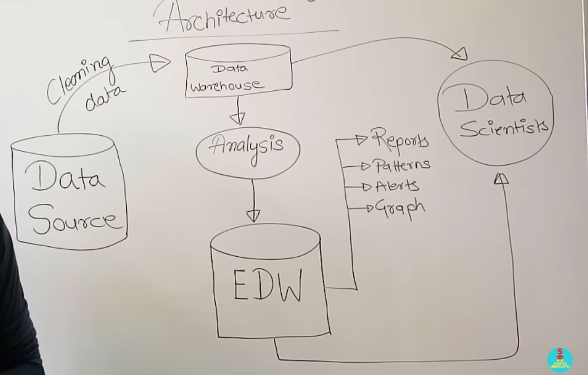

# UNIT 3 : Big Data Analytics Life Cycle

### Q1. What is Data Science? Differenciate between business intelligence and data science.

- Data science is a multidisciplinary field that uses scientific methods, algorithms, processes, and systems to extract insights and knowledge from structured and unstructured data.
- It involves various techniques from statistics, mathematics, computer science, and domain expertise to analyze and interpret complex data sets.
- The goal of data science is to uncover patterns, trends, and correlations that can be used to inform decision-making and solve problems across diverse domains such as business, healthcare, finance, and more.

Business Intelligence: 
- Business intelligence (BI), on the other hand, is a subset of data science that focuses specifically on the analysis of business-related data to help organizations make informed decisions.
- BI involves the use of tools, technologies, and processes to collect, store, analyze, and present data in a way that supports strategic planning, operational efficiency, and competitive advantage.

Differential points between data science and business intelligence:

1. **Scope and Application**: Data science has a broader scope, encompassing various domains such as healthcare, finance, and social sciences, whereas business intelligence is primarily focused on analyzing data to support business decision-making.

2. **Techniques and Tools**: Data science employs advanced techniques such as machine learning and deep learning, whereas business intelligence typically relies on more traditional analytical methods and reporting tools.

3. **Data Complexity and Volume**: Data science often deals with large volumes of complex and unstructured data, whereas business intelligence typically focuses on structured data from internal systems such as databases and spreadsheets.

4. **Predictive Analytics vs. Descriptive Analytics**: Data science emphasizes predictive analytics, where models are built to forecast future trends and outcomes, while business intelligence focuses on descriptive analytics, which provides insights into past performance and current trends.

5. **Strategic vs. Tactical Insights**: Data science provides strategic insights that can drive long-term planning and innovation, while business intelligence offers tactical insights that support day-to-day operational decisions within an organization.

---

### Q2. Explain the sources of big data in detail.

Big data originates from various sources, each contributing to the vast volumes of data that organizations collect and analyze. Here's a detailed explanation of some key sources of big data:

1. **Social Media**: Social media platforms like Facebook, Twitter, Instagram, LinkedIn, and TikTok generate enormous amounts of data through user interactions. This includes posts, comments, likes, shares, messages, photos, videos, and more. Social media data provides valuable insights into user preferences, behavior, sentiment, and trends, which organizations use for marketing, customer service, product development, and market research.

2. **IoT (Internet of Things) Devices**: IoT devices are embedded with sensors and connected to the internet, enabling them to collect and transmit data in real-time. These devices include smart thermostats, wearable fitness trackers, smart home appliances, industrial sensors, GPS trackers, and more. IoT data encompasses a wide range of information, such as environmental conditions, machine performance, location tracking, health metrics, and energy consumption. Organizations leverage IoT data for predictive maintenance, asset tracking, supply chain optimization, smart city initiatives, and personalized services.

3. **Transactional Data**: Transactional data includes records of financial transactions, purchases, sales, invoices, receipts, payments, and orders generated by businesses and consumers. This data is typically stored in databases, transaction logs, and financial systems. Transactional data provides insights into customer behavior, revenue trends, product performance, fraud detection, and compliance monitoring. Retailers, banks, e-commerce platforms, and financial institutions rely on transactional data to make strategic decisions and detect anomalies.

4. **Web and Mobile Applications**: Web and mobile applications generate large volumes of data through user interactions, clicks, page views, searches, downloads, registrations, and subscriptions. This data is collected through web analytics tools, mobile app analytics, tracking pixels, cookies, and server logs. Web and mobile data offer insights into user engagement, conversion rates, user experience, content performance, and advertising effectiveness. Organizations use this data to optimize digital experiences, personalize content, target advertisements, and improve conversion rates.

5. **Sensor Networks**: Sensor networks consist of distributed sensors deployed in various environments to monitor physical phenomena, such as temperature, humidity, pressure, motion, sound, and light. These sensors generate continuous streams of data, which are collected and analyzed to detect patterns, anomalies, and trends. Sensor data is used in diverse applications, including environmental monitoring, industrial automation, smart agriculture, healthcare monitoring, and traffic management.

6. **Machine and Log Data**: Machines, servers, and IT systems generate logs and telemetry data that record events, errors, performance metrics, and system behavior. This includes server logs, network logs, application logs, error logs, sensor data from industrial machinery, and diagnostic data from vehicles. Machine and log data provide insights into system performance, security threats, operational efficiency, and troubleshooting. Organizations use this data for monitoring, alerting, capacity planning, anomaly detection, and incident response.

7. **Text and Multimedia Content**: Textual content, such as emails, documents, articles, blogs, social media posts, reviews, and chat transcripts, constitutes a significant portion of big data. In addition, multimedia content, including images, videos, audio recordings, and graphics, adds to the data volume. Text and multimedia data are analyzed using natural language processing (NLP) and computer vision techniques to extract insights, sentiment, topics, and patterns. Organizations leverage text and multimedia data for sentiment analysis, content recommendation, image recognition, voice transcription, and content moderation.

These are just a few examples of the diverse sources of big data. As technology evolves and new data sources emerge, the landscape of big data continues to expand, offering organizations unprecedented opportunities to derive insights and drive innovation.

---

### Q3. Explain in detail how the model building phase is built by team in data analytics life cycle.

The model building phase in the data analytics lifecycle involves the development and evaluation of predictive models or analytical algorithms to extract insights from data and solve specific business problems. 

Let's consider an example scenario where a team of data scientists is tasked with building a predictive model to optimize customer retention for an e-commerce company. Here's how the model building phase unfolds:

1. **Problem Definition and Goal Setting**:
   - The team meets with stakeholders from the e-commerce company to understand the business problem. They learn that the company is experiencing a high churn rate among customers, leading to loss of revenue.
   - The goal is to develop a predictive model that can identify customers at risk of churn based on their historical behavior and characteristics, allowing the company to proactively intervene with targeted retention strategies.

2. **Data Preparation and Exploration**:
   - The team gathers relevant data from various sources, including customer transactions, website interactions, demographics, customer support tickets, and marketing campaigns.
   - They clean the data, handle missing values, encode categorical variables, and engineer features such as customer lifetime value, frequency of purchases, recency of interactions, and sentiment analysis of customer reviews.
   - Exploratory data analysis reveals insights such as seasonality in purchase patterns, correlations between customer satisfaction scores and churn rates, and differences in behavior between loyal and churned customers.

3. **Model Selection and Training**:
   - The team explores different machine learning algorithms suitable for binary classification tasks, such as logistic regression, decision trees, random forests, gradient boosting machines (GBM), and neural networks.
   - They split the data into training and validation sets and train multiple models using cross-validation to assess their performance.
   - Performance metrics such as accuracy, precision, recall, and F1-score are calculated for each model, and the team selects the top-performing models for further evaluation.

4. **Hyperparameter Tuning and Optimization**:
   - The team conducts hyperparameter tuning experiments to optimize the selected models further.
   - They use techniques such as grid search and random search to search the hyperparameter space efficiently and improve model performance.
   - The models are retrained with the optimal hyperparameters, and their performance is evaluated again to ensure improvement.

5. **Model Evaluation and Validation**:
   - The team evaluates the performance of the tuned models on a holdout validation set to simulate real-world performance.
   - They assess metrics such as precision, recall, and ROC-AUC to measure the model's ability to identify customers at risk of churn accurately.
   - The best-performing model achieves high precision and recall, indicating its effectiveness in identifying churn risk while minimizing false positives.

6. **Interpretability and Explanation**:
   - The team examines the top features contributing to the model's predictions using techniques such as feature importance analysis and partial dependence plots.
   - They discover that factors such as low purchase frequency, recent negative interactions with customer support, and decreasing sentiment in customer reviews are strong predictors of churn risk.
   - This insight informs the company's retention strategies, allowing them to focus on addressing these key drivers of churn.

7. **Documentation and Reporting**:
   - The team documents the model development process, including data preprocessing steps, model selection criteria, hyperparameter tuning results, and model evaluation metrics.
   - They create a comprehensive report summarizing the findings, insights, and recommendations for the company's stakeholders.
   - The report includes visualizations, tables, and explanations to facilitate understanding and decision-making.

8. **Deployment and Integration**:
   - The best-performing model is deployed into the company's production environment, where it integrates with the customer relationship management (CRM) system and other relevant workflows.
   - The deployment process is overseen by the data engineering and IT teams to ensure reliability, scalability, and performance in a production setting.
   - The model starts generating predictions in real-time, identifying customers at risk of churn for targeted retention efforts.

9. **Monitoring and Iteration**:
   - The team sets up monitoring mechanisms to track the model's performance in production continuously.
   - They collect feedback from stakeholders, monitor key performance indicators (KPIs), and analyze model drifts or deviations from expected behavior.
   - Based on feedback and new data, the team iterates on the model, making improvements and refinements to enhance its effectiveness over time.

By following this structured approach, the team successfully builds and deploys a predictive model for customer retention, helping the e-commerce company reduce churn rates and improve customer loyalty. Collaboration, communication, and iterative refinement are essential throughout the model-building phase to ensure alignment with business goals and stakeholder expectations.

---

### Q4. Draw the diagram of data analytics life cycle in big data and briefly explain its phases

The data analytics lifecycle is a structured approach used by organizations to extract insights and value from data. It consists of a series of interconnected phases that guide the process of data analysis, from problem identification to solution deployment. Here's an explanation of each phase:

**1. Discovery**: In this phase, the team identifies the business problem or opportunity that requires data analytics. They define the objectives, stakeholders, and success criteria for the analytics project.

**2. Preprocessing Data**: The data preprocessing phase involves cleaning, transforming, and preparing the raw data for analysis. This includes handling missing values, outliers, encoding categorical variables, and scaling numerical features.

**3. Model Planning**: In the model planning phase, the team decides on the modeling approach and techniques to be used based on the problem at hand, data characteristics, and business requirements. They outline the steps for model development and evaluation.

**4. Model Building**: In this phase, the team develops predictive models or analytical algorithms using machine learning, statistical analysis, or other techniques. They train, validate, and optimize the models to achieve the desired performance metrics.

**5. Communicate Results**: The results of the analysis are communicated to stakeholders, decision-makers, and other relevant parties. This may involve creating reports, dashboards, presentations, or visualizations to convey key insights, findings, and recommendations.

**6. Operationalize**: In the operationalize phase, the validated models are deployed into production environments or integrated into existing systems and workflows for real-world usage. This involves collaboration with IT teams, DevOps engineers, and other stakeholders to ensure seamless deployment, monitoring, and maintenance of the models in production.

Each phase of the data analytics lifecycle is crucial for the success of the project, and they often overlap and interact with each other in iterative cycles. Effective communication, collaboration, and continuous improvement are essential throughout the lifecycle to drive value and impact from data analytics initiatives.

### Q5. List and explain the steps in data preparation phase of data analytics life cycle

Data preparation is a critical stage in the data analytics lifecycle as the quality of the data used for analysis has a direct impact on the accuracy and reliability of the results. In this stage, data is collected, cleaned, and transformed into a format that is suitable for analysis

The data preparation phase in the data analytics lifecycle is crucial for ensuring that the data used for analysis is clean, complete, and suitable for the intended purpose. Here are the steps involved in the data preparation phase, along with explanations for each step:

1. **Data Collection**:
   - Data collection involves gathering relevant data from various sources, including databases, files, APIs, web scraping, IoT devices, and sensors.
   - The data collected should be comprehensive and cover all necessary variables required for analysis.

2. **Data Exploration**:
   - Data exploration involves understanding the structure, format, and characteristics of the data.
   - This includes examining the data types, variable distributions, summary statistics, and identifying any anomalies or outliers.

3. **Data Cleaning**:
   - Data cleaning is the process of identifying and correcting errors, inconsistencies, and missing values in the data.
   - Common tasks in data cleaning include handling missing data by imputation or deletion, correcting data entry errors, and removing duplicates.

4. **Data Transformation**:
   - Data transformation involves converting the raw data into a format that is suitable for analysis.
   - This may include standardizing units of measurement, normalizing numerical variables, and encoding categorical variables into a numerical format.

5. **Feature Engineering**:
   - Feature engineering involves creating new features or variables from existing data that may improve the performance of predictive models.
   - This may include creating interaction terms, deriving new variables from existing ones, or transforming variables to better capture relationships in the data.

6. **Data Integration**:
   - Data integration involves combining data from multiple sources into a single dataset for analysis.
   - This may require merging datasets based on common identifiers or keys, resolving inconsistencies in data formats, and reconciling differences in data structures.

7. **Data Reduction**:
   - Data reduction involves reducing the size or dimensionality of the dataset while preserving as much relevant information as possible.
   - Techniques for data reduction include feature selection, dimensionality reduction (e.g., PCA), and sampling methods to create representative subsets of the data.

8. **Data Splitting**:
   - Data splitting involves dividing the dataset into training, validation, and test sets for model development and evaluation.
   - This ensures that models are trained on one subset of the data, validated on another subset, and tested on a separate subset to assess their performance and generalization ability.

9. **Data Documentation**:
   - Data documentation involves documenting the data preparation process, including details about data sources, cleaning procedures, transformations, and any modifications made to the original dataset.
   - This documentation helps ensure transparency, reproducibility, and accountability in the analysis process.

By following these steps in the data preparation phase, organizations can ensure that the data used for analysis is of high quality, reliable, and well-suited for deriving meaningful insights and making informed decisions.

---

### Q6. Explain big data analytics architecture with diagram.

Big data analytics architecture typically consists of several components that work together to process, store, analyze, and visualize large volumes of data efficiently. Here's an explanation of each component along with a diagram illustrating the architecture:

In this architecture, data flows through several components to enable effective analysis and utilization:

1. **Different Data Sources**:
   - Data originates from various sources such as transactional databases, IoT devices, social media platforms, sensors, logs, and web applications. These sources contribute to the diverse range and volume of data available for analysis.

2. **Data Warehouse**:
   - The data collected from different sources is cleaned, transformed, and loaded into the data warehouse. The data warehouse serves as a centralized repository for storing structured and organized data, making it easily accessible for analysis.

3. **Data Analysis**:
   - Once the data is stored in the data warehouse, it undergoes analysis by data scientists and analysts. This involves applying statistical, machine learning, and other analytical techniques to derive insights, patterns, and trends from the data.

4. **EDW (Enterprise Data Warehouse)**:
   - The analyzed data may then be transferred to the Enterprise Data Warehouse (EDW). The EDW integrates data from various sources and provides a unified view of the organization's data assets, enabling cross-functional analysis and reporting.

5. **Dashboards, Reports, Alerts, Patterns, Graphs**:
   - From the EDW, stakeholders can generate dashboards, reports, alerts, and visualizations to monitor performance, identify patterns, and gain actionable insights. Dashboards and reports provide interactive visualizations and summaries of key metrics and KPIs, while alerts notify stakeholders of critical events or anomalies in the data.

6. **Data Scientist**:
   - Data scientists play a crucial role in the analysis process, leveraging their expertise in statistics, machine learning, and domain knowledge to extract valuable insights from the data. They collaborate with data analysts, domain experts, and business stakeholders to develop predictive models, identify trends, and solve complex business problems.

7. **Data Analyst**:
   - Data analysts also contribute to the analysis process by exploring data, generating reports, and interpreting findings to support decision-making. They have a deep understanding of the organization's data and business processes and use analytical tools and techniques to extract actionable insights from the data.

In summary, this architecture enables organizations to collect, store, analyze, and visualize data effectively, empowering stakeholders to make data-driven decisions and drive business outcomes. The integration of different components facilitates seamless data flow and collaboration across teams, ultimately enhancing the organization's ability to leverage data as a strategic asset.

---

### Q7. What is Data Discovery phase ? Explain With Example. OR List and explain various activities involved in identifying potential data resources as a part of discovery phase in data analytics.
   

The Data Discovery phase is the initial stage in a data analytics project where the organization identifies and explores potential data sources to understand the available data landscape. This phase is crucial for gaining insights into the types of data available, their quality, relevance to business objectives, and potential value for analysis.

Let's consider an example of a retail company embarking on a data analytics project to optimize its inventory management and supply chain operations:

- **Identification of Data Sources**: The retail company identifies various data sources, including its transactional database, sales records, inventory management system, supplier databases, logistics data, and customer feedback channels.

- **Exploration of Data Landscape**: The organization examines the structure and format of the available data, such as sales transactions, inventory levels, shipment tracking, supplier information, and customer reviews. They review metadata and sample datasets to understand the data's characteristics.

- **Assessment of Data Quality**: During Data Discovery, the company assesses the quality of the data by checking for completeness, accuracy, consistency, and timeliness. They identify issues such as missing product codes, discrepancies in inventory counts, and outdated supplier contact information.

- **Evaluation of Data Relevance**: The organization evaluates the relevance of the available data to its inventory management objectives. They focus on data related to sales trends, demand forecasting, stock levels, lead times, supplier performance, and customer preferences.

- **Identification of Data Opportunities**: Based on the exploration and assessment, the retail company identifies opportunities to leverage data for improving inventory forecasting accuracy, optimizing reorder points, minimizing stockouts, reducing excess inventory, and enhancing supplier relationships.

Through the Data Discovery phase, the organization gains valuable insights into the available data assets, paving the way for subsequent phases of data analysis, modeling, and decision-making in the analytics project.

---

### Q8. What are the three characteristics of big data and What are the main consideration in processing big data.

The three characteristics of big data, often referred to as the "3 Vs," are Volume, Velocity, and Variety:

1. **Volume**:
   - Volume refers to the vast amount of data generated and collected from various sources. Big data involves datasets that are too large to be processed using traditional data processing techniques. The sheer volume of data presents challenges in terms of storage, processing, and analysis.

2. **Velocity**:
   - Velocity refers to the speed at which data is generated, collected, and processed in real-time or near-real-time. With the proliferation of IoT devices, social media platforms, sensors, and other sources, data is being generated at an unprecedented rate. Big data systems need to handle high-velocity data streams efficiently to enable timely analysis and decision-making.

3. **Variety**:
   - Variety refers to the diversity of data types, formats, and sources. Big data encompasses structured, semi-structured, and unstructured data, including text, images, videos, audio, sensor data, social media posts, and more. Managing and analyzing diverse data types present challenges in terms of data integration, interoperability, and analytics.
4. **Ambiguity**: Big data ambiguous in nature ..
5. **Complexity**: Big data complexity needs to be handled effectively to ensure data quality and accuracy.

(New Question: We can classify BIG DATA REQUIREMENTS based on following 5 characteristics:... above)

Main considerations in processing big data include:

1. **Scalability**:
   - Big data processing systems need to be highly scalable to handle large volumes of data efficiently. They should be able to scale out horizontally by adding more computational resources (e.g., servers, nodes) to accommodate growing data volumes and processing demands.

2. **Parallel Processing**:
   - Big data processing frameworks, such as Apache Hadoop and Apache Spark, leverage parallel processing techniques to distribute data and computation across multiple nodes or clusters. Parallelism enables faster data processing by executing tasks concurrently and in parallel across distributed computing resources.

3. **Fault Tolerance**:
   - Given the distributed nature of big data processing systems, they need to be resilient to hardware failures, network disruptions, and other faults. Fault tolerance mechanisms, such as data replication, task redundancy, and automatic recovery, ensure continuous operation and data integrity in the event of failures.

4. **Data Locality**:
   - Data locality refers to the principle of processing data where it resides, minimizing data movement and network overhead. Big data processing frameworks optimize data locality by scheduling tasks close to the data they operate on, reducing data transfer times and improving overall performance.

5. **Cost Efficiency**:
   - Processing big data can be resource-intensive, both in terms of computational resources and storage costs. Organizations need to consider cost-efficient strategies for provisioning and managing infrastructure, optimizing resource utilization, and prioritizing workloads to minimize operational expenses.

6. **Security and Compliance**:
   - Big data processing systems must address security and compliance requirements to protect sensitive data, ensure data privacy, and adhere to regulatory guidelines. This involves implementing access controls, encryption, audit trails, and compliance monitoring mechanisms to safeguard data throughout its lifecycle.

By addressing these considerations, organizations can effectively process big data and extract valuable insights to support decision-making, drive innovation, and gain a competitive edge in today's data-driven world.

---
### Q9.Write  note on the following : 
1. ETL
2. Common tools for the model building
3. Model selection for data analytics

**1. ETL (Extract, Transform, Load)**:

ETL is a crucial process in data warehousing and analytics that involves extracting data from various sources, transforming it into a consistent format, and loading it into a target system, such as a data warehouse or a data lake. Here's a brief overview of each component:

- **Extract**: In the extraction phase, data is collected from multiple sources, including databases, files, APIs, and streaming platforms. This may involve querying databases, scraping web data, or accessing data from external sources.

- **Transform**: During the transformation phase, the extracted data is cleansed, standardized, and transformed into a unified format suitable for analysis. This includes tasks such as data cleaning, data validation, deduplication, data enrichment, and data normalization. Transformations may also involve aggregating, filtering, or joining data from different sources.

- **Load**: In the loading phase, the transformed data is loaded into the target system, such as a data warehouse or a data lake. This may involve loading data into tables, partitions, or files using batch processing or real-time streaming techniques. Loading strategies may vary based on factors such as data volume, frequency, and latency requirements.

ETL plays a crucial role in ensuring data quality, consistency, and accessibility for downstream analytics and reporting purposes. It enables organizations to integrate and analyze diverse data sources effectively, driving informed decision-making and business insights.

**2. Common Tools for Model Building**:

Model building in data analytics involves developing predictive models or analytical algorithms to extract insights from data and solve specific business problems. Several tools and platforms are commonly used for model building, each offering different features, capabilities, and programming languages. Here are some common tools:

- **Python**: Python is a popular programming language for data science and machine learning, with libraries such as scikit-learn, TensorFlow, and PyTorch for building and training models.

- **R**: R is another widely used programming language for statistical computing and data analysis. It offers packages like caret, randomForest, and glmnet for building predictive models.

- **Apache Spark**: Apache Spark is a distributed computing framework that provides libraries for scalable data processing and machine learning. Spark MLlib offers machine learning algorithms for building models on large datasets.

- **KNIME**: KNIME is an open-source data analytics platform that allows users to visually design data workflows and build predictive models using a graphical interface.

- **RapidMiner**: RapidMiner is a data science platform that provides a visual workflow designer and machine learning algorithms for building predictive models.

- **TensorFlow and Keras**: TensorFlow is an open-source machine learning framework developed by Google, while Keras is a high-level neural networks API that runs on top of TensorFlow. These tools are widely used for building deep learning models.

These tools offer a range of functionalities for data preprocessing, feature engineering, model training, evaluation, and deployment, catering to different use cases and preferences within the data science community.

**3. Model Selection for Data Analytics**:

Model selection is a critical step in the data analytics process, where the appropriate model or algorithm is chosen to solve a specific business problem or analytical task. Here are some key considerations for model selection:

- **Problem Type**: The type of problem being addressed (e.g., classification, regression, clustering) influences the choice of model. For example, logistic regression is suitable for binary classification tasks, while decision trees are effective for both classification and regression problems.

- **Data Characteristics**: The characteristics of the data, such as its volume, dimensionality, and distribution, impact the choice of model. For high-dimensional data, linear models or ensemble methods like random forests may be preferred, while for non-linear data, kernel methods or neural networks may be more suitable.

- **Interpretability**: In some cases, interpretability of the model is essential for understanding the factors driving the predictions and gaining insights into the underlying relationships in the data. Simple models like linear regression or decision trees are more interpretable than complex models like deep neural networks.

- **Performance Metrics**: The choice of performance metrics (e.g., accuracy, precision, recall, F1-score, AUC-ROC) depends on the specific goals and requirements of the project. Different models may perform differently on different metrics, so it's essential to select the model that optimizes the relevant performance metric for the task at hand.

- **Computational Resources**: The availability of computational resources, such as memory, processing power, and parallelization capabilities, influences the choice of model. Some models may be computationally intensive and require specialized hardware or distributed computing frameworks to train and evaluate effectively.

- **Domain Knowledge**: Domain knowledge and expertise play a crucial role in model selection, as domain-specific insights can guide the choice of appropriate features, algorithms, and evaluation criteria. Collaboration between data scientists and domain experts is essential for selecting models that align with business objectives and constraints.

By considering these factors and conducting rigorous evaluation and validation, organizations can select the most suitable model for their data analytics projects, leading to accurate predictions, actionable insights, and impactful outcomes.

---
### Q10. List and explain the key roles for successful analytics project

Successful analytics projects often involve collaboration among individuals with diverse skills and expertise. Here are key roles commonly found in analytics projects, along with explanations of their responsibilities:

1. **Project Sponsor**:
   - The project sponsor is a senior-level executive or stakeholder who provides strategic direction, sponsorship, and resources for the analytics project. They define the project's objectives, align it with organizational goals, and ensure its success by securing necessary support and funding.

2. **Project Manager**:
   - The project manager oversees the planning, execution, and delivery of the analytics project. They are responsible for managing project timelines, budgets, resources, and risks. The project manager facilitates communication among team members, coordinates tasks, and ensures that project milestones are met on time and within budget.

3. **Data Scientist**:
   - Data scientists are experts in statistical analysis, machine learning, and data mining techniques. They are responsible for exploring, analyzing, and interpreting data to derive actionable insights and solve complex business problems. Data scientists develop predictive models, perform data visualizations, and communicate findings to stakeholders.

4. **Data Engineer**:
   - Data engineers focus on building and maintaining the infrastructure and systems required for data processing, storage, and integration. They design data pipelines, manage data warehouses, and optimize data architectures to support analytics workflows. Data engineers work closely with data scientists to ensure data availability, quality, and reliability.

5. **Data Analyst**:
   - Data analysts are responsible for querying, cleaning, and transforming data to support analytical tasks and reporting. They conduct exploratory data analysis, generate reports, and create dashboards to visualize key metrics and trends. Data analysts collaborate with stakeholders to understand business requirements and provide insights for decision-making.

6. **Business Analyst**:
   - Business analysts bridge the gap between technical teams and business stakeholders by translating business requirements into technical specifications and vice versa. They gather and analyze user needs, define project scope, and prioritize features based on business value. Business analysts ensure that analytics solutions align with organizational objectives and deliver tangible benefits.

7. **Domain Expert**:
   - Domain experts possess specialized knowledge and expertise in a specific industry or subject area relevant to the analytics project. They provide insights into domain-specific challenges, opportunities, and best practices, guiding the development of analytics solutions that address real-world business needs. Domain experts collaborate with data scientists and analysts to validate assumptions, interpret results, and refine models.

8. **IT Infrastructure Specialist**:
   - IT infrastructure specialists are responsible for managing the hardware, software, and networking components required to support analytics workflows. They deploy and configure servers, databases, and cloud services, ensuring scalability, reliability, and security of the infrastructure. IT infrastructure specialists collaborate with data engineers and project managers to maintain operational efficiency and compliance with IT policies.

9. **UX/UI Designer**:
   - UX/UI designers focus on creating intuitive and user-friendly interfaces for analytics applications and dashboards. They design wireframes, prototypes, and visualizations that enhance the user experience and facilitate data exploration and interaction. UX/UI designers collaborate with data analysts and business stakeholders to understand user needs and preferences, ensuring that analytics solutions are intuitive and engaging.

By leveraging the skills and expertise of these key roles, organizations can execute analytics projects effectively, deliver value to stakeholders, and drive innovation and growth through data-driven decision-making. Collaboration, communication, and cross-functional teamwork are essential for success in analytics projects, ensuring alignment with business objectives and user needs.
