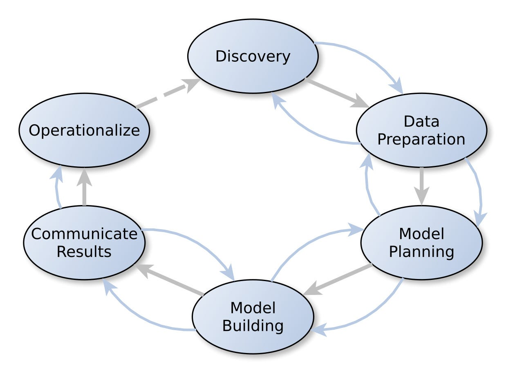

# UNIT 3 : Big Data Analytics Life Cycle

### Q1. What is Data Science? Differenciate between business intelligence and data science.

- Data science is a multidisciplinary field that uses scientific methods, algorithms, processes, and systems to extract insights and knowledge from structured and unstructured data.
- It involves various techniques from statistics, mathematics, computer science, and domain expertise to analyze and interpret complex data sets.
- The goal of data science is to uncover patterns, trends, and correlations that can be used to inform decision-making and solve problems across diverse domains such as business, healthcare, finance, and more.

Business Intelligence: 
- Business intelligence (BI), on the other hand, is a subset of data science that focuses specifically on the analysis of business-related data to help organizations make informed decisions.
- BI involves the use of tools, technologies, and processes to collect, store, analyze, and present data in a way that supports strategic planning, operational efficiency, and competitive advantage.

Differential points between data science and business intelligence:

1. **Scope and Application**: Data science has a broader scope, encompassing various domains such as healthcare, finance, and social sciences, whereas business intelligence is primarily focused on analyzing data to support business decision-making.

2. **Techniques and Tools**: Data science employs advanced techniques such as machine learning and deep learning, whereas business intelligence typically relies on more traditional analytical methods and reporting tools.

3. **Data Complexity and Volume**: Data science often deals with large volumes of complex and unstructured data, whereas business intelligence typically focuses on structured data from internal systems such as databases and spreadsheets.

4. **Predictive Analytics vs. Descriptive Analytics**: Data science emphasizes predictive analytics, where models are built to forecast future trends and outcomes, while business intelligence focuses on descriptive analytics, which provides insights into past performance and current trends.

5. **Strategic vs. Tactical Insights**: Data science provides strategic insights that can drive long-term planning and innovation, while business intelligence offers tactical insights that support day-to-day operational decisions within an organization.

---

### Q2. Explain the sources of big data in detail.

Big data originates from various sources, each contributing to the vast volumes of data that organizations collect and analyze. Here's a detailed explanation of some key sources of big data:

1. **Social Media**: Social media platforms like Facebook, Twitter, Instagram, LinkedIn, and TikTok generate enormous amounts of data through user interactions. This includes posts, comments, likes, shares, messages, photos, videos, and more. Social media data provides valuable insights into user preferences, behavior, sentiment, and trends, which organizations use for marketing, customer service, product development, and market research.

2. **IoT (Internet of Things) Devices**: IoT devices are embedded with sensors and connected to the internet, enabling them to collect and transmit data in real-time. These devices include smart thermostats, wearable fitness trackers, smart home appliances, industrial sensors, GPS trackers, and more. IoT data encompasses a wide range of information, such as environmental conditions, machine performance, location tracking, health metrics, and energy consumption. Organizations leverage IoT data for predictive maintenance, asset tracking, supply chain optimization, smart city initiatives, and personalized services.

3. **Transactional Data**: Transactional data includes records of financial transactions, purchases, sales, invoices, receipts, payments, and orders generated by businesses and consumers. This data is typically stored in databases, transaction logs, and financial systems. Transactional data provides insights into customer behavior, revenue trends, product performance, fraud detection, and compliance monitoring. Retailers, banks, e-commerce platforms, and financial institutions rely on transactional data to make strategic decisions and detect anomalies.

4. **Web and Mobile Applications**: Web and mobile applications generate large volumes of data through user interactions, clicks, page views, searches, downloads, registrations, and subscriptions. This data is collected through web analytics tools, mobile app analytics, tracking pixels, cookies, and server logs. Web and mobile data offer insights into user engagement, conversion rates, user experience, content performance, and advertising effectiveness. Organizations use this data to optimize digital experiences, personalize content, target advertisements, and improve conversion rates.

5. **Sensor Networks**: Sensor networks consist of distributed sensors deployed in various environments to monitor physical phenomena, such as temperature, humidity, pressure, motion, sound, and light. These sensors generate continuous streams of data, which are collected and analyzed to detect patterns, anomalies, and trends. Sensor data is used in diverse applications, including environmental monitoring, industrial automation, smart agriculture, healthcare monitoring, and traffic management.

6. **Machine and Log Data**: Machines, servers, and IT systems generate logs and telemetry data that record events, errors, performance metrics, and system behavior. This includes server logs, network logs, application logs, error logs, sensor data from industrial machinery, and diagnostic data from vehicles. Machine and log data provide insights into system performance, security threats, operational efficiency, and troubleshooting. Organizations use this data for monitoring, alerting, capacity planning, anomaly detection, and incident response.

7. **Text and Multimedia Content**: Textual content, such as emails, documents, articles, blogs, social media posts, reviews, and chat transcripts, constitutes a significant portion of big data. In addition, multimedia content, including images, videos, audio recordings, and graphics, adds to the data volume. Text and multimedia data are analyzed using natural language processing (NLP) and computer vision techniques to extract insights, sentiment, topics, and patterns. Organizations leverage text and multimedia data for sentiment analysis, content recommendation, image recognition, voice transcription, and content moderation.

These are just a few examples of the diverse sources of big data. As technology evolves and new data sources emerge, the landscape of big data continues to expand, offering organizations unprecedented opportunities to derive insights and drive innovation.

---

### Q3. Explain in detail how the model building phase is built by team in data analytics life cycle.

The model building phase in the data analytics lifecycle involves the development and evaluation of predictive models or analytical algorithms to extract insights from data and solve specific business problems. 

Let's consider an example scenario where a team of data scientists is tasked with building a predictive model to optimize customer retention for an e-commerce company. Here's how the model building phase unfolds:

1. **Problem Definition and Goal Setting**:
   - The team meets with stakeholders from the e-commerce company to understand the business problem. They learn that the company is experiencing a high churn rate among customers, leading to loss of revenue.
   - The goal is to develop a predictive model that can identify customers at risk of churn based on their historical behavior and characteristics, allowing the company to proactively intervene with targeted retention strategies.

2. **Data Preparation and Exploration**:
   - The team gathers relevant data from various sources, including customer transactions, website interactions, demographics, customer support tickets, and marketing campaigns.
   - They clean the data, handle missing values, encode categorical variables, and engineer features such as customer lifetime value, frequency of purchases, recency of interactions, and sentiment analysis of customer reviews.
   - Exploratory data analysis reveals insights such as seasonality in purchase patterns, correlations between customer satisfaction scores and churn rates, and differences in behavior between loyal and churned customers.

3. **Model Selection and Training**:
   - The team explores different machine learning algorithms suitable for binary classification tasks, such as logistic regression, decision trees, random forests, gradient boosting machines (GBM), and neural networks.
   - They split the data into training and validation sets and train multiple models using cross-validation to assess their performance.
   - Performance metrics such as accuracy, precision, recall, and F1-score are calculated for each model, and the team selects the top-performing models for further evaluation.

4. **Hyperparameter Tuning and Optimization**:
   - The team conducts hyperparameter tuning experiments to optimize the selected models further.
   - They use techniques such as grid search and random search to search the hyperparameter space efficiently and improve model performance.
   - The models are retrained with the optimal hyperparameters, and their performance is evaluated again to ensure improvement.

5. **Model Evaluation and Validation**:
   - The team evaluates the performance of the tuned models on a holdout validation set to simulate real-world performance.
   - They assess metrics such as precision, recall, and ROC-AUC to measure the model's ability to identify customers at risk of churn accurately.
   - The best-performing model achieves high precision and recall, indicating its effectiveness in identifying churn risk while minimizing false positives.

6. **Interpretability and Explanation**:
   - The team examines the top features contributing to the model's predictions using techniques such as feature importance analysis and partial dependence plots.
   - They discover that factors such as low purchase frequency, recent negative interactions with customer support, and decreasing sentiment in customer reviews are strong predictors of churn risk.
   - This insight informs the company's retention strategies, allowing them to focus on addressing these key drivers of churn.

7. **Documentation and Reporting**:
   - The team documents the model development process, including data preprocessing steps, model selection criteria, hyperparameter tuning results, and model evaluation metrics.
   - They create a comprehensive report summarizing the findings, insights, and recommendations for the company's stakeholders.
   - The report includes visualizations, tables, and explanations to facilitate understanding and decision-making.

8. **Deployment and Integration**:
   - The best-performing model is deployed into the company's production environment, where it integrates with the customer relationship management (CRM) system and other relevant workflows.
   - The deployment process is overseen by the data engineering and IT teams to ensure reliability, scalability, and performance in a production setting.
   - The model starts generating predictions in real-time, identifying customers at risk of churn for targeted retention efforts.

9. **Monitoring and Iteration**:
   - The team sets up monitoring mechanisms to track the model's performance in production continuously.
   - They collect feedback from stakeholders, monitor key performance indicators (KPIs), and analyze model drifts or deviations from expected behavior.
   - Based on feedback and new data, the team iterates on the model, making improvements and refinements to enhance its effectiveness over time.

By following this structured approach, the team successfully builds and deploys a predictive model for customer retention, helping the e-commerce company reduce churn rates and improve customer loyalty. Collaboration, communication, and iterative refinement are essential throughout the model-building phase to ensure alignment with business goals and stakeholder expectations.

---

### Q4. Draw the diagram of data analytics life cycle in big data and briefly explain its phases

The data analytics lifecycle is a structured approach used by organizations to extract insights and value from data. It consists of a series of interconnected phases that guide the process of data analysis, from problem identification to solution deployment. Here's an explanation of each phase:

**1. Discovery**: In this phase, the team identifies the business problem or opportunity that requires data analytics. They define the objectives, stakeholders, and success criteria for the analytics project.

**2. Preprocessing Data**: The data preprocessing phase involves cleaning, transforming, and preparing the raw data for analysis. This includes handling missing values, outliers, encoding categorical variables, and scaling numerical features.

**3. Model Planning**: In the model planning phase, the team decides on the modeling approach and techniques to be used based on the problem at hand, data characteristics, and business requirements. They outline the steps for model development and evaluation.

**4. Model Building**: In this phase, the team develops predictive models or analytical algorithms using machine learning, statistical analysis, or other techniques. They train, validate, and optimize the models to achieve the desired performance metrics.

**5. Communicate Results**: The results of the analysis are communicated to stakeholders, decision-makers, and other relevant parties. This may involve creating reports, dashboards, presentations, or visualizations to convey key insights, findings, and recommendations.

**6. Operationalize**: In the operationalize phase, the validated models are deployed into production environments or integrated into existing systems and workflows for real-world usage. This involves collaboration with IT teams, DevOps engineers, and other stakeholders to ensure seamless deployment, monitoring, and maintenance of the models in production.

Each phase of the data analytics lifecycle is crucial for the success of the project, and they often overlap and interact with each other in iterative cycles. Effective communication, collaboration, and continuous improvement are essential throughout the lifecycle to drive value and impact from data analytics initiatives.

### Q5. List and explain the steps in data preparation phase of data analytics life cycle

Data preparation is a critical stage in the data analytics lifecycle as the quality of the data used for analysis has a direct impact on the accuracy and reliability of the results. In this stage, data is collected, cleaned, and transformed into a format that is suitable for analysis

The data preparation phase in the data analytics lifecycle is crucial for ensuring that the data used for analysis is clean, complete, and suitable for the intended purpose. Here are the steps involved in the data preparation phase, along with explanations for each step:

1. **Data Collection**:
   - Data collection involves gathering relevant data from various sources, including databases, files, APIs, web scraping, IoT devices, and sensors.
   - The data collected should be comprehensive and cover all necessary variables required for analysis.

2. **Data Exploration**:
   - Data exploration involves understanding the structure, format, and characteristics of the data.
   - This includes examining the data types, variable distributions, summary statistics, and identifying any anomalies or outliers.

3. **Data Cleaning**:
   - Data cleaning is the process of identifying and correcting errors, inconsistencies, and missing values in the data.
   - Common tasks in data cleaning include handling missing data by imputation or deletion, correcting data entry errors, and removing duplicates.

4. **Data Transformation**:
   - Data transformation involves converting the raw data into a format that is suitable for analysis.
   - This may include standardizing units of measurement, normalizing numerical variables, and encoding categorical variables into a numerical format.

5. **Feature Engineering**:
   - Feature engineering involves creating new features or variables from existing data that may improve the performance of predictive models.
   - This may include creating interaction terms, deriving new variables from existing ones, or transforming variables to better capture relationships in the data.

6. **Data Integration**:
   - Data integration involves combining data from multiple sources into a single dataset for analysis.
   - This may require merging datasets based on common identifiers or keys, resolving inconsistencies in data formats, and reconciling differences in data structures.

7. **Data Reduction**:
   - Data reduction involves reducing the size or dimensionality of the dataset while preserving as much relevant information as possible.
   - Techniques for data reduction include feature selection, dimensionality reduction (e.g., PCA), and sampling methods to create representative subsets of the data.

8. **Data Splitting**:
   - Data splitting involves dividing the dataset into training, validation, and test sets for model development and evaluation.
   - This ensures that models are trained on one subset of the data, validated on another subset, and tested on a separate subset to assess their performance and generalization ability.

9. **Data Documentation**:
   - Data documentation involves documenting the data preparation process, including details about data sources, cleaning procedures, transformations, and any modifications made to the original dataset.
   - This documentation helps ensure transparency, reproducibility, and accountability in the analysis process.

By following these steps in the data preparation phase, organizations can ensure that the data used for analysis is of high quality, reliable, and well-suited for deriving meaningful insights and making informed decisions.
