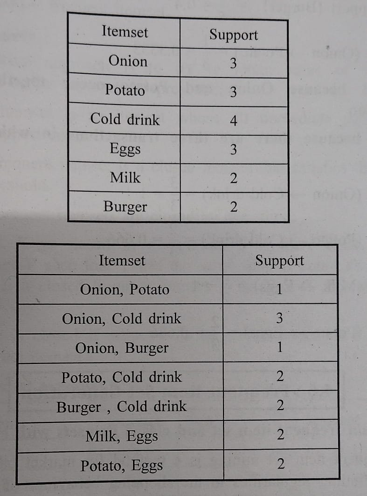

# Unit 4: Predictive big data analytics with Python

### Q1. What is data preprocessing? Explain various data preprocessing steps. Discuss essential python libraries for preprocessing

- Data preprocessing is a crucial step in data science and big data analytics where raw data is transformed into a clean, organized, and structured format suitable for analysis.
- It involves various operations to clean, transform, and prepare the data for analysis, ensuring that the data is of high quality and can be effectively used by machine learning models or other analytical techniques.
- Data preprocessing is essential because real-world datasets are often messy and incomplete.
    Ex, Salary="-3000"(Noisy data), Age="18yrs" with DOB:"11/2/2023"(Inconsistent data),Occupation=""(Incomplete data).

Here are some common data preprocessing steps:

1. **Data Cleaning**:
   - Handling missing values: This involves strategies like imputation (replacing missing values with a calculated value such as mean median mode) or deletion (removing rows or columns with missing values).

2. **Data Transformation**:
   - Converting categorical variables into a numerical format that machine learning algorithms can work with.
   - Data standardization is the process of transforming data such that its mean is 0 and standard deviation is 1.
   - Data normalization, on the other hand, scales the data to a range between 0 and 1. Data normalized by dividing each value by the maximum value in its respective dataset.

3. **Data Reduction**:
   - Dimensionality reduction: Data Reduction used to reduce the number of features while retaining most of the information.

4. **Data Integration**:
   - Combining data from multiple sources into a single dataset, ensuring consistency and compatibility between them.

5. **Data Discretization**:
   - Discretization  used to reduce the number of continuous values in a dataset by dividing them into intervals or categories.

Python offers several libraries for data preprocessing, some of which are widely used in the data science community:

1. **Pandas**: Pandas is a powerful library for data manipulation and analysis. It provides data structures like DataFrames, which are ideal for handling tabular data, and a wide range of functions for data preprocessing tasks such as handling missing values, data transformation, and data cleaning.

2. **NumPy**: NumPy is a fundamental package for scientific computing in Python. It provides support for large, multi-dimensional arrays and matrices, along with a collection of mathematical functions to operate on these arrays efficiently. NumPy is often used in conjunction with Pandas for numerical computations and data manipulation tasks.

3. **Scikit-learn**: Scikit-learn is a machine learning library in Python that provides simple and efficient tools for data mining and data analysis. 

4. **Matplotlib**: These libraries are commonly used for data visualization in Python. Visualizing data is an essential part of the data preprocessing pipeline as it helps in understanding the distribution of data, identifying outliers, and detecting patterns.

By leveraging these libraries effectively, data scientists can preprocess raw data efficiently and prepare it for further analysis or modeling.

---

### Q2. What are association rules ? Explain Apriori algorithm in brief.

Association rules are a type of rule-based technique used in data mining and machine learning to discover interesting relationships or patterns within large datasets. These rules describe the probabilistic relationships between items in a dataset and are often used in market basket analysis, where the goal is to find associations between products that are frequently purchased together.

An association rule typically has two parts:

1. **Antecedent (LHS)**: This is the set of items or itemsets that are present in the rule's condition. It represents the items that act as the premise for the association.

2. **Consequent (RHS)**: This is the item or itemset that is predicted or implied by the antecedent. It represents the item(s) that are likely to be purchased together with the items in the antecedent.

The strength of an association rule is usually measured using metrics like support, confidence, and lift:

- **Support**: This indicates the frequency with which a rule occurs in the dataset. It measures the proportion of transactions in the dataset that contain both the antecedent and consequent. Support is calculated as the ratio of the number of transactions containing both the antecedent and consequent to the total number of transactions in the dataset.(Support =A+B/Total)

- **Confidence**: This measures the reliability or certainty of the rule. It is the ratio of the support of both the antecedent and consequent to the support of the antecedent. (Confidence =A+B/A)

- **Lift**: Lift measures how much more likely the consequent is given the antecedent, compared to its likelihood without the antecedent. It is calculated as the ratio of the confidence of the rule to the support of the consequent. (Lift = Confidence/Support)

Now, let's discuss the Apriori algorithm:

The Apriori algorithm is one of the most popular algorithms for mining association rules. It works by iteratively generating candidate itemsets and pruning those that do not meet the minimum support threshold. The algorithm follows these steps:

1. **Initialization**: The algorithm starts by scanning the dataset to determine the support of each individual item. Items that do not meet the minimum support threshold are discarded.

2. **Generation of Candidate Itemsets**: Based on the frequent itemsets discovered in the previous iteration, the algorithm generates candidate itemsets of larger sizes by joining pairs of frequent itemsets.

3. **Pruning**: Candidate itemsets that do not meet the minimum support threshold are pruned from further consideration.

4. **Repeat**: Steps 2 and 3 are repeated until no new frequent itemsets can be generated.

5. **Rule Generation**: Once all frequent itemsets are discovered, association rules are generated from them by applying a confidence threshold. Only rules with confidence above the threshold are retained.

The Apriori algorithm is efficient for discovering frequent itemsets and association rules in large datasets because of its pruning strategy, which reduces the search space. However, it can still be computationally expensive for very large datasets or datasets with a large number of unique items.

---

### Q3. How Apriori algorithm works, Explain with suitable example

Let's illustrate how the Apriori algorithm works with a simple example of market basket analysis. Imagine you have a dataset containing transactions from a grocery store, where each transaction consists of a set of items purchased by a customer.

Here's a sample dataset:

```
Transaction 1: Bread, Milk
Transaction 2: Bread, Diapers, Beer, Eggs
Transaction 3: Milk, Diapers, Beer, Coke
Transaction 4: Bread, Milk, Diapers, Beer
Transaction 5: Bread, Milk, Diapers, Coke
```

We'll apply the Apriori algorithm to find association rules in this dataset.

**Step 1: Initialization**

In the first step, we determine the support of each individual item. Let's assume our minimum support threshold is 2 (i.e., an item must appear in at least 2 transactions to be considered frequent).

```
Item:        Support:
Bread        4
Milk         4
Diapers      4
Beer         3
Eggs         1
Coke         2
```

We discard Eggs because it doesn't meet the minimum support threshold.

**Step 2: Generation of Candidate Itemsets**

Next, we generate candidate itemsets of size 2 by joining pairs of frequent itemsets. We only consider pairs of items that were frequent in the previous step.

```
Frequent Itemsets of Size 2:
{Bread, Milk}
{Bread, Diapers}
{Bread, Beer}
{Milk, Diapers}
{Milk, Beer}
{Diapers, Beer}
{Diapers, Coke}
```

**Step 3: Pruning**

We prune candidate itemsets that do not meet the minimum support threshold. 

```
Pruned Frequent Itemsets of Size 2:
{Bread, Milk}
{Bread, Diapers}
{Milk, Diapers}
{Diapers, Beer}
{Diapers, Coke}
```

**Step 4: Repeat**

We repeat steps 2 and 3 to generate frequent itemsets of size 3 and beyond. For simplicity, let's consider only frequent itemsets of size 3.

```
Frequent Itemsets of Size 3:
{Bread, Milk, Diapers}
{Milk, Diapers, Beer}
{Diapers, Beer, Coke}
```

**Step 5: Rule Generation**

Finally, we generate association rules from the frequent itemsets by applying a confidence threshold. Let's assume our confidence threshold is 0.5.

```
Association Rules:
{Bread, Milk} -> {Diapers} (Confidence = 3/4 = 0.75)
{Milk, Diapers} -> {Beer} (Confidence = 2/4 = 0.5)
{Diapers} -> {Beer, Coke} (Confidence = 2/4 = 0.5)
```

These are the association rules discovered by the Apriori algorithm in our example dataset. They indicate the likelihood of one itemset leading to the purchase of another itemset. For example, the rule {Bread, Milk} -> {Diapers} suggests that customers who buy Bread and Milk are likely to also buy Diapers, with a confidence of 75%.

---

### Q4. What are the types of analytics in big data? Explain in brief

In big data analytics, there are primarily three types of analytics: descriptive analytics, predictive analytics, and prescriptive analytics. Each type serves a distinct purpose and provides valuable insights to organizations:

1. **Descriptive Analytics**:
   - Descriptive analytics focuses on summarizing historical data to understand what has happened in the past. It involves analyzing data to uncover patterns, trends, and insights that can help in understanding past performance and making data-driven decisions.
   - The descriptive model shows relationships between the customer and product/service
   - Examples of descriptive analytics include generating reports, creating dashboards, and visualizing data through charts and graphs.
   - Descriptive statistics are useful to show things like, total stock in inventory, average dollars spent per customer and Year over year change in sales.
   - What has happened?

2. **Predictive Analytics**:
   - Predictive analytics involves analyzing historical data to make predictions about future events or outcomes. It uses statistical techniques, machine learning algorithms, and data mining to identify patterns and relationships in data that can be used to forecast future trends.
   - Predictive analytics helps your organization predict with confidence what will happen next so that you can make smarter decisions and improve business outcomes
   - Examples of predictive analytics include sales forecasting, demand forecasting, customer churn prediction, and risk assessment.
   - Predictive analytics helps organizations anticipate future events and make informed decisions based on likely outcomes, allowing them to proactively plan and allocate resources.
   - What could happened?

3. **Prescriptive Analytics**:
   - Prescriptive analytics goes beyond predicting future outcomes by providing recommendations or prescriptions for actions to achieve desired outcomes. It combines insights from descriptive and predictive analytics with optimization and simulation techniques to recommend the best course of action.
   - An example of this is a traffic application helping you choose the best route home and taking into account the distance of each route, the speed at which one can travel on each road and, crucially, the current traffic constraints.
   - Larger companies are successfully using prescriptive analytics to optimize production; It helps in the supply chain to make sure that are delivering the right products at the right time and optimizing the customer experience
   - What should we do?

In summary, descriptive analytics helps in understanding what happened, predictive analytics helps in predicting what will happen, and prescriptive analytics helps in determining what actions to take to achieve desired outcomes. By leveraging all three types of analytics, organizations can gain deeper insights into their data, drive innovation, and gain a competitive edge in today's data-driven world.

### Q5. Explain following in detail
   1. Linear regression 
   2. Logistic regression

Certainly! Let's explore both Linear Regression and Logistic Regression in detail:

**1. Linear Regression:**

Linear regression is a statistical method used for modeling the relationship between a dependent variable (often denoted as \(y\)) and one or more independent variables (often denoted as \(x\)). It assumes a linear relationship between the independent variables and the dependent variable. The goal of linear regression is to find the best-fitting linear equation that describes the relationship between the variables.

The general form of a linear regression equation with one independent variable is:

 y = b0 + b1(x) + E

Where:
- y is the dependent variable (the variable we are trying to predict).
- x is the independent variable (the variable used for prediction).
- b0 is the intercept (the value of \(y\) when \(x\) is 0).
- b1 is the slope (the change in \(y\) for a unit change in \(x\)).
- E is the error term (the difference between the observed and predicted values).

When there is only one independent feature, it is known as Simple Linear Regression, and when there are more than one feature, it is known as Multiple Linear Regression.

Similarly, when there is only one dependent variable, it is considered Univariate Linear Regression, while when there are more than one dependent variables, it is known as Multivariate Regression.

Linear regression is widely used for various purposes, including:
- Predictive modeling: Predicting continuous outcomes such as sales, prices, or temperatures based on input variables.
- Trend analysis: Analyzing trends and relationships in data.
- Estimation and forecasting: Estimating future values based on historical data.

**2. Logistic Regression:**  See following question..


### Q6. Explain the use of logistic function in logistic regression in detail.

**2. Logistic Regression:**

Logistic regression is used for binary classification where we use sigmoid function, that takes input as independent variables and produces a probability value between 0 and 1.

For example, we have two classes Class 0 and Class 1 if the value of the logistic function for an input is greater than 0.5 (threshold value) then it belongs to Class 1 otherwise it belongs to Class 0. It’s referred to as regression because it is the extension of linear regression but is mainly used for classification problems.

Key Points:
- Logistic regression predicts the output of a categorical dependent variable. Therefore, the outcome must be a categorical or discrete value.
- It can be either Yes or No, 0 or 1, true or False, etc. but instead of giving the exact value as 0 and 1, it gives the probabilistic values which lie between 0 and 1.
- In Logistic regression, instead of fitting a regression line, we fit an “S” shaped logistic function, which predicts two maximum values (0 or 1).

Logistic regression is commonly used for binary classification tasks, such as:
- Predicting whether a customer will buy a product (yes/no).
- Predicting whether an email is spam or not spam.
- Predicting whether a patient has a particular disease (e.g., diabetes) based on medical test results.

**Logistic Function – Sigmoid Function use in logistic regression**
- The sigmoid function is a mathematical function used to map the predicted values to probabilities.
- It maps any real value into another value within a range of 0 and 1. The value of the logistic regression must be between 0 and 1, which cannot go beyond this limit, so it forms a curve like the “S” form.
- The S-form curve is called the Sigmoid function or the logistic function.
- In logistic regression, we use the concept of the threshold value, which defines the probability of either 0 or 1. Such as values above the threshold value tends to 1, and a value below the threshold values tends to 0.

Overall, the logistic function plays a crucial role in logistic regression by transforming the output of a linear equation into a probability, allowing us to model and predict binary outcomes based on the values of the independent variables.

---

### Q7.Explain the need of logistic regression along with its various types

Logistic regression is a fundamental statistical technique used for modeling the relationship between one or more independent variables and a binary outcome variable. The primary purpose of logistic regression is to predict the probability of a binary outcome (such as the presence or absence of a particular event) based on the values of the independent variables. 

Now, let's delve into the need for logistic regression and its various types:

**Need for Logistic Regression:**

1. **Binary Outcome Prediction**: Logistic regression is specifically designed for situations where the dependent variable is binary, meaning it has only two possible outcomes. For example, predicting whether a customer will purchase a product (yes/no), whether a patient has a particular disease (positive/negative), or whether an email is spam or not spam.

2. **Scalability**: Logistic regression can handle large datasets efficiently and is computationally less expensive compared to some other machine learning algorithms. It's suitable for situations where computational resources are limited or when dealing with high-dimensional data.

- In regression, we are predicting the continuous values but what if we want to predict categorical values like True or False, right or wrong, Yes or no so in that case our linear regression model doesn't work, so for solving this type of problem we have to use logistic regression

- Logistic regression is a supervised learning classification algorithm used to predict the probability of the target variable. By logistic we are trying to solve the binary classification (True or false) and Multiclass classification(Class 1, class2, class3 and so on).

**Types of Logistic Regression:**

1. **Binary Logistic Regression**: This is the most common type of logistic regression, where the dependent variable has only two possible outcomes (e.g., yes/no, 1/0). Binary logistic regression predicts the probability of one of the two categories based on the values of the independent variables.

2. **Multinomial Logistic Regression**: Also known as nominal logistic regression, multinomial logistic regression is used when the dependent variable has more than two unordered categories. It predicts the probability of each category relative to a reference category.

3. **Ordinal Logistic Regression**: Ordinal logistic regression is used when the dependent variable has more than two ordered categories. It predicts the probability of each category relative to the categories below it in the order.

4. **Regularized Logistic Regression**: Regularized logistic regression adds regularization terms to the loss function to prevent overfitting and improve generalization performance. Common regularization techniques include L1 regularization (Lasso) and L2 regularization (Ridge).

5. **Penalized Logistic Regression**: Penalized logistic regression is a variation of regularized logistic regression that penalizes large coefficients to avoid overfitting. It's particularly useful when dealing with high-dimensional datasets with potentially collinear features.

Each type of logistic regression is suited to different types of data and modeling objectives. Choosing the appropriate type depends on the nature of the dependent variable and the specific goals of the analysis.

---

### Q8. Write note in detail:
1. Removing duplicates from data set
2. Handling missing data
3. Data transformation

Certainly! Here's a detailed note on each topic:

**1. Removing Duplicates from Dataset:**

Duplicates in a dataset can skew analysis results and lead to incorrect insights. It's essential to identify and remove duplicates to ensure the integrity and accuracy of the data. Here's how to handle duplicates effectively:

- **Identifying Duplicates**: Before removing duplicates, it's crucial to identify them. Duplicates can occur across all columns or specific columns in a dataset. Use pandas or other data manipulation tools to identify duplicates based on selected columns.

- **Removing Duplicates**: Once duplicates are identified, they can be removed using appropriate methods. In Python, pandas provides the `drop_duplicates()` function to remove duplicates from a DataFrame. Specify the subset of columns to consider for duplicate identification if needed.

- **Preserving Important Information**: When removing duplicates, consider whether certain duplicates contain valuable information that should be preserved. In some cases, duplicates may represent legitimate data entries, such as repeated measurements or transactions.

- **Handling Large Datasets**: For large datasets, removing duplicates can be computationally expensive. Consider using efficient algorithms or parallel processing techniques to handle duplicates more efficiently.

**2. Handling Missing Data:**

Missing data is a common issue in datasets and can arise due to various reasons such as data collection errors, equipment failures, or survey non-response. Handling missing data is crucial to ensure the quality and reliability of the analysis. Here are some approaches to handle missing data:

- **Identifying Missing Data**: Begin by identifying missing values in the dataset. In Python, missing values are often represented as NaN (Not a Number) in pandas DataFrames.

- **Imputation**: Imputation involves replacing missing values with estimated or calculated values. Common imputation techniques include mean imputation (replacing missing values with the mean of the column), median imputation, or mode imputation. Choose the imputation method based on the nature of the data and the underlying distribution.

- **Dropping Missing Values**: In some cases, it may be appropriate to remove rows or columns with missing values entirely. Use the `dropna()` function in pandas to drop rows or columns containing missing values. However, be cautious with this approach, as it may lead to loss of valuable information, especially if missingness is not random.

- **Advanced Techniques**: Advanced techniques such as predictive modeling or interpolation can be used for imputing missing values based on the relationships observed in the data. These techniques can be more sophisticated but require careful consideration and validation.

- **Multiple Imputation**: Multiple imputation involves generating multiple imputed datasets and combining the results to account for uncertainty in the imputation process. This approach can provide more robust estimates compared to single imputation methods.

**3. Data Transformation:**

Data transformation involves converting raw data into a suitable format for analysis, visualization, or modeling. It includes various techniques to preprocess and manipulate data to improve its quality and usability. Here are some common data transformation techniques:

- **Normalization**: Normalization scales numerical features to a standard range, typically between 0 and 1. It ensures that all features contribute equally to the analysis and prevents features with larger magnitudes from dominating the model.

- **Standardization**: Standardization transforms numerical features to have a mean of 0 and a standard deviation of 1. It is useful for algorithms that assume normally distributed features or require standardized input.

- **Encoding Categorical Variables**: Categorical variables need to be encoded into numerical format for analysis. Common encoding techniques include one-hot encoding, where each category is represented as a binary variable, and label encoding, where categories are mapped to integer values.

- **Feature Engineering**: Feature engineering involves creating new features from existing ones or transforming features to improve model performance. It can include operations such as polynomial features, interaction terms, or logarithmic transformations.

- **Data Aggregation**: Data aggregation combines multiple data points into summary statistics or aggregated values. It is useful for reducing the dimensionality of the data or summarizing information at different levels of granularity.

- **Dimensionality Reduction**: Dimensionality reduction techniques such as Principal Component Analysis (PCA) or Singular Value Decomposition (SVD) reduce the number of features in the dataset while retaining most of the information. These techniques are valuable for high-dimensional datasets or reducing computational complexity.

- **Log Transformation**: Log transformation is used to stabilize variance and make the data more normally distributed. It is particularly useful for skewed data distributions or when the relationship between variables is multiplicative rather than additive.

Effective data transformation is essential for preparing data for analysis and modeling, ensuring that the data is in a suitable format for the chosen analytical techniques. Experiment with different transformation methods to find the most appropriate approach for your dataset and analytical goals.

---
### Q9. What is data preprocessing ? Explain in details about handling missing data and transformation of data.

Data preprocessing refers to the process of preparing raw data for analysis or modeling by cleaning, transforming, and organizing it into a structured format. It is a crucial step in the data analysis pipeline that helps ensure the quality, consistency, and usability of the data for subsequent tasks. Here's a short note on data preprocessing:

Data preprocessing involves several key steps: Data Cleaning, Data Transformation, Data Reduction, Data Integration etc

Remaining ans: See above question


---

### Q10.Explain scikit-learn library for matplotlib with example

- Scikit-learn is a powerful Python library designed for machine learning and statistical modeling tasks.
- It integrates seamlessly with other popular scientific computing libraries such as NumPy, SciPy, and Matplotlib.
- Scikit-learn provides a wide range of tools and algorithms for various machine learning tasks, including classification, regression, clustering, and dimensionality reduction.
- Key Features of Scikit-learn:
   1. Supervised Learning Algorithms: Scikit-learn offers a vast collection of supervised learning algorithms for classification and regression tasks
   2. Cross-validation: Scikit-learn provides several methods for evaluating the performance of supervised models on unseen data. 
   3. Feature Extraction: Scikit-learn provides utilities for feature extraction from raw data, particularly useful in natural language processing (NLP) and computer vision tasks. 


**Matplotlib: Versatile Visualization Library**

- Matplotlib is a comprehensive library for creating static, animated and interactive visualizations in Python.
- Matplotlib is a plotting library for the Python programming language.
- It allows to make quality charts in few lines of code. Most of the other python plotting library are built on top of Matplotlib

Key Features of Matplotlib:
1. 2D Plotting: Matplotlib primarily focuses on creating 2D plots, including line plots, scatter plots, bar plots, histograms, and more
2. Static and Interactive Visualizations: Matplotlib supports both static and interactive plotting.

Ex, Line plots can be created in Python with Matplotlib's pyplot library. To build a line plot, first import Matplotlib. It is a standard convention to

import Matplotlib's pyplot library as plt.
plt.plot([1,2,3],[5,7,4])
plt.show()

---

### Q11. Explain why decision tree are used. Draw a sample decision tree and explain its parts.

Decision trees are widely used in machine learning and data mining for both classification and regression tasks. They are popular because of their simplicity, interpretability, and ability to handle both numerical and categorical data. Here are some reasons why decision trees are used:

1. **Interpretability**: Decision trees provide a transparent and easy-to-understand representation of the decision-making process. The structure of a decision tree can be visualized and interpreted by humans, making it valuable for explaining the logic behind predictions or decisions.

2. **Versatility**: Decision trees can handle both categorical and numerical data, as well as multi-class classification and regression tasks. They can also be used for both binary and multi-way splits, making them versatile for various types of problems.

3. **Automatic Feature Selection**: Decision trees inherently perform feature selection by choosing the most informative features at each node. This helps in identifying the most relevant features for making predictions, reducing the need for manual feature engineering.

4. **Non-linear Relationships**: Decision trees can capture non-linear relationships between features and the target variable. They recursively partition the feature space into regions, allowing them to model complex decision boundaries.

5. **Scalability**: Decision trees can handle large datasets efficiently, with time complexity typically logarithmic in the number of samples. Additionally, ensemble methods such as Random Forests and Gradient Boosting Machines (which use decision trees as base learners) further improve scalability and model performance.

Now, let's draw a sample decision tree and explain its parts:

Consider a simple decision tree for classifying whether a person will play tennis based on weather conditions:

```
                    Outlook
                     /   \
               Sunny      Overcast
                /            \
          Humidity            Play Tennis
          /     \
       High     Normal
        /         \
  Play Tennis   Don't Play Tennis
```

Parts of the decision tree:

1. **Root Node (Outlook)**: The top node of the tree represents the feature that best splits the dataset into homogeneous subsets based on a certain criterion (e.g., Gini impurity or information gain). In this example, the Outlook is the root node.

2. **Internal Nodes (Humidity)**: Internal nodes represent feature decisions or tests. Each internal node splits the dataset based on a specific feature and its corresponding threshold or condition. In the example, the Humidity node represents a decision based on the humidity level.

3. **Leaf Nodes (Play Tennis, Don't Play Tennis)**: Leaf nodes represent the final outcomes or predictions. They do not require any further splitting and provide the predicted class label or value. In the example, the leaf nodes indicate whether to play tennis or not based on the weather conditions.

4. **Branches**: Branches connect nodes and represent the flow of decisions based on feature values. Each branch corresponds to a specific outcome of the feature test at the parent node.

Decision trees recursively partition the feature space into regions, with each region corresponding to a leaf node. The decision-making process follows the path from the root node to the appropriate leaf node based on the feature values of the input data.

---

### Q12. Explain Naive Bayes Classifier and its applications

- The Naive Bayes classifier is a probabilistic machine learning algorithm based on Bayes' theorem with the "naive" assumption of conditional independence between features.
- Despite its simplistic assumptions, Naive Bayes classifiers have been widely used in various applications due to their simplicity, efficiency, and good performance on many real-world datasets.

**Explanation of Naive Bayes Classifier:**

1. **Bayes' Theorem**: The foundation of the Naive Bayes classifier is Bayes' theorem, which describes the probability of a hypothesis given the evidence. Mathematically, it is expressed as:

P(A|B) = {P(B|A) * P(A) } / {P(B)} 

Where: expalain all p(a)..

2. **Naive Assumption**: The "naive" assumption of Naive Bayes is that all features are conditionally independent given the class label. In other words, the presence or absence of a particular feature does not affect the presence or absence of any other feature. While this assumption may not hold true in many real-world scenarios, Naive Bayes classifiers can still perform well in practice, especially with sufficiently large and diverse datasets.

**Applications of Naive Bayes Classifier:**

1. **Text Classification**: Naive Bayes classifiers are widely used for document classification tasks such as spam email detection, sentiment analysis, and topic categorization. They work well with text data represented as bag-of-words or TF-IDF vectors.

2. **Spam Filtering**: Naive Bayes classifiers are effective for spam filtering in email systems. They can classify incoming emails as spam or non-spam based on the presence or absence of certain keywords or features.

3. **Medical Diagnosis**: Naive Bayes classifiers have been applied to medical diagnosis tasks, including disease prediction and risk assessment. They can use patient symptoms and medical history as features to predict the likelihood of various diseases.

4. **Recommendation Systems**: Naive Bayes classifiers can be used in recommendation systems to predict user preferences or interests based on past behavior. They can recommend products, movies, or articles to users by analyzing their historical interactions.

5. **Document Filtering**: Naive Bayes classifiers are employed in document filtering applications such as news article categorization and web page classification. They can classify documents into predefined categories based on their content or metadata.

Overall, the Naive Bayes classifier is a simple yet effective algorithm that finds applications in a wide range of domains due to its ease of implementation, efficiency, and ability to handle high-dimensional datasets with categorical features.

---
### Q 




Support (A) = Number of transaction in which A appears / Total number of transactions

Confidence (A→ B) = Support (AUB) / Support (A)


Support {Onion} = 3/5 =0.6

Support {Potato} =3/5 = 0.6

Support (Cold drink) =4/5 = 0.8

Support (Eggs) = 3/5 = 0.6

Support (Milk) = 2/ 5 = 0.4

Support (Burger) = 2/5 =0.4

Confidence (Onion → Potato) = 1/3 = 0.3333

Why 1? because Onion and Potato occur together only in 1 transaction
Why 3? because there are three transactions in which Onion is occurring.

Confidence (Onion-> Cold drink) = 3/3 = 1

Confidence (Potato ->Cold drink) = 2/3 = 0.666

Confidence (Milk → Eggs) =2/2=1

Confidence (Potato → Eggs)= 2/3 = 0.666