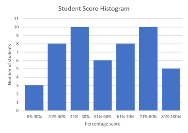
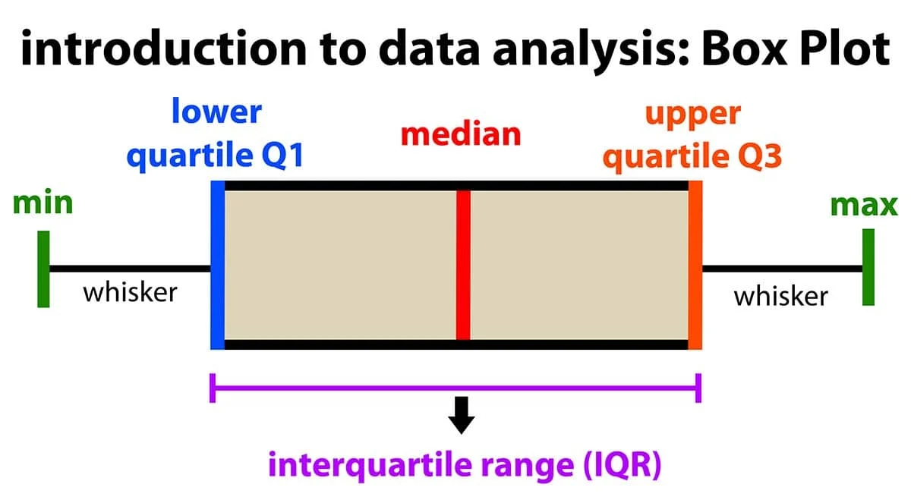

# Data Visualization and Hadoop

### Q1. What is data visualization ?  Why it is important ? Explain benefits of data visualization.

Data visualization is the graphical representation of data and information. It involves creating visual elements like charts, graphs, and maps to help convey complex datasets in a clear and understandable manner. Through visual representations, data visualization enables individuals to interpret and comprehend large volumes of data more easily, allowing for better insights and decision-making.

Here's why data visualization is important and the benefits it offers:

1. **Clarity and Understanding**: Visualizing data makes complex information more accessible and understandable. Instead of sifting through rows and columns of numbers, individuals can quickly grasp trends, patterns, and relationships within the data.

2. **Insight Discovery**: Visualization allows for the discovery of insights and correlations that may not be immediately apparent from the raw data. By representing data visually, analysts can identify outliers, trends, and anomalies, leading to deeper insights and better decision-making.

3. **Communication**: Visualizations are powerful tools for communicating data-driven insights to a diverse audience, including stakeholders, clients, and team members. Visual representations are often more engaging and memorable than written reports or spreadsheets, making it easier to convey key messages and findings.

4. **Identifying Trends and Patterns**: Visualizations facilitate the identification of trends, patterns, and relationships within the data. By visualizing data over time or across different variables, analysts can uncover meaningful insights that inform strategic decisions and actions.

5. **Enhanced Decision-Making**: Data visualization empowers decision-makers to make informed and data-driven decisions. By presenting data visually, decision-makers can quickly assess the situation, evaluate options, and choose the most effective course of action.

6. **Efficient Data Exploration**: Visualizations provide a rapid and efficient means of exploring and analyzing large datasets. Interactive visualizations allow users to drill down into the data, filter specific variables, and explore different perspectives, enabling deeper analysis and understanding.

7. **Detecting Anomalies and Errors**: Visualizations can help identify anomalies, errors, and inconsistencies in the data. By visualizing data distributions and relationships, analysts can quickly spot data quality issues and take corrective actions.

Overall, data visualization plays a crucial role in data science and big data analytics by facilitating data exploration, insight discovery, and effective communication of findings. By harnessing the power of visual representations, organizations can unlock the full potential of their data and drive better decision-making and outcomes.

---
 
### Q2.List the challenges of data visualization. Explain the types of visualization with example

While data visualization offers numerous benefits, it also comes with its own set of challenges:

1. **Choosing the Right Visualization**: Selecting the appropriate type of visualization for a given dataset and analysis objective can be challenging. Different datasets may require different visualization techniques, and choosing the wrong type of visualization can obscure rather than clarify insights.

2. **Data Quality and Preprocessing**: Poor data quality, missing values, and inconsistencies can hinder the effectiveness of data visualization. Preprocessing steps such as data cleaning, normalization, and transformation may be necessary to ensure accurate and meaningful visual representations.

3. **Interpretation and Misinterpretation**: Misinterpretation of visualizations can occur if they are not properly labeled, scaled, or annotated. Ambiguous or misleading visualizations may lead to incorrect conclusions and decisions.

4. **Visual Clutter**: Overly complex or cluttered visualizations can overwhelm users and make it difficult to discern meaningful patterns or trends within the data. Designing clear and concise visualizations is essential for effective communication of insights.

5. **Scalability**: Visualizing large and high-dimensional datasets can be challenging due to scalability issues. Traditional visualization techniques may struggle to handle massive volumes of data efficiently, requiring innovative approaches and technologies for visualization at scale.

6. **Accessibility and Inclusivity**: Ensuring that visualizations are accessible to all users, including those with disabilities or using assistive technologies, poses a challenge. Designing visualizations that are both visually appealing and accessible requires careful consideration of color contrast, text size, and other accessibility features.

Now, let's explore some common types of data visualization along with examples:

1. **Bar Chart**: Bar charts are used to compare categorical data. Each category is represented by a bar, with the height or length of the bar corresponding to the value of the category. For example, a bar chart can be used to compare sales figures for different products over a specific time period.

2. **Line Chart**: Line charts are ideal for showing trends and changes over time. Data points are connected by lines, making it easy to visualize patterns and fluctuations. An example of a line chart would be plotting stock prices over several months to analyze trends in the market.

3. **Pie Chart**: Pie charts are used to represent proportions or percentages of a whole. The entire "pie" represents 100%, and each slice represents a proportionate part of the whole. For instance, a pie chart can illustrate the distribution of sales by product category, with each slice representing the percentage of total sales for a specific category.

4. **Scatter Plot**: Scatter plots are used to observe the relationship between two continuous variables. A scatter plot uses dots to represent values for two different numeric variables. The position of each dot on the horizontal and vertical axis indicates values for an individual data point. For example, a scatter plot can show the temperatures between different areas

5. **Heatmap**: Heatmaps use color-coded cells to represent the magnitude of values in a matrix. They are commonly used to visualize relationships between two categorical variables or to display the density of data points in a two-dimensional space. An example of a heatmap is a Rainfall, color of the cell indicates the amount of rainfall in that area.

These are just a few examples of the many types of visualizations available. Choosing the most appropriate type depends on the nature of the data and the insights you want to convey.

---

### Q3. List the data visualization tools and discuss any four application of data visualization along with the use of suitable plot.

Certainly! Here's a list of some popular data visualization tools:

1. **Tableau**: Tableau is a widely used data visualization tool that offers a user-friendly interface and powerful visualization capabilities. It allows users to create interactive dashboards and visualizations from various data sources.

2. **Microsoft Power BI**: Power BI is a business analytics tool by Microsoft that enables users to create interactive reports and dashboards. It integrates seamlessly with other Microsoft products and supports a wide range of data sources.

3. **Google Data Studio**: Google Data Studio is a free data visualization tool that allows users to create interactive reports and dashboards using data from Google Analytics, Google Sheets, and other sources. It offers collaboration features and easy sharing options.

4. **Plotly**: Plotly is a Python graphing library that enables users to create interactive, publication-quality visualizations. It supports a variety of chart types, including scatter plots, bar charts, line charts, and heatmaps.

5. **Matplotlib**: Matplotlib is a Python plotting library that provides a wide range of static, interactive, and animated visualizations. It is highly customizable and widely used for creating publication-quality plots.

Now, let's discuss four applications of data visualization along with the use of suitable plots:

1. **Financial Analysis**:
   - **Application**: Visualizing stock market data to analyze trends and patterns.
   - **Suitable Plot**: Line Chart or Candlestick Chart.
   - **Example**: Plotting the daily closing prices of a stock over a certain period using a line chart to identify trends and potential trading opportunities.

2. **Google Forms:**:
   - **Application**: Visualizing the distribution of responses to different survey questions or options.
   - **Suitable Plot**:  Pie Chart.
   - **Example**:  A pie chart can be used to represent the percentage of respondents in each satisfaction category. Each slice of the pie chart would represent a different satisfaction level category, and the size of each slice would correspond to the proportion of respondents who selected that satisfaction level.

3. **Geospatial Analysis**:
   - **Application**: Traffic Density
   - **Suitable Plot**: Heatmap
   - **Example**: A heatmap could be used to display traffic density on road networks. Areas with heavier traffic would be represented by warmer colors.

4. **Marketing Campaign Performance**:
   - **Application**: Visualizing marketing campaign data to evaluate performance and ROI.
   - **Suitable Plot**: Bar Chart or Stacked Area Chart.
   - **Example**: Using a bar chart to compare the effectiveness of different marketing channels in driving conversions or a stacked area chart to visualize the cumulative impact of multiple campaigns over time.

These are just a few examples of how data visualization can be applied across various domains to gain insights and inform decision-making. The choice of visualization technique depends on the specific analysis objectives and the nature of the data being visualized.

---

### Q4. Describe the data visualization tool "Tableau". Explain its application in brief.

Tableau is a powerful and widely used data visualization tool that allows users to create interactive and visually appealing dashboards and reports. Here's a brief overview of Tableau and its applications:

**Tableau Overview**:

Tableau is a business intelligence and analytics platform that enables users to connect to various data sources, visualize data, and share insights across organizations. It offers a user-friendly interface with drag-and-drop functionality, making it accessible to both technical and non-technical users. Tableau supports a wide range of data sources, including spreadsheets, databases, cloud services, and big data platforms.

**Features of Tableau**:

1. **Data Connectivity**: Tableau can connect to a variety of data sources, including Excel, SQL databases, cloud services like Google Analytics and Salesforce, and big data platforms like Hadoop and Amazon Redshift.

2. **Visual Analytics**: Tableau provides a wide range of visualization options, including bar charts, line charts, scatter plots, maps, and more. Users can create interactive visualizations by simply dragging and dropping fields onto the canvas and customizing visual properties.

3. **Dashboard Creation**: Tableau allows users to combine multiple visualizations into interactive dashboards. Dashboards can include filters, parameters, and actions to enable dynamic exploration of data.

6. **Collaboration and Sharing**: Tableau Server and Tableau Online allow users to publish and share dashboards and reports with colleagues and stakeholders. Users can collaborate on visualizations in real-time and access content from any device.

**Applications:**
**Supply Chain Management**: Visualizing supplier performance, transportation routes, and distribution networks.
**Education Analytics**: Creating interactive dashboards for educational institutions to track progress and improve student outcomes.
**Healthcare Analytics**: Analyzing patient data, medical records, and treatment outcomes.
**Financial Analysis** : Visualizing financial data including budgeting, forecasting, and expense tracking.
**Business Intelligence (BI)**: Analyzing sales data, financial data, and operational metrics to gain insights into business performance.

Overall, Tableau is a versatile data visualization tool that empowers users to explore, analyze, and communicate insights from their data effectively. Its intuitive interface, powerful features, and scalability make it a preferred choice for businesses and organizations across various industries.

### Q5. With a suitable example explain and draw histogram and explain its usages

- A histogram is a graphical representation of the distribution of numerical data.
- It consists of a series of contiguous rectangles (or bars) where the area of each rectangle corresponds to the frequency of data values within a specific interval, known as a "bin." 
- Histograms are particularly useful for visualizing the frequency distribution of continuous data and identifying patterns or trends in the data.

Let's consider an example to illustrate how to draw a histogram and its usages:

Let's create an example of a histogram representing the distribution of student scores. We'll use the following score intervals on the horizontal axis: 0-50, 51-60, 61-70, 71-80, 81-90, and 91-100. The vertical axis will represent the number of students in each score interval.

**Data Collection:** As a teacher, you collect the scores of students in a mathematics exam, representing your sample data.

**Data Preparation:** You organize the student scores into bins or intervals, such as 0-50, 51-60, 61-70, 71-80, 81-90, and 91-100, representing different percentage score ranges.

**Frequency Calculation:** You count the number of students in each interval, tallying how many scored within 0-50, 51-60, and so forth.

**Drawing the Histogram:** On a graph, the horizontal axis displays the score ranges, while the vertical axis represents the number of students in each range. Bars are drawn to depict the frequency of students in each interval.

**Analysis:** You analyze the histogram to identify trends. For instance, a concentration of scores in the 61-70 and 71-80 ranges may indicate overall good performance, while fewer students in higher ranges could suggest challenges in achieving higher scores. This analysis informs teaching strategies to support student learning and improve performance.

10 students scored within the range 41-50.(like these for each)

**Usage of Histogram:**

1. **Understanding Distribution**: Histograms help visualize the distribution of numerical data, showing whether the data is symmetric, skewed, or bimodal.

2. **Identifying Central Tendency**: Histograms make it easy to identify the central tendency of the data, such as the mean or median.

3. **Comparing Distributions**: Histograms allow for easy comparison of distributions between different datasets or subgroups within the same dataset.

4. **Analyzing Variability**: Histograms help analyze the variability or spread of the data, such as range or variance.

---

### Q6. With a suitable example explain and draw box plot and explain its usages
- A box plot, also known as a box-and-whisker plot, is a graphical representation of the distribution of numerical data through their quartiles.
- Box plot uses boxes and lines to depict the distributions of one or more groups of numeric data.
- Box plots are used to show distributions of numeric data values, especially when you want to compare them between multiple groups.
- A box plot have lines, called whiskers, indicating data outside the upper and lower quartiles.

**Example**: Let's say we have a dataset representing the exam scores of students in a class. We want to create a box plot to visualize the distribution of scores.

1. **Data Collection**: We collect the exam scores of students, representing our sample data.

2. **Data Preparation**: We organize the scores and sort them in ascending order.

3. **Box Plot Construction**:
   - **Median (Q2)**: We find the median score, which represents the middle value of the dataset.
   - **Quartiles (Q1 and Q3)**: We find the first quartile (Q1) and the third quartile (Q3), which represent the 25th and 75th percentiles of the data, respectively.
   - **Interquartile Range (IQR)**: We calculate the interquartile range (IQR) by subtracting Q1 from Q3.
   - **Whiskers**: We extend the whiskers to the minimum and maximum values within 1.5 times the IQR from Q1 and Q3, respectively. Any data points beyond the whiskers are considered outliers and plotted as individual points.
   - **Box**: We draw a box from Q1 to Q3, representing the middle 50% of the data.

4. **Drawing the Box Plot**: We plot the median line inside the box and draw the whiskers extending from the box to the minimum and maximum values within the 1.5*IQR range. Outliers are plotted as individual points outside the whiskers.

**Box Plot Usages:**

1. **Comparing Distributions**: Box plots are useful for comparing the distributions of different datasets or groups. They provide a visual summary of the central tendency, spread, and skewness of the data.

2. **Identifying Central Tendency**: Box plots display the median, which represents the central tendency of the data. Comparing medians between groups can reveal differences in central tendency.

3. **Examining Variability**: The length of the box in a box plot indicates the variability of the data. A longer box implies greater variability, while a shorter box indicates less variability.

4. **Highlighting Quartiles**: Box plots clearly display quartiles (Q1, Q2, Q3), allowing for easy interpretation of the data's spread and distribution.

5. **Understanding Data Range**: The whiskers of the plot extend to the minimum and maximum values of the dataset, giving a clear picture of the data range.