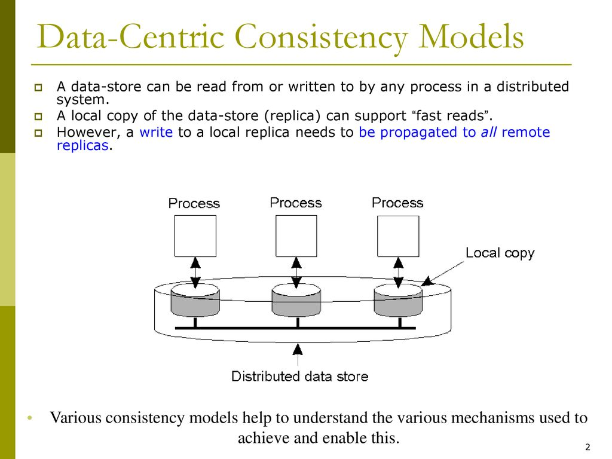
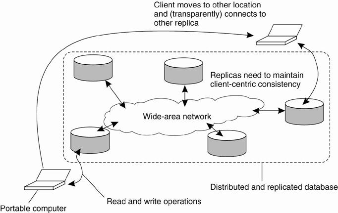

# Consistency and Replication 

### Q1. What is Replication ? Explain replication as a scaling technique

### Replication in Distributed Systems

Replication is the process of creating and maintaining multiple copies of data or services across different nodes in a distributed system. This technique enhances the system's reliability, availability, fault tolerance, and performance. Replication ensures that data is not only accessible even if some nodes fail but also that the load can be distributed across several nodes, improving the system's overall efficiency and scalability.

### Types of Replication

1. **Data Replication:**
   - Involves copying data across different nodes or locations.
   - Ensures data availability and reliability.
   - Examples: Replicating a database across multiple servers.

2. **Service Replication:**
   - Involves replicating the services or applications across different nodes.
   - Ensures continuous service availability and load distribution.
   - Examples: Running multiple instances of a web server.

### Replication as a Scaling Technique

Replication is a crucial technique for scaling distributed systems, and it plays a significant role in both vertical and horizontal scaling:

#### Horizontal Scaling (Scaling Out)

Horizontal scaling involves adding more nodes to the system to handle increased load. Replication fits well into this model by distributing the workload across multiple instances.

1. **Load Balancing:**
   - With multiple replicas, load balancers can distribute client requests across various nodes.
   - This reduces the load on any single node and ensures efficient resource utilization.

2. **Fault Tolerance and High Availability:**
   - If one node fails, other replicas can take over, ensuring that the service remains available.
   - This reduces the risk of downtime and improves the system's resilience.

3. **Geographic Distribution:**
   - Replicating data and services across different geographical locations reduces latency for users by serving them from the nearest replica.
   - This improves the user experience and can be crucial for global applications.

4. **Read Scalability:**
   - By replicating data across multiple nodes, read operations can be distributed among these nodes, significantly improving read throughput.
   - Common in systems like content delivery networks (CDNs) and distributed databases.

#### Vertical Scaling (Scaling Up)

Vertical scaling involves increasing the capacity of a single node, such as adding more CPU, RAM, or storage. While replication is primarily associated with horizontal scaling, it can complement vertical scaling in certain scenarios:

1. **Enhanced Data Access:**
   - Even with powerful individual nodes, replication can ensure that data access remains fast and reliable by spreading the load.
   - Reduces bottlenecks by allowing multiple nodes to serve read requests simultaneously.

### Replication Strategies

1. **Synchronous Replication:**
   - Ensures that all replicas are updated simultaneously.
   - Provides strong consistency but can be slower due to the need to wait for all nodes to acknowledge updates.

2. **Asynchronous Replication:**
   - Updates are propagated to replicas at different times.
   - Improves performance and reduces latency but can lead to temporary inconsistencies.

**Reasons:**

1. **Improved Availability:** Replication ensures that data and services remain accessible even if some nodes fail, enhancing the overall availability of the system.
  
2. **Enhanced Performance:** By distributing the load across multiple nodes, replication helps in balancing the workload, leading to better system performance and reduced response times.

3. **Fault Tolerance:** Replication provides redundancy, allowing the system to continue functioning smoothly despite hardware or software failures on some nodes.

4. **Geographical Distribution:** Replicating data across different geographical locations reduces latency for users by serving them from the nearest replica, improving the user experience.

5. **Load Distribution:** Replication allows read operations to be spread across multiple nodes, preventing any single node from becoming a bottleneck and ensuring efficient resource utilization.

### Conclusion

Replication is a fundamental technique in distributed systems, enhancing scalability, reliability, and performance. By creating multiple copies of data and services, replication ensures that systems can handle increased load, maintain high availability, and provide a robust user experience. Despite its challenges, effective replication strategies and management practices can significantly improve the efficiency and resilience of distributed systems.

----

### Q2. Explain the methods of content replication and content distribution

Content replication and content distribution are two crucial techniques in distributed systems for ensuring data availability, reliability, and performance. Here's an explanation of various methods used for both:

### Methods of Content Replication

1. **Full Replication:**
   - **Description:** Every node in the network maintains a complete copy of the entire dataset.
   - **Advantages:** Maximizes data availability and fault tolerance since every node has a complete set of data.
   - **Disadvantages:** High storage and maintenance costs, and synchronization overhead can be significant.

2. **Partial Replication:**
   - **Description:** Only a subset of the data is replicated across different nodes, based on specific criteria like frequency of access or importance.
   - **Advantages:** Reduces storage requirements and can optimize performance by strategically placing frequently accessed data.
   - **Disadvantages:** Can complicate data access patterns and consistency management.

3. **Synchronous Replication:**
   - **Description:** Data updates are simultaneously propagated to all replicas, ensuring that all copies are consistent at any point in time.
   - **Advantages:** Provides strong consistency guarantees.
   - **Disadvantages:** Can introduce latency and reduce system performance due to the need to wait for all replicas to acknowledge updates.

4. **Asynchronous Replication:**
   - **Description:** Data updates are propagated to replicas at different times, allowing some delay between the original update and its propagation.
   - **Advantages:** Improves performance and reduces latency since updates do not need to be immediately synchronized across all replicas.
   - **Disadvantages:** Can lead to temporary inconsistencies between replicas.

5. **Quorum-based Replication:**
   - **Description:** A majority (quorum) of nodes must agree on an update before it is committed, balancing between consistency and availability.
   - **Advantages:** Provides a middle ground between strong consistency and high availability.
   - **Disadvantages:** Requires careful management of quorum size and can be complex to implement.

### Methods of Content Distribution

1. **Content Delivery Networks (CDNs):**
   - **Description:** Distribute content across a network of geographically dispersed servers to deliver content more efficiently to users.
   - **Advantages:** Reduces latency by serving content from the nearest server to the user, and improves load balancing.
   - **Disadvantages:** Can be costly to deploy and maintain, and may introduce complexity in content management.

2. **Edge Caching:**
   - **Description:** Content is cached at the edge of the network, closer to the end-users, often in devices like routers or local servers.
   - **Advantages:** Significantly reduces access time and bandwidth usage by storing frequently accessed data near users.
   - **Disadvantages:** Cache consistency and expiration policies need to be carefully managed to ensure users receive up-to-date content.

3. **Peer-to-Peer (P2P) Distribution:**
   - **Description:** Uses a decentralized network of peers to distribute and share content directly among users.
   - **Advantages:** Highly scalable and reduces the load on central servers by leveraging the resources of participating peers.
   - **Disadvantages:** Can lead to variable performance and reliability, and poses challenges in managing content integrity and security.

4. **Hierarchical Caching:**
   - **Description:** Involves multiple layers of caches, such as primary, secondary, and tertiary caches, with each layer storing different content based on access patterns.
   - **Advantages:** Optimizes bandwidth usage and improves content retrieval times by strategically placing content at various levels.
   - **Disadvantages:** Can be complex to configure and manage due to the hierarchical structure and the need for efficient cache invalidation mechanisms.

5. **Replication with Load Balancing:**
   - **Description:** Combines replication with load balancing techniques to distribute user requests evenly across multiple servers hosting the replicated content.
   - **Advantages:** Enhances performance and reliability by preventing any single server from becoming a bottleneck.
   - **Disadvantages:** Requires sophisticated load balancing algorithms and infrastructure to ensure effective distribution of requests.

### Conclusion

Both content replication and content distribution are vital techniques for improving the performance, availability, and scalability of distributed systems. By employing various replication methods, systems can ensure data consistency and reliability, while diverse content distribution strategies enhance user experience by reducing latency and optimizing resource utilization. Each method has its advantages and trade-offs, and the choice of technique depends on the specific requirements and constraints of the application or system.

### Q3.Explain with suitable example , Cache Coherence Protocol

Cache coherence protocols are critical in distributed systems to ensure consistency among multiple caches that store copies of shared data. They are designed to manage the state of data stored in local caches of a shared resource, ensuring that any changes in data are propagated throughout the system so that all nodes have a consistent view of the data. 

Here is a detailed explanation of a common cache coherence protocol, the MESI protocol, along with an example:

### MESI Protocol

The MESI protocol is one of the most widely used cache coherence protocols. It stands for Modified, Exclusive, Shared, and Invalid, which are the four states a cache line can be in:

1. **Modified (M)**: The cache line is present only in the current cache, and it has been modified from the value in the main memory. The current cache must write back the data to main memory before permitting any other read or write operations by other caches.
2. **Exclusive (E)**: The cache line is present only in the current cache, but it is clean (not modified). This means that the value in the cache is the same as that in the main memory.
3. **Shared (S)**: The cache line may be stored in other caches, and it is clean (not modified). Any of the caches can read the data without causing inconsistencies.
4. **Invalid (I)**: The cache line is invalid; it does not hold valid data.

### Protocol Operations

The MESI protocol operates through a series of transitions between these states based on read and write requests:

- **Read Miss**: If a cache misses on a read (the data is not present in the cache), it will fetch the data from the main memory or another cache that has the data in the Shared state.
- **Write Miss**: If a cache misses on a write (the data is not present in the cache), it will fetch the data and typically place it in the Modified state.
- **Invalidation**: When a cache writes to a cache line, it broadcasts an invalidation message to other caches, forcing them to invalidate their copies of the data.

### Example

Let's consider a distributed system with three processors (P1, P2, P3), each with its own cache. They all access a shared variable `X` stored in the main memory. Here’s how the MESI protocol ensures cache coherence:

1. **Initial State**:
   - Main memory has `X = 10`.
   - All caches have the state of `X` as Invalid (I).

2. **P1 reads X**:
   - Cache miss occurs in P1's cache.
   - P1 fetches `X` from the main memory and places it in its cache with state Exclusive (E) because it is the only cache with `X`.

3. **P2 reads X**:
   - Cache miss occurs in P2's cache.
   - P2 fetches `X` from the main memory or from P1’s cache.
   - Now, both P1's and P2's caches hold `X` in Shared (S) state.

4. **P1 writes X = 20**:
   - P1 invalidates `X` in P2’s cache.
   - P1 updates its copy of `X` to 20 and sets its state to Modified (M).
   - P2’s cache sets the state of `X` to Invalid (I).

5. **P3 reads X**:
   - Cache miss occurs in P3's cache.
   - P3 fetches `X` from P1’s cache (because it is the Modified copy).
   - P1 writes back the updated value (20) to the main memory.
   - P3 and P1 now both have `X` in Shared (S) state.

By following these steps, the MESI protocol ensures that all caches have a coherent view of the data. Each time a cache line is read or written, the protocol transitions the state of the data to maintain consistency across the system.

### Conclusion

Cache coherence protocols like MESI are essential in maintaining data consistency in distributed systems with multiple caches. They manage the states of cached data and ensure that updates are propagated to all relevant caches, preventing scenarios where different processors have inconsistent views of the same data.

---

### Q4. Explain Data-Centric consistency in detail

- Data-centric consistency models in distributed systems are focused on how data is stored and accessed across multiple nodes to ensure a consistent view of the data for all users and processes.
- These models define the rules about the visibility and ordering of updates to the data.
- There are several levels of consistency, ranging from strict to more relaxed, each providing different guarantees and trade-offs between consistency, availability, and performance.
- Consistency model is a contract between processes and the data store.
- If processes obey certain rules, data store will work correctly. All models attempt to return the results of the last write for a read operation

### Types of Data-Centric Consistency Models

1. **Strict Consistency**:
    - Definition: Any read operation on a data item X returns the value of the most recent write operation on X, regardless of which node the operation is performed on.
    - Example: In a strictly consistent system, if a write operation sets X to 10, any subsequent read operation will see X as 10, regardless of the node from which it is read.

2. **Sequential Consistency**:
    - Definition: The result of any execution is the same as if the operations of all the processes were executed in some sequential order, and the operations of each individual process appear in this sequence in the order specified by its program.
    - Example: If Process A writes X = 1 and then Process B writes X = 2, all processes will see the writes in the same order, although some may see B's write before A's if they do not observe real-time order.

3. **Causal Consistency**:
    - Definition: Writes that are causally related must be seen by all processes in the same order. Concurrent writes (not causally related) may be seen in different orders on different nodes.
    - Example: If Process A writes X = 1, and Process B, after reading X = 1, writes Y = 2, then all processes that see Y = 2 must first see X = 1.

4. **Eventual Consistency**:
    - Definition: If no new updates are made to a given data item, eventually all accesses to that item will return the last updated value.
    - Example: In a shopping cart system, if a user adds an item to the cart, eventually all nodes will reflect this addition, though there might be a delay.

5. **Strong Consistency**:
    - Definition: A combination of strict and sequential consistency, where updates are immediately visible to all nodes, and all nodes see operations in the same order.
    - Example: In financial transactions, strong consistency ensures that all updates are immediately reflected across all nodes to avoid discrepancies.

6. **Entry Consistency**:
    - Definition: Ensures that updates to a particular data item are seen by all processes before any subsequent operations on that item are performed. This consistency model is often associated with distributed shared memory systems where synchronization operations (such as acquiring a lock) ensure consistency.
    - Example: If Process A acquires a lock, updates data item X, and releases the lock, then Process B, upon acquiring the same lock, will see the updated value of X before performing any operations.

### Conclusion

Data-centric consistency models are essential for designing and implementing distributed systems that require different levels of data consistency. Choosing the appropriate consistency model depends on the specific requirements of the application, such as the need for immediate consistency versus performance and availability trade-offs. Understanding these models helps in making informed decisions about the architecture and behavior of distributed systems.

---

### Q5. Explain Client-Centric consistency in detail

- Client-centric consistency models focus on the perspective of individual clients in a distributed system, ensuring that the consistency guarantees are tailored to their interactions with the data.
- These models aim to provide a consistent view of the data for a specific client, even if the data might be replicated across multiple nodes with different states.
- The primary goal is to improve user experience by maintaining a logical order of operations for each client.
- System wide view on data store is provided by data - centric consistency model.
- Client - centric consistency models are generally used for applications that lack simultaneous
updates, i.e., most operations involve reading data.
- Here are the main types of client-centric consistency models:

### Types of Client-Centric Consistency Models

1. **Monotonic Reads**:
    - Definition: If a client reads a value of a data item, any subsequent reads by that client will return the same value or a more recent value.
    - Example: If a client reads a post on a social media platform, any future reads will either return the same post or an updated one with more comments or likes, but never an older version.

2. **Monotonic Writes**:
    - Definition: A write operation by a client on a data item is completed before any subsequent write operation by the same client.
    - Example: If a client writes two consecutive status updates, the system ensures that the first update is completed before the second one is applied.

3. **Read Your Writes**:
    - Definition: A client will always see its own previous writes when it reads the same data item again.
    - Example: If a client updates their profile picture, any subsequent view of their profile will display the updated picture.

4. **Writes Follow Reads**:
    - Definition: A write operation by a client following a read operation on a data item will be performed on the latest version of that data item read by the client.
    - Example: If a client reads an email and then replies to it, the reply will be based on the latest version of the email that the client read.

### Conclusion

Client-centric consistency models provide consistency guarantees tailored to individual clients, improving their experience by ensuring a logical and predictable view of the data. These models are particularly useful in scenarios where user interactions are critical, such as in social media platforms, online banking, and collaborative applications. By focusing on the client's perspective, these models help maintain a coherent and consistent view of the data, even in highly distributed and replicated systems.

---

### Q6. Explain how Data-Centric Consistency Models are different from Client-Centric consistency.

Data-centric and client-centric consistency models address different aspects of consistency in distributed systems. While both aim to maintain coherent views of data, they focus on different perspectives and use cases. Here’s a detailed comparison highlighting their key differences:

### Data-Centric Consistency Models

Data-centric consistency models focus on the overall state and behavior of data across the entire distributed system. They are concerned with how data is stored, updated, and accessed across multiple nodes to ensure a consistent view for all users and processes. These models provide global guarantees about data consistency, irrespective of which client is accessing the data.

#### Key Characteristics

1. **Global Perspective**:
    - Ensures that all nodes in the system have a consistent view of the data.
    - Focuses on maintaining consistency across all replicas of the data.

2. **Consistency Types**:
    - **Strict Consistency**: Ensures that any read returns the most recent write.
    - **Sequential Consistency**: Ensures that all processes see all operations in the same sequential order.
    - **Causal Consistency**: Ensures that causally related operations are seen by all processes in the same order.
    - **Eventual Consistency**: Ensures that, eventually, all replicas converge to the same value if no new updates are made.
    - **Strong Consistency**: Combines aspects of strict and sequential consistency to ensure immediate synchronization.

3. **Use Cases**:
    - Suitable for applications where a global, consistent state is critical, such as financial systems, inventory management, and distributed databases.

### Client-Centric Consistency Models

Client-centric consistency models focus on the perspective of individual clients. They ensure that the consistency guarantees are tailored to each client’s interactions with the data. These models aim to provide a logical and consistent view of the data for a specific client, even if the data might be replicated across multiple nodes with different states.

#### Key Characteristics

1. **Client Perspective**:
    - Ensures that each client has a consistent view of the data based on their own operations.
    - Focuses on maintaining consistency for individual clients’ experiences.

2. **Consistency Types**:
    - **Monotonic Reads**: Ensures that once a client has seen a value, it will not see an older value in subsequent reads.
    - **Monotonic Writes**: Ensures that writes by a client are seen by others in the order they were issued.
    - **Read Your Writes**: Ensures that a client’s subsequent reads reflect their own writes.
    - **Writes Follow Reads**: Ensures that a client’s writes are based on the latest values they have read.

3. **Use Cases**:
    - Suitable for applications where individual user experiences are critical, such as social media platforms, online banking, collaborative tools, and personalized services.

### Conclusion

Data-centric consistency models focus on maintaining a consistent global state across all nodes in a distributed system, making them suitable for applications where a unified view of data is essential. In contrast, client-centric consistency models prioritize the experience of individual clients, ensuring that their interactions with the data are logical and consistent, making them ideal for personalized and user-centric applications. Understanding these differences helps in selecting the appropriate consistency model based on the specific requirements of the system and its users.

---

### Q7. Explain following consistency in detail 1) Continuous consistency 2) Sequential consistency

Consistency in distributed systems ensures that multiple nodes or processes perceive the system's state in a coherent manner. Here's an in-depth look at Continuous Consistency and Sequential Consistency:

### Continuous Consistency

Continuous consistency is a model that provides a more flexible approach compared to traditional consistency models. It allows a system to operate with a controlled degree of inconsistency. This model is especially useful in large-scale distributed systems where strict consistency can be too costly or impractical.

#### Key Points:
1. **Degree of Consistency**: Instead of enforcing a strict consistent state across all nodes, continuous consistency allows deviations within predefined bounds. These bounds can be defined in terms of numerical values, staleness of data, or the number of versions of the data.
2. **Metrics**: Consistency is measured using specific metrics, such as numerical error (the difference between the actual value and the observed value), staleness (how old the data is), and ordering (how out-of-order the operations are).
3. **Trade-offs**: By relaxing consistency requirements, systems can achieve better performance, availability, and fault tolerance. For example, in large-scale web applications, slight inconsistencies might be acceptable to ensure low latency and high availability.
4. **Dynamic Adjustment**: The degree of allowed inconsistency can be dynamically adjusted based on network conditions, load, and application requirements.

#### Examples:
- **Numerical Consistency**: In a financial application, balances across distributed nodes can have minor discrepancies that are acceptable within a certain range.
- **Temporal Consistency**: In social media, posts may appear slightly delayed but are eventually consistent.

### Sequential Consistency

**Definition**: Sequential consistency is a data-centric consistency model which ensures that the results of operations are the same as if the operations were executed in some sequential order, and the operations of each individual process appear in this sequence in the order specified by its program. It guarantees that all processes in the system see all operations (reads and writes) in the same order, though not necessarily in the real-time order they were issued.

**Key Concepts**:
- **Operation Order**: All operations appear in the same order across all processes, though the actual order might differ from the real-time order.
- **Program Order**: Operations issued by a single process are seen in the order issued by that process.

#### Examples:
- **Shared Memory Systems**: In a multi-core processor system, sequential consistency ensures that memory operations (reads and writes) appear in a coherent order across all cores.
- **Distributed Databases**: In a distributed database, sequential consistency ensures that all transactions appear in the same order to all users, preserving the causality and order of operations.

### Comparison:

- **Granularity**: Continuous consistency can vary in granularity, allowing for small, controlled inconsistencies, whereas sequential consistency requires a single, globally agreed-upon sequence of operations.
- **Performance**: Continuous consistency often allows for higher performance and availability by tolerating some level of inconsistency. Sequential consistency can be more demanding on resources due to the need to maintain a consistent global order of operations.
- **Use Cases**: Continuous consistency is useful in scenarios where performance and availability are prioritized over strict accuracy, such as in large-scale web services. Sequential consistency is preferred in scenarios requiring a coherent view of operations across all nodes, such as in financial systems or multi-processor systems.

In summary, both models serve to balance the trade-offs between consistency, availability, and performance in distributed systems, but they cater to different application needs and system architectures.

---

### Q8. Explain the terms: 1.Monotonic Reads 2. Monotonic Writes of consistency models

### Monotonic Reads

**Definition**: Monotonic Reads consistency ensures that if a process reads a value of a data item, any subsequent reads by that process will return the same value or a more recent value. This consistency model guarantees that once a process has seen a certain value, it will not see an older value in the future.

**Key Characteristics**:
- Ensures a non-decreasing view of the data for a process.
- Helps in maintaining a logical progression of data as observed by a client.

**Example**:
Consider a scenario where a user reads email messages from different servers:
1. The user reads an email on Server A, and the email content is "Message 1".
2. Later, the user reads the same email on Server B.

With Monotonic Reads, if the email was updated to "Message 2" between the two reads, the user will see either "Message 1" or "Message 2" on Server B, but never an older version (i.e., not any message before "Message 1").

**Use Cases**:
- **Email Clients**: Ensuring that a user does not see older versions of an email once they have read a newer one.
- **Social Media Feeds**: Ensuring that once a user sees a post, they do not see an older version of it later.
- **Distributed File Systems**: Ensuring that file reads do not return older versions once a newer version has been read.

### Monotonic Writes

**Definition**: Monotonic Writes consistency ensures that write operations by a process are completed in the order they were issued. This model guarantees that the system will not reorder writes by the same process, and any writes seen by others will reflect the same order as they were issued.

**Key Characteristics**:
- Preserves the order of write operations for a single process.
- Ensures a consistent state of updates as perceived by other processes.

**Example**:
Consider a scenario where a user posts updates to a social media platform:
1. The user writes a status update "Hello" (Write 1).
2. The user then writes another status update "How are you?" (Write 2).

With Monotonic Writes, the system ensures that all other users will see "Hello" before "How are you?". The writes are seen in the order they were issued by the user, preventing a situation where "How are you?" appears before "Hello" to any other user.

**Use Cases**:
- **Blogging Platforms**: Ensuring that posts and updates are displayed in the order they were written.
- **Banking Systems**: Ensuring that transactions are processed in the correct order to maintain account consistency.
- **Version Control Systems**: Ensuring that commits by a developer are seen in the order they were made.

### Comparison

Both Monotonic Reads and Monotonic Writes are types of client-centric consistency models that focus on the perspective of individual clients rather than the entire system:

- **Monotonic Reads**: Ensures that once a client reads a value, it will not see an older value in subsequent reads. This is important for maintaining a consistent and logical progression of data as seen by the client.
- **Monotonic Writes**: Ensures that writes by a client are seen in the order they were issued. This is crucial for maintaining the logical sequence of updates and preventing inconsistencies due to reordered writes.

### Q9. Describe consistency protocols in brief

Consistency protocols in distributed systems are mechanisms that ensure data consistency across different nodes or replicas. These protocols define how updates are propagated, synchronized, and made visible to different nodes to maintain a consistent view of the data. 

- Consistency Protocols: Continuous Consistency, Sequential Consistency, and Cache Coherence Protocols

1. Continuous Consistency

Definition:
Continuous consistency is a model that allows specifying the degree of consistency required for a distributed system. Unlike traditional binary consistency models, continuous consistency quantifies consistency in terms of numerical error, staleness, or divergence.

2. Sequential Consistency

Definition:
Sequential consistency ensures that the result of any execution is the same as if the operations of all processes were executed in some sequential order. Moreover, operations of each individual process appear in this sequence in the order specified by the program.

3. Cache Coherence Protocols

Definition:
Cache coherence protocols ensure that multiple copies of data across different caches maintain consistency. These protocols are crucial in multi-processor systems where each processor has its own cache.

- Refer Q3 and Q7

----

### Q10. What is replica management? Explain techniques of replica management.

**What is Replica Management?**
### What is Replica Management?

Replica management is the process of overseeing and coordinating the creation, maintenance, synchronization, and consistency of data copies (replicas) across multiple nodes in a distributed system. The primary goals of replica management are to ensure data availability, reliability, fault tolerance, and performance optimization. Effective replica management helps in distributing the load, reducing latency, and providing high system resilience against failures. 

Key aspects of replica management include deciding where and how many replicas to create (replication strategies), ensuring data consistency across replicas (consistency protocols), synchronizing updates (synchronization techniques), and resolving conflicts when they arise (conflict resolution). Proper replica management is crucial for achieving the desired balance between performance, data consistency, and system reliability in distributed environments..

### Techniques of Replica Management

1. **Replication Strategies**
   - **Primary-Backup Replication**: One primary node handles all writes and updates, which are then propagated to backup replicas. Ensures consistency and failover support, but can create a single point of failure and performance bottleneck.
   - **Multi-Master Replication**: Multiple nodes can accept writes and updates, enhancing availability and load distribution. Requires complex conflict resolution mechanisms due to potential concurrent updates.

2. **Finding the Best Server Location**
   - **Latency-Based Selection**: Chooses server locations based on the lowest latency to users, improving access times. Ensures quick data delivery, especially for time-sensitive applications.
   - **Geographical Proximity**: Places servers close to users to reduce network latency and improve response times. Enhances performance by minimizing data travel distance.

3. **Content Replication and Placement**
   - **Static Placement**: Replicas are placed at predetermined locations based on expected access patterns. Simple but inflexible to changing workloads.
   - **Dynamic Placement**: Adjusts replicas' number and location based on real-time access patterns and load. Optimizes performance but requires sophisticated monitoring.

4. **Content Distribution**
   - **CDNs (Content Delivery Networks)**: Distributes content to geographically dispersed servers, reducing latency and bandwidth usage. Enhances scalability and performance by bringing content closer to users.
   - **P2P (Peer-to-Peer) Networks**: Leverages users' devices to distribute content, improving scalability and reducing central server load. Useful for large-scale content distribution.

5. **Consistency Protocols**
   - **Strong Consistency**: Ensures all replicas reflect the same state at all times, using techniques like Two-Phase Commit. Guarantees immediate synchronization but can impact performance.
   - **Eventual Consistency**: Ensures replicas will eventually converge to the same state, often using Gossip protocols. Offers higher availability and performance with temporary inconsistencies.

6. **Synchronization Techniques**
   - **Synchronous Replication**: Propagates updates to all replicas simultaneously, ensuring immediate consistency. Can lead to higher latency and reduced throughput.
   - **Asynchronous Replication**: Propagates updates to replicas at a later time, improving performance and reducing latency. Allows for temporary inconsistencies but enhances responsiveness.

7. **Conflict Resolution**
   - **Last-Write-Wins (LWW)**: Resolves conflicts by choosing the latest update based on timestamp. Simple to implement but can result in data loss from earlier writes.
   - **Version Vectors**: Tracks versions of data items to resolve conflicts based on causal relationships. Provides precise conflict resolution but requires additional metadata.

8. **Load Balancing**
   - **Round Robin**: Distributes requests to replicas cyclically, balancing the load predictably. Does not account for current load or performance of replicas.
   - **Weighted Load Balancing**: Distributes requests based on replicas' capacity or performance. Optimizes resource utilization and improves overall system performance.

9. **Managing Replicated Objects**
   - **Consistency Maintenance**: Ensures all replicas of an object remain consistent with each other using protocols like two-phase commit. Maintains a unified view of data across distributed systems.
   - **Fault Tolerance**: Implements replication and failover strategies to handle node or replica failures. Helps maintain availability and reliability despite individual component failures.