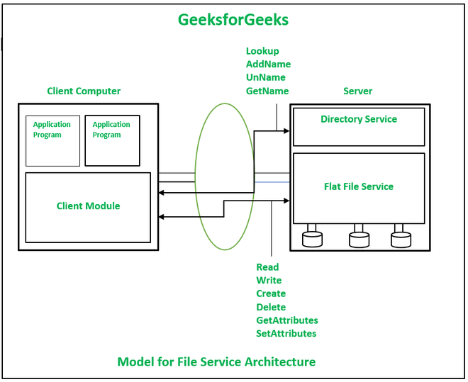

# Naming and Distributed File Systems

### Q1. Explain the need of Distributed file system. List any three distributed file system.

A file is a named collection of related data or information that is stored on a storage medium, such as a hard drive, SSD, or other types of digital storage devices. Files are used to organize, manage, and access data efficiently. They can contain various types of information, including text, images, audio, video, executable programs, and more.

A Distributed File System (DFS) is a file system that allows access to files and data that are distributed across multiple physical servers or locations in a network. It enables users and applications to store, access, and manage files in a 

### The Need for a Distributed File System

1. **Scalability**: As the volume of data grows, a single machine can no longer handle the storage and processing needs efficiently.  A good distributed file system should be designed to easily cope with the growth of nodes and users in the system. 

2. **Fault Tolerance**: By replicating data across multiple nodes, a DFS ensures that the system can tolerate hardware failures. If one node fails, the data can still be accessed from other nodes, providing continuous service and minimizing downtime.

3. **Performance**: Distributing data across multiple nodes allows for parallel data access and processing. The performance of the file system is usually measured as the average
amount of time needed to satisfy client requests

4. **Availability**: A DFS ensures higher data availability by replicating data across different nodes. This means that even if some nodes are down due to maintenance or failure, the data remains accessible from other nodes, ensuring uninterrupted service.

5. **Transparency**: A DFS abstracts the complexity of the underlying infrastructure from the user. Users interact with the system as if it were a single, unified file system, regardless of the physical location of the data. This transparency simplifies file management and access.

6. **Security**: A DFS can implement robust security measures, such as encryption and access controls, to protect data across multiple nodes. By ensuring secure data transmission and storage, a DFS protects sensitive information from unauthorized access and breaches.

7. **Mobility**: With a DFS, users can access their files from any device and any location, as long as they have network access. This mobility is crucial in today’s world, where remote work and mobile access to data are increasingly important.

8. **Cost Efficiency**: Utilizing a DFS allows organizations to use commodity hardware for storage rather than relying on expensive high-end servers. This can significantly reduce costs while still providing high performance and reliability. Additionally, the ability to scale out by adding more nodes as needed provides a cost-effective way to manage growing data demands.

9. **Reliability:**: In a good distributed file system, the probability of loss of stored data
should be minimized as far as practicable. 

- Three Distributed Systems:

1. **Sun Network File System (NFS)**: A protocol developed by Sun Microsystems that allows a computer to access files over a network as if they were on its local disks.

2. **Andrew File System (AFS)**: A distributed file system developed at Carnegie Mellon University that uses a client-server architecture to provide a scalable and secure file storage solution.

3. **Hadoop Distributed File System (HDFS)**: A distributed file system designed for storing large datasets across multiple machines, providing high-throughput access and fault tolerance, commonly used in Hadoop applications.

---

### Q2. Explain why naming is essential in DFS ?  list Types of Naming.

### Importance of Naming in a Distributed File System (DFS)

1. **Resource Identification**: Naming in a DFS provides a method to identify and locate resources such as files and directories across a distributed network. Without a proper naming system, it would be nearly impossible to pinpoint where specific data resides within the network.

2. **Transparency**: Naming ensures that users and applications can access files without needing to know the physical location of the data. This location transparency simplifies user interaction and management, as users perceive a unified file system despite the underlying complexity.

3. **Scalability**: A robust naming convention supports the addition of new nodes and resources seamlessly. As the system scales, a consistent and hierarchical naming system helps maintain order and avoids conflicts, ensuring smooth integration of new resources.

4. **Consistency and Integrity**: Proper naming ensures that each file and directory is uniquely identifiable, preventing conflicts and ensuring data integrity. This consistency is crucial for maintaining the accuracy and reliability of the distributed file system.

5. **Ease of Management**: System administrators rely on naming conventions to manage and organize files efficiently. Clear and logical naming schemes make it easier to perform tasks such as backups, replication, and migration, reducing administrative overhead.

6. **Access Control and Security**: Naming is essential for implementing access control and security policies. By clearly identifying resources, the system can enforce permissions and restrictions, ensuring that only authorized users can access sensitive data.

7. **Fault Tolerance and Recovery**: In the event of a node failure, a well-designed naming system helps in quickly locating and retrieving data from other nodes. This facilitates efficient fault tolerance and recovery mechanisms, minimizing downtime and data loss.

8. **User-Friendly Interface**: A meaningful and intuitive naming system enhances the user experience by providing a clear and organized structure for accessing files. This user-friendly interface is critical for both end-users and developers who interact with the DFS.

- Types: Flat naming, Structured Naming and Attribute-Based Naming

---

### Q3. Explain File Service Architecture of Distributed File System.

The file service architecture in a Distributed File System (DFS) is designed to manage how files are stored, accessed, and manipulated across multiple networked nodes. It typically comprises several key components and follows a client-server model

**Clients**
Clients are user-facing components that request file operations. 
- **Application Programs:** These are end-user applications that require access to files stored in the DFS.

**1. Flat file service:** A flat file service is used to perform operations on the contents of a file. Unique File Identifiers (UFIDs) are used to refer to files in all requests for flat file
service operations. When a request is received by the Flat file service for the creation of a new file then it generates a new UFID and returns it to the requester.

Flat File Service Model Operations:

- Read() 
- Write()
- Create() 
- Delete()
- GetAttributes() 
- SetAttributes()

2. **Directory Service:** The directory service serves the purpose of mapping between text names for the files and their UFIDs. Clients may obtain the UFID of a file by quoting its text name to directory service. 

The directory service provides operations for creating directories and adding new files to existing directories.

- Lookup(Dir, Name) Returns the relevant UFID after finding the text name in the directory. 
- AddName(Dir, Name, File): Adds(Name, File) to the directory and modifies the file’s attribute record if Name is not in the directory. If a name already exists in the directory, an exception is thrown.
- UnName(Dir, Name): If Name is in the directory, the directory entry containing Name is removed. An exception is thrown if the Name is not found in the directory.
- GetNames(Dir, Pattern) -> NameSeq: Returns all the text names that match the regular expression Pattern in the directory.

3. **Client Module:** The client module executes on each computer and delivers an integrated service (flat file and directory services) to application programs with the help of a single API. It stores information about the network locations of flat files and directory server processes.  It acts as an intermediary between the application programs and the DFS. The client module handles communication with the file servers, caching, and local file management.

### Interaction Workflow

1. **File Operation Request**:
    - An application program initiates a file operation (e.g., open a file).
    - The request is sent to the client module.

2. **Name Resolution**:
    - The client module forwards the request to the directory service to resolve the file name to its metadata.
    - The directory service returns the metadata, including the location of the data blocks.

3. **Data Retrieval/Manipulation**:
    - The client module uses the metadata to locate the appropriate data blocks and sends a request to the flat file service.
    - The flat file service retrieves or modifies the data as needed.

4. **Caching**:
    - Frequently accessed data may be cached by the client module to improve performance for subsequent requests.

5. **Access Control**:
    - Throughout the process, the directory service ensures that the user has the necessary permissions to perform the requested operation.

6. **Response to Client**:
    - The client module receives the data or confirmation of the operation and forwards it to the application program.

---

### Q4. Explain distributed file system requirements

A Distributed File System (DFS) must meet several requirements to effectively manage data across multiple machines while providing seamless access to users and applications. These requirements ensure that the DFS can handle the complexities of distributed environments and offer robust, efficient, and reliable data management. Here are the key requirements:

Refer Q1.

The requirements for a Distributed File System are designed to ensure that it can efficiently, reliably, and securely manage data across multiple machines. By addressing above a DFS can provide a robust solution for modern data storage and access needs. These requirements help in building a system that is user-friendly, resilient to failures, and capable of handling large-scale data processing and storage.
---

### Q5. Explain Flat naming, Structured Naming and Attribute-Based Naming in DFS

### Flat Naming in DFS

Flat naming is a simple and straightforward naming scheme where each file or object is assigned a unique identifier without any hierarchical structure. Here are five key points about flat naming in a Distributed File System (DFS):

1. **Unique Identifiers**:
   - Each file or object is assigned a globally unique identifier (UID), ensuring that no two files have the same identifier within the system.

2. **No Hierarchy**:
   - There is no hierarchical structure or directory tree. All identifiers are treated as equal and are not organized into folders or directories.

3. **Simple Resolution**:
   - Name resolution is straightforward since each identifier directly maps to a specific file or object. There is no need to traverse a directory hierarchy to locate an item.

4. **Scalability**:
   - Flat naming scales well because the system only needs to manage a list of unique identifiers without dealing with complex directory structures.

5. **Limited Human Usability**:
   - Flat naming is less user-friendly because the identifiers are often long, cryptic, and not meaningful to users. It is more suitable for system-level operations rather than human interaction.

### Structured Naming in DFS

Structured naming uses a hierarchical or organized scheme to name and locate files. This method typically involves directories and subdirectories. Here are five key points about structured naming in a DFS:

1. **Hierarchical Structure**:
   - Files and directories are organized in a tree-like structure, with paths that reflect this hierarchy (e.g., /home/user/documents/file.txt).

2. **Ease of Navigation**:
   - Users can navigate the file system easily by following the directory paths, making it more intuitive and user-friendly.

3. **Name Resolution**:
   - To locate a file, the system traverses the directory tree, resolving each component of the path until it reaches the target file.

4. **Namespace Management**:
   - Structured naming helps manage namespaces efficiently, avoiding conflicts through the use of hierarchical paths.

5. **Scalability and Organization**:
   - This method supports better organization of files, making it easier to manage and search for files, especially in large systems with numerous files and directories.

### Attribute-Based Naming in DFS

Attribute-based naming uses descriptive attributes to identify and locate files instead of fixed paths or identifiers. This method is more flexible and supports complex queries. Here are five key points about attribute-based naming in a DFS:

1. **Descriptive Attributes**:
   - Files are identified by a set of attributes (e.g., author, date created, file type) rather than a fixed name or path.

2. **Flexible Queries**:
   - Users can search for files based on attribute values, allowing for more flexible and powerful search capabilities compared to hierarchical or flat naming.

3. **Metadata Dependency**:
   - The effectiveness of attribute-based naming relies heavily on the quality and comprehensiveness of the file metadata.

4. **Dynamic Organization**:
   - Files can be organized and accessed in multiple ways based on different attributes, supporting dynamic views and organization of data.

5. **Complexity and Overhead**:
   - This method can introduce complexity in terms of managing and indexing attributes, and may require additional overhead to maintain and update the metadata.

### Summary

Each naming scheme in a Distributed File System has its strengths and weaknesses, suited to different use cases and requirements:

- **Flat Naming**: Simple and scalable but not user-friendly.
- **Structured Naming**: Hierarchical and user-friendly, suitable for most general-purpose file systems.
- **Attribute-Based Naming**: Flexible and powerful for searching, but relies heavily on good metadata and can be complex to manage.

Choosing the appropriate naming scheme depends on the specific needs of the DFS and its users.

---

### Q6.  Explain Andrew file system in detail

Based on the provided information about the Andrew File System (AFS), here are the extracted points:

1. **Overview of AFS**:
   - AFS is a distributed, networked file system designed for efficient file sharing between clients and servers.
   - Originally developed for computer networks running BSD UNIX and Mach.

2. **Global File System**:
   - AFS appears as a branch of a traditional UNIX file system at each workstation.
   - Based on the client-server model and relies on Remote Procedure Calls (RPCs) for communication.

3. **Versions of AFS**:
   - Three versions: AFS1, AFS2, and AFS3.

4. **Caching Mechanisms**:
   - AFS1 and AFS2: Cache updated only at the file level; block level updates not possible.
   - AFS3: Supports block-level caching, dividing files into 64 Kilobyte chunks for separate caching.

5. **Active Cache Management**:
   - AFS servers actively participate in client cache management.

6. **Organizational Unit: Cell**:
   - AFS cell is an independently administered collection of server and client machines.

7. **Concurrency Control**:
   - If multiple clients concurrently modify the same file, the update resulting from the last close overwrites previous changes.
   - AFS does not handle concurrent updates, leaving this responsibility to applications.

8. **File Locking**:
   - AFS uses advisory file locking; only whole files can be locked.
   - Not suitable for situations where many users simultaneously need to write to a file (e.g., database applications).

9. **Design Characteristics**:
   - Whole-file serving: Entire contents of directories and files transmitted to client computers by AFS servers.
   - Whole-file caching: Files transferred to clients stored on the client's local disk.

These points summarize the key features, mechanisms, and characteristics of the Andrew File System (AFS) as described in the provided information.

Here are the advantages of the Andrew File System (AFS) summarized in one simple sentence each:

1. **Scalability**: AFS can efficiently handle a large number of users and data, making it suitable for extensive networks.

2. **Transparent Access**: Users can access files seamlessly without needing to know their physical locations.

3. **Efficient Caching**: AFS improves performance by caching frequently accessed files locally on the client's machine.

4. **Security**: AFS ensures secure access with robust authentication and fine-grained access control policies.

### Q7. Explain Sun Network file system in detail

### Sun Network File System (NFS) Detailed Explanation

The Sun Network File System (NFS) is a distributed file system protocol developed by Sun Microsystems in the 1980s. NFS allows a computer to access files over a network in a manner similar to how local storage is accessed. It is widely used in Unix and Unix-like operating systems for sharing files across networks.

#### Key Features:

1. **Transparency**:
   - **Description**: NFS provides a seamless experience by allowing remote files to be accessed as if they were on the local machine.
   - **Benefit**: Users and applications do not need to be aware that files are stored remotely.

2. **Client-Server Model**:
   - **Description**: NFS operates on a client-server model where the server shares its file system, and the client mounts these file systems to access files.
   - **Benefit**: This model allows central management of files while providing access to multiple clients.

3. **Statelessness**:
   - **Description**: NFS servers are designed to be stateless, meaning they do not retain any information about clients between requests.
   - **Benefit**: This simplifies recovery from crashes and reduces server-side memory usage.

4. **File Access Transparency**:
   - **Description**: NFS allows users to perform standard file operations (such as read, write, open, close) on remote files.
   - **Benefit**: Users interact with remote files in the same way they do with local files, simplifying the user experience.

5. **Standard Protocol**:
   - **Description**: NFS uses a standard protocol based on Remote Procedure Calls (RPCs) for communication between clients and servers.
   - **Benefit**: This allows interoperability between different systems and platforms.

#### Architecture:

1. **NFS Server**:
   - **Role**: The server exports one or more of its file systems, making them available to clients on the network.
   - **Components**:
     - **Exported File Systems**: File systems that are shared over the network.
     - **NFS Daemons**: Processes that handle client requests, such as `nfsd`.

2. **NFS Client**:
   - **Role**: The client mounts the remote file systems provided by the NFS server, making them accessible as if they were part of the local file system.
   - **Components**:
     - **Mount Daemon**: Handles the mounting of NFS file systems.
     - **Cache**: Stores frequently accessed file data locally to improve performance.

3. **Mounting Process**:
   - **Description**: Clients use the `mount` command to attach the remote file system to a directory in their local file system.
   - **Dynamic Mounting**: NFS supports both static and dynamic mounting, allowing file systems to be mounted on demand.

#### Versions of NFS:

1. **NFSv2**:
   - **Description**: The original version, supporting basic file operations and statelessness.
   - **Limitations**: Limited file size and lack of security features.

2. **NFSv3**:
   - **Description**: Introduced improvements such as support for larger files, better error handling, and performance enhancements.
   - **Benefits**: Increased file size limit, better caching, and support for safe asynchronous writes.

3. **NFSv4**:
   - **Description**: Adds stateful operations, stronger security mechanisms (including Kerberos-based authentication), and better support for performance.
   - **Benefits**: Improved security, enhanced performance, and integration of file locking and mount protocols.

#### Advantages

1. **Interoperability**: NFS supports many operating systems, enabling seamless file sharing across diverse platforms.

2. **Scalability**: NFS can efficiently manage a large number of clients and servers, making it suitable for growing network environments.

3. **Performance**: NFS employs caching mechanisms to improve file access speed by storing frequently accessed data locally.

4. **Ease of Administration**: Centralized file management simplifies tasks such as backups, permissions, and updates, streamlining administrative operations.