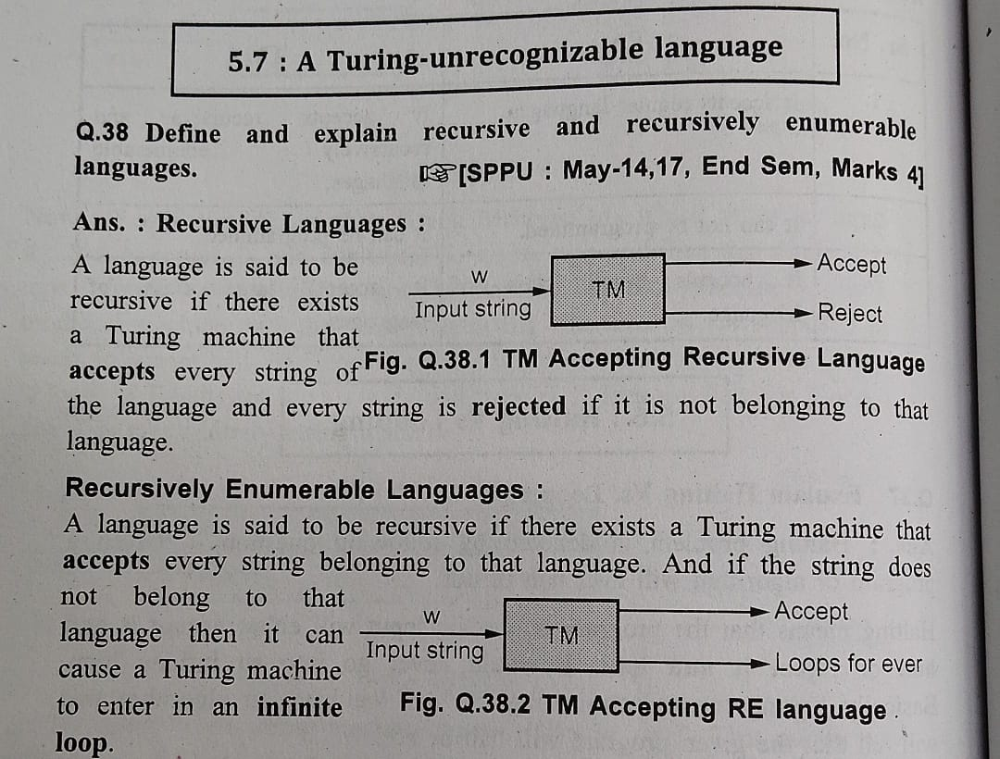
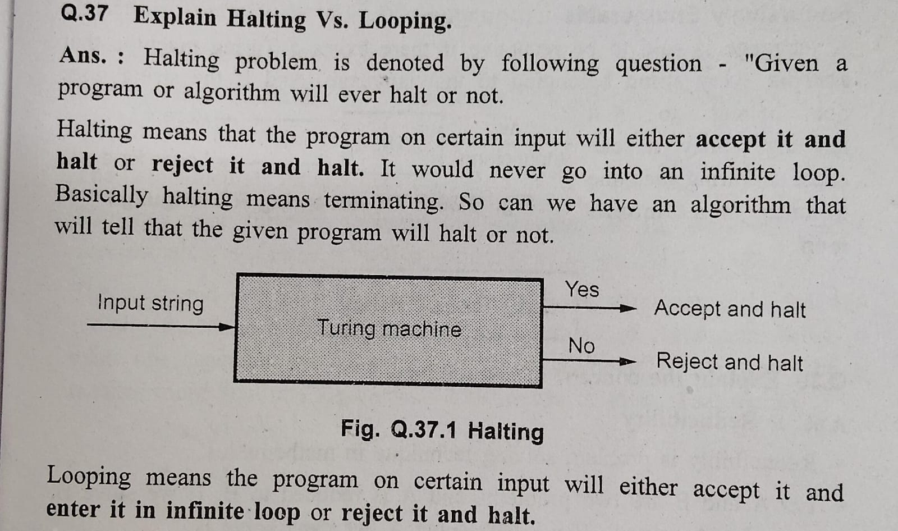

### Q1. Elaborate the following terms in detail
1.Universal Turing Machine (UTM)
2.Recursively enumerable languages.
3.Halting problem of turing machine

1. **Universal Turing Machine (UTM)**:
A Universal Turing Machine (UTM) is a theoretical construct in computability theory that embodies the concept of a Turing Machine (TM) capable of simulating the behavior of any other TM on any input. In simpler terms, it's a Turing Machine that can take as input the description of another TM along with its input and simulate the execution of that TM on that input.

Key features of a UTM:
- **Tape Content Interpretation**: The input to a UTM typically consists of two parts: the description of the TM to be simulated (encoded in a specific format) and the input for that TM.
- **Programmability**: A UTM is programmed to interpret the description of other TMs and simulate their behavior. It can read and execute the instructions provided in the description of the TM being simulated.
- **Universal Capability**: The UTM is capable of simulating the behavior of any TM on any input. This universality is a fundamental concept in computability theory.
- **Turing-Completeness**: UTMs are Turing-complete, meaning they can perform any computation that any other Turing-complete device can.

2. **Recursively enumerable languages**

3. **Halting problem of turing machine**:
- Halting Problem can be stated as follows Given any functional matrix, input data tape and initial configuration, then it is decide whether the process will run forever or will eventually stop."
- The halting problem is unsolvable

Consider a hypothetical scenario where we have a magical Turing Machine, let's call it H, that can solve the halting problem. This Turing Machine, when given the description of any other Turing Machine M and an input string w, can determine whether M halts on input w.

Now, let's create a Turing Machine, call it C, with the following behavior:

1. If H says that C halts on input "C", then C enters an infinite loop.
2. If H says that C does not halt on input "C", then C halts immediately.

Now, let's analyze what happens when we feed the description of C and the input "C" to the magical Turing Machine H.

- If H says that C halts on input "C", then according to the behavior of C, it should enter an infinite loop. But this contradicts H's assertion that C halts on input "C".
- Similarly, if H says that C does not halt on input "C", then according to the behavior of C, it should halt immediately. But again, this contradicts H's assertion that C does not halt on input "C".

In both cases, we reach a contradiction. If H says that C halts, it should not halt according to the behavior of C, and if H says that C does not halt, it should halt according to the behavior of C. This contradiction arises because we assumed the existence of a Turing Machine H that can solve the halting problem.

Since we've reached a contradiction, our initial assumption that H exists must be false. Therefore, there cannot be a Turing Machine H that solves the halting problem for all possible Turing Machines and inputs. This illustrates the undecidability of the halting problem: there is no algorithm that can determine whether a given Turing Machine halts on a given input for all possible cases.

### Q2. Write short note on 1. Reducibility 2. Multi tape turing machine

- Reducibility is problem solving technique in mathematics.

- Let A and B are two problems and A is reduced to B. If we solve B, we solve A as well. If we can't solve A, we can't solve B.

- For example If we solve the Eulerian cycle problem, we solve the Eulerian path problem.

- To decide if a problem is solvable or not we use mapping reducibility technique.

- If there is a mapping reduction from language A to language B, we say that language A is mapping reducible to language B.

- Notation used for mapping reducibility is AMB iff language A is mapping reducible to language B.

- If A is reduced to B and B is decidable, then A is decidable.

- If A is undecidable and reducible to B then B is also undecidable.

2. **Multi-Tape Turing Machine**:
   A Multi-Tape Turing Machine (MTM) is an extension of the classical Turing Machine model that features multiple tapes instead of just one. Each tape has its own read/write head, allowing the machine to simultaneously access and manipulate multiple portions of the input.

   Key points:
   - **Multiple Tapes**: In an MTM, there are typically two or more tapes, each with its own independent head.
   - **Tape Operations**: Each head can independently read from or write to its tape and move left or right.
   - **Transition Function**: The transition function of an MTM is typically extended to allow transitions based on the symbols read from multiple tapes simultaneously.
   - **Computational Power**: Multi-tape Turing Machines are equivalent in computational power to single-tape Turing Machines. That is, any computation that can be performed by an MTM can also be performed by a single-tape TM, albeit potentially with a higher time complexity.
   - **Advantages**: MTMs can sometimes provide more efficient solutions to certain problems compared to single-tape TMs, as they can perform certain operations in parallel.

