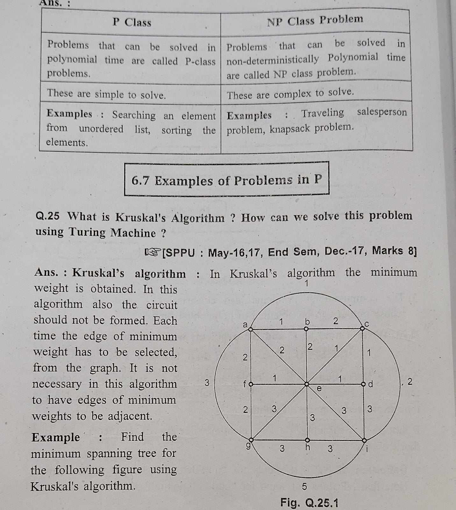
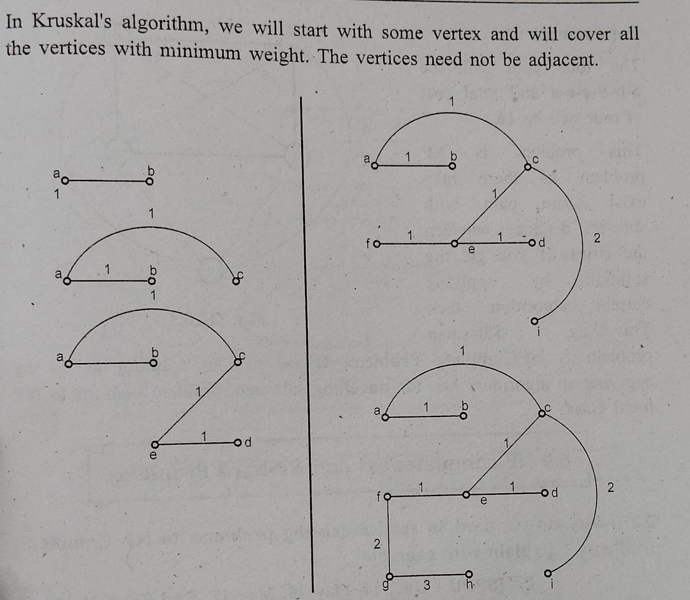
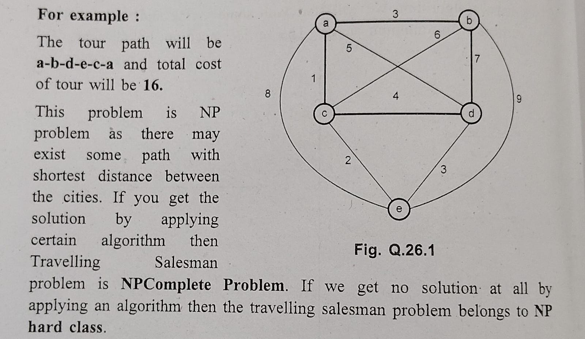
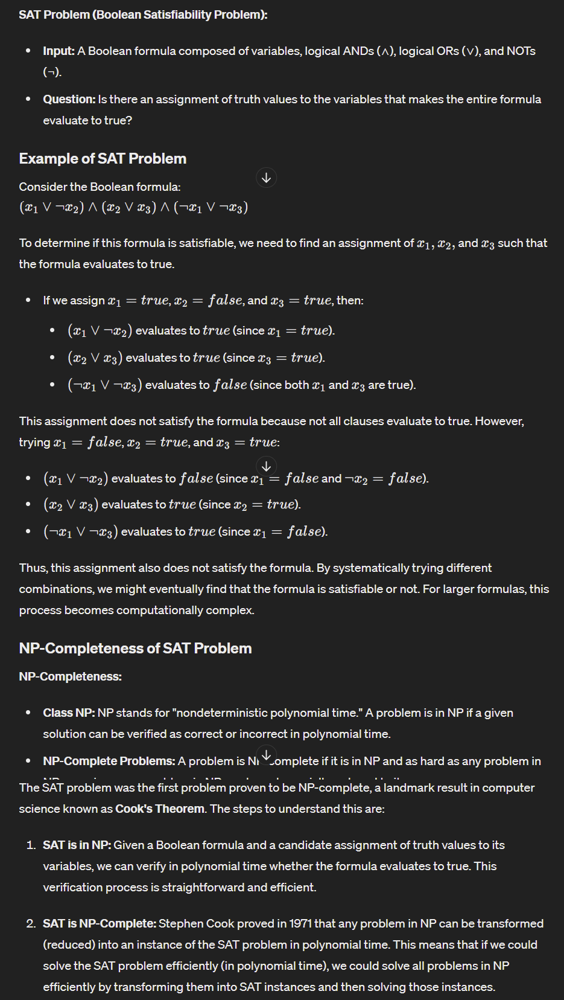
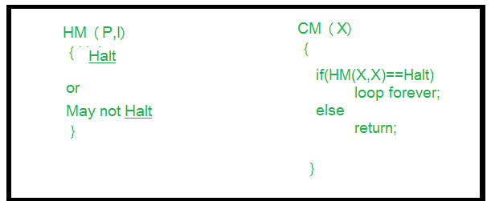

# Computability and Complexity Theory

### Q1. Define and compare the class P and class NP problem with their example

**P Class**:
The P in the P class stands for Polynomial Time. It is the collection of decision problems(problems with a “yes” or “no” answer) that can be solved by a deterministic machine in polynomial time. 

**Features:**

- The solution to P problems is easy to find. 
- P is often a class of computational problems that are solvable and tractable.
- Tractable means that the problems can be solved in theory as well as in practice. But the problems that can be solved in theory but not in practice are known as intractable.

**Example of a P problem:**
(Searching element in list, Sorting a list)
Sorting a list of numbers: Given a list of 
𝑛
n numbers, determining the sorted order can be done in polynomial time using algorithms like Merge Sort or Quick Sort, which run in O(n log n) time.

**NP Class**:
The NP in NP class stands for Non-deterministic Polynomial Time. It is the collection of decision problems that can be solved by a non-deterministic machine in polynomial time.  

**Features:**

- The solutions of the NP class are hard to find since they are being solved by a non-deterministic machine but the solutions are easy to verify.
- Problems of NP can be verified by a Turing machine in polynomial time. 

**Example of NP**
(Travelling salesman problem)
Let us consider an example to better understand the NP class. Suppose there is a company having a total of 1000 employees having unique employee IDs. Assume that there are 200 rooms available for them. A selection of 200 employees must be paired together, but the CEO of the company has the data of some employees who can’t work in the same room due to personal reasons.
This is an example of an NP problem. Since it is easy to check if the given choice of 200 employees proposed by a coworker is satisfactory or not i.e. no pair taken from the coworker list appears on the list given by the CEO. But generating such a list from scratch seems to be so hard as to be completely impractical.

---

### Q2. What do you mean by Polynomial Time Reduction ? Explain with suitble example

- n computational complexity theory, a polynomial time reduction is a method used to transform one problem into another problem in such a way that a solution to the second problem can be used to solve the first problem.
- If problem A can be reduced to problem B in polynomial time, and we have an algorithm that solves B efficiently, then we can use this reduction to solve A efficiently as well.

Let's consider another simple example involving polynomial time reduction, this time using the **Subset Sum** problem and the **Partition** problem.

### Problems Definition

1. **Subset Sum Problem:**
   - **Input:** A set of integers S = { s1, s2, .... Sn} and an integer ( t).
   - **Question:** Is there a subset of ( S )whose elements sum up to ( t )?

2. **Partition Problem:**
   - **Input:** A set of integers S = { s1, s2, .... Sn}
   - **Question:** Can the set ( S ) be partitioned into two subsets with equal sum?

### Reduction from Partition to Subset Sum

We will show that the Partition problem can be reduced to the Subset Sum problem in polynomial time.

### Steps for the Reduction:

1. **Given an instance of the Partition problem:**
   - A set of integers S = { s1, s2, .... Sn}

2. **Construct an instance of the Subset Sum problem:**
   - Use the same set ( S ).
   - Let \( t \) be half the sum of all elements in \( S \), i.e., \( t = \frac{1}{2} \sum_{i=1}^n s_i \).

3. **Explanation:**
   - If the total sum of all elements in \( S \) is even, say \( 2T \), then we are looking for a subset of \( S \) whose sum is \( T \). This would mean the other subset also sums to \( T \), thereby partitioning the set into two equal parts.
   - If the total sum is odd, then it's impossible to partition \( S \) into two subsets with equal sum, so there’s no solution for the Partition problem in this case.

### Example:

- **Input for Partition Problem:**
  - Set \( S = \{3, 1, 1, 2, 2, 1\} \).

- **Total sum of elements in \( S \):**
  - \( 3 + 1 + 1 + 2 + 2 + 1 = 10 \).

- **Target sum \( t \) for Subset Sum problem:**
  - \( t = \frac{10}{2} = 5 \).

- **Instance of Subset Sum Problem:**
  - Set \( S = \{3, 1, 1, 2, 2, 1\} \), target \( t = 5 \).

**Verification:**
- If there is a subset of \( S \) that sums to 5, for example \( \{3, 2\} \), then the rest of the set \( \{1, 1, 2, 1\} \) also sums to 5. This confirms that \( S \) can be partitioned into two subsets with equal sum.

### Summary:

Through this reduction, we have shown that solving the Partition problem can be transformed into solving the Subset Sum problem in polynomial time. This illustrates that if we had an efficient algorithm to solve the Subset Sum problem, we could use it to solve the Partition problem efficiently as well. This reduction is a typical example of how polynomial time reductions help us understand the relationships between different computational problems.

---

### Q3. Explain satisfiability problem and SAT problem and comment on NP Completeness of SAT problem

**SAT Problem:** 
- SAT(Boolean Satisfiability Problem) is the problem of determining if there exists an interpretation that satisfies a given boolean formula.
- It asks whether the variables of a given boolean formula can be consistently replaced by the values TRUE or FALSE in such a way that the formula evaluates to TRUE.
- If this is the case, the formula is called satisfiable.
- On the other hand, if no such assignment exists, the function expressed by the formula is FALSE for all possible variable assignments and the formula is unsatisfiable.

---
### Justify "Halting Problem of turing machine is undecidable"

To understand better the halting problem, we must know Computability, Turing machine, decision problems.

- Computability theory –
The branch of theory of computation that studies which problems are computationally solvable using different model. 
- Decision problems –
A decision problem has only two possible outputs (yes or no) on any input
- Turing machine –
A Turing machine is a mathematical model of computation.

Now, lets discuss Halting problem:

**The Halting problem** – Given a program/algorithm will ever halt or not?
Halting means that the program on certain input will accept it and halt or reject it and halt and it would never go into an infinite loop. Basically halting means terminating. So can we have an algorithm that will tell that the given program will halt or not. In terms of Turing machine, will it terminate when run on some machine with some particular given input string.

- The answer is no we cannot design a generalized algorithm which can appropriately say that given a program will ever halt or not?
The only way is to run the program and check whether it halts or not.

**Proof by Contradiction** –
Problem statement: Can we design a machine which if given a program can find out if that program will always halt or not halt on a particular input?

**Solution:** Let us assume that we can design that kind of machine called as HM(P, I) where HM is the machine/program, P is the program and I is the input. On taking input the both arguments the machine HM will tell that the program P either halts or not.
If we can design such a program this allows us to write another program we call this program CM(X) where X is any program(taken as argument) and according to the definition of the program CM(X) shown in the figure.

In the program CM(X) we call the function HM(X), which we have already defined and to HM() we pass the arguments (X, X), according to the definition of HM() it can take two arguments i.e one is program and another is the input.Now in the second program we pass X as a program and X as input to the function HM().We know that the program HM() gives two output either “Halt” or “Not Halt”.But in case second program, when HM(X, X) will halt loop body tells to go in loop and when it doesn’t halt that means loop, it is asked to return.   

It is impossible for outer function to halt if its code (inner body) is in loop and also it is impossible for outer non halting function to halt even after its inner code is halting. So the both condition is non halting for CM machine/program even we had assumed in the beginning that it would halt.So this is the contradiction and we can say that our assumption was wrong and this problem, i.e., halting problem is undecidable.

This is how we proved that halting problem is undecidable.