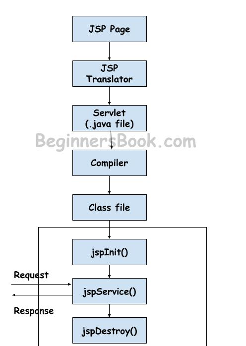
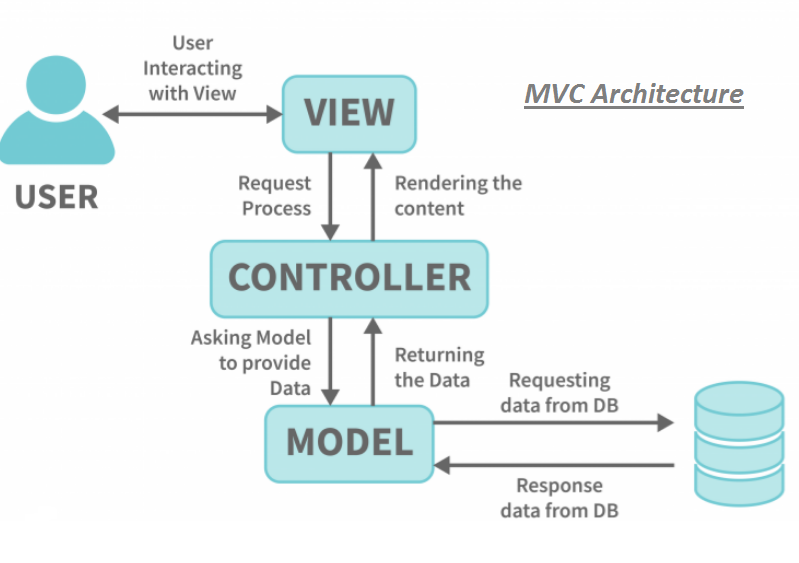
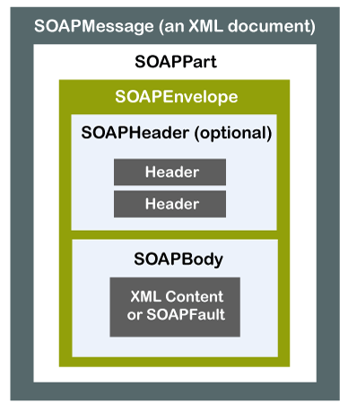

### Q1. Explain the concept of JSP with syntax and sample example. Explain the analogy of JSP and Servlets.
- JSP stands for Java Server Pages
- It is an alternative way than the servlet to build the dynamic web pages
- It allows Java code to be embedded into HTML pages, enabling the creation of dynamic content that can be generated based on user input, database queries, or other conditions.

Example:
```jsp
<%@ page language="java" contentType="text/html; charset=UTF-8" pageEncoding="UTF-8"%>
<!DOCTYPE html>
<html>
<head>
    <meta charset="UTF-8">
    <title>JSP Example</title>
</head>
<body>
    <%
        out.println("<h1>Hello, Guest!</h1>");  
        out.println("<p>This is our JSP Page</p>");  
    %>
</body>
</html>
```

In this example, the JSP page takes a parameter "name" from the request URL. If the parameter is provided, it prints "Hello, [name]!" where [name] is the provided value. If no parameter is provided, it defaults to "Hello, Guest!".

Explanation:
- `<%@ page ... %>`: This directive is used to set page-specific attributes such as language, content type, and page encoding.
- `<%! ... %>`: This is a declaration tag used to declare variables and methods accessible to the entire JSP page.
- `<% ... %>`: This is a scriptlet tag used to write Java code directly into the JSP page. Anything inside these tags is executed on the server when the page is requested.
- `<%= ... %>`: This expression tag is used to output the result of a Java expression directly into the HTML response.

Now, onto the analogy of JSP and Servlets:
- Servlets are Java classes that handle requests and responses on the server-side.
- JSP is a technology that allows the embedding of Java code into HTML pages to generate dynamic content.
- The analogy between JSP and Servlets can be likened to the relationship between a chef and a recipe. Servlets are like the chef, responsible for cooking (handling) the request and preparing (generating) the response. JSP, on the other hand, is like a recipe that the chef follows. It provides instructions (Java code embedded in HTML) on how to prepare the response dynamically. Just as a chef follows a recipe to cook a dish, a servlet uses JSP to dynamically generate web pages.

---

### Q2. What is the difference between JSP and Servlets?

JSP (JavaServer Pages) and Servlets are both technologies used for building dynamic web applications in Java, but they serve different purposes and have different features.

1. **Purpose**:
   - **Servlets**: Servlets are Java classes that handle HTTP requests and generate HTTP responses. They are primarily used to implement the business logic of a web application.
   - **JSP**: JSP, on the other hand, is a technology that simplifies the process of creating dynamic web pages. JSP pages are essentially HTML pages with embedded Java code. They are used to generate dynamic content that is sent to the client.

2. **Syntax**:
   - **Servlets**: Servlets use Java code to handle requests and responses. This involves writing Java code to handle tasks such as reading form data, querying databases, and generating HTML.
   - **JSP**: JSP allows embedding Java code directly into HTML using special tags. This makes it easier for web developers to create dynamic content as they can mix HTML and Java code seamlessly.

3. **Development**:
   - **Servlets**: Developing with servlets typically involves writing Java classes and deploying them on a web server. Servlets provide a low-level API for handling HTTP requests and responses.
   - **JSP**: JSP simplifies web development by allowing developers to embed Java code directly into HTML pages. This makes it easier to separate the presentation layer (HTML) from the business logic (Java code).

4. **Maintenance and readability**:
   - **Servlets**: Servlets are generally more complex than JSP because they require writing Java code to handle requests and responses. This can make servlets harder to maintain and less readable, especially for web designers who are more familiar with HTML and CSS.
   - **JSP**: JSP pages are often easier to maintain and more readable because they allow developers to mix HTML and Java code directly. This makes it easier to understand the flow of the page and make changes to the code.

5. **Reusability**:
   - **Servlets**: Servlets can be reused across multiple JSP pages or other servlets, making them a good choice for implementing reusable business logic.
   - **JSP**: JSP pages are not as reusable as servlets because they are designed to generate specific HTML content. However, you can include reusable code fragments in JSP pages using custom tags or include directives.

In practice, both Servlets and JSP are often used together in Java web applications, with servlets handling the business logic and JSP pages handling the presentation layer.

---

### Q3. Explain the Life Cycle of JSP. Write advantages of JSP over servlet.

The lifecycle of a JSP (JavaServer Pages) involves several stages from its creation to its execution and response delivery:

1. **Translation**: When a JSP page is first accessed, the JSP engine translates it into a servlet. This translation process involves converting the JSP page into a Java servlet class. The translated servlet is then compiled by the Java compiler.

2. **Compilation**: The translated servlet is compiled into bytecode by the Java compiler. This bytecode is then loaded and executed by the Java Virtual Machine (JVM) when the JSP page is accessed by a client.

3. **Initialization**: During initialization, the servlet instance corresponding to the JSP page is created by the servlet container. Any initialization code specified in the JSP page, such as declarations and static initializers, is executed at this stage.

4. **Request Handling**: When a client sends a request to the JSP page, the servlet container invokes the `service()` method of the servlet instance. The `service()` method processes the request by executing the Java code embedded within the JSP page, generating dynamic content, and producing an HTTP response.

5. **Destroying**: Finally, when the servlet container decides to remove the JSP page from memory, it invokes the `destroy()` method of the servlet instance. This allows any cleanup tasks to be performed, such as releasing resources or closing connections.

Advantages of JSP over Servlets:

1. **Simplified Syntax**: JSP allows developers to embed Java code directly into HTML pages using simple syntax, making it easier to develop dynamic web pages without extensive Java programming knowledge. This simplification reduces development time and effort.

2. **Rapid Development**: JSP promotes rapid development of dynamic web pages by providing a template-based approach where HTML markup serves as the template for dynamic content generation. Developers can focus on designing the presentation layer without worrying about the underlying servlet code.

3. **Separation of Concerns**: JSP facilitates the separation of presentation (HTML markup) from business logic (Java code), promoting a cleaner and more maintainable codebase. This separation allows designers to work on the presentation layer independently of developers working on the backend logic.

4. **Code Reusability**: JSP promotes code reusability by allowing developers to encapsulate common functionality into reusable components such as custom tags or tag libraries. This reusability reduces code duplication and improves maintainability.

5. **Integration with Existing Skills**: JSP leverages existing HTML skills, allowing web designers familiar with HTML to contribute to dynamic web development projects without needing to learn complex Java programming concepts. This integration of existing skills streamlines the development process and enhances collaboration between designers and developers.



---

### Q4. What are different JSP directives? Explain with example.

JSP (JavaServer Pages) directives are special instructions that provide information to the JSP engine during the translation phase. They are not executed as part of the response generated for the client but instead affect how the JSP page is translated into a servlet. There are three main types of JSP directives:

1. **Page Directives**: Page directives are used to provide instructions to the JSP container regarding the entire JSP page. They are typically placed at the beginning of the JSP file, before any HTML or Java code.

   Example:
   ```jsp
   <%@ page language="java" contentType="text/html; charset=UTF-8" pageEncoding="UTF-8" %>
   ```
   Explanation:
   - `language="java"`: Specifies the scripting language used in the JSP page. Here, it indicates Java.
   - `contentType="text/html; charset=UTF-8"`: Specifies the content type of the response generated by the JSP page. In this case, it's HTML with UTF-8 encoding.
   - `pageEncoding="UTF-8"`: Specifies the character encoding used for the JSP page itself.

2. **Include Directives**: Include directives are used to include a file into the current JSP page during the translation phase. The content of the included file is copied into the JSP page at the location of the include directive.

   Example:
   ```jsp
   <%@ include file="header.jsp" %>
   ```
   Explanation:
   - `file="header.jsp"`: Specifies the file to be included in the current JSP page. In this example, the content of "header.jsp" will be included at this location in the JSP page.

3. **Taglib Directives**: Taglib directives are used to declare and specify tag libraries that contain custom tags used in the JSP page.

   Example:
   ```jsp
   <%@ taglib uri="/WEB-INF/mytags" prefix="my" %>
   ```
   Explanation:
   - `uri="/WEB-INF/mytags"`: Specifies the URI (Uniform Resource Identifier) of the tag library descriptor (TLD) file that defines the custom tags used in the JSP page.
   - `prefix="my"`: Specifies the prefix to be used when referencing the custom tags from the tag library.

These directives provide essential instructions to the JSP container during the translation phase, helping to configure various aspects of the JSP page and facilitate integration with external resources and custom tags.

---

### Q5. Draw and explain MVC architecture for developing web applications.(Explain JSP with support for MVC)

- The design model of JSP application is called MVC model. The MVC stands for Model-View-Controller. The basic idea in MVC design model is to separate out design logic into three parts modelling, viewing and controlling.

1. **Model**: 
   - The Model represents the application's data and business logic. It encapsulates the data and behavior of the application, providing an interface for manipulating and accessing the data.
   - In a web application, the Model typically interacts with the database or other data sources to perform CRUD (Create, Read, Update, Delete) operations.
   - Example: In a simple blog application, the Model would include classes for managing blog posts, comments, users, etc., and would handle tasks such as retrieving blog posts from the database.

2. **View**: 
   - The View represents the presentation layer of the application. It is responsible for rendering the user interface and displaying the data to the user.
   - In a web application, the View is usually implemented using HTML, CSS, and client-side scripting languages like JavaScript. It generates the UI that users interact with.
   - Example: In our blog application, the View would consist of JSP pages or HTML templates that display blog posts, comments, user profiles, etc., to the user.

3. **Controller**: 
   - The Controller acts as an intermediary between the Model and the View. It receives user input, processes requests, and updates the Model or selects the appropriate View to render.
   - In a web application, the Controller is often implemented as servlets or other server-side components that handle HTTP requests and generate responses.
   - Example: In our blog application, the Controller would include servlets or Java classes that handle requests for creating, updating, or deleting blog posts, as well as requests for displaying blog posts and comments.

Now, let's see how JSP fits into the MVC architecture:
- Any server application is classified in three parts such as business logic, presentation and request processing.
- According to the MVC design model, the model corresponds to business logic, view corresponds to presentation and controller corresponds to request processing.



---

### Q6. What are web services? Write the benefits of web services.

- Web services are software systems designed to allow communication and data exchange between different applications or systems over the internet.
- They provide a standardized way for various software components to interact with each other, regardless of the programming languages, platforms, or technologies they use.
- Web services are based on open standards such as XML, SOAP, WSDL, and HTTP, making them platform-independent and language-agnostic.
- Web service is a software system designed which is independent of specific hardware or software on which it is running.

Following are the steps that a web service model follows -

Step 1: In the first step, a service provider publishes a web service in the web service registry.

Step 2: A web client who demands for some web service searches in the registry.After finding a match for the desired web service in the registry, the client chooses it.

Step 3: The client binds to the corresponding web service provider and invokes for the service.

Here are some benefits of web services:


1. **Scalability**: Web services can be easily scaled by adding resources or deploying multiple instances across distributed environments, ensuring performance under heavy usage.

2. **Reuse and Modularity**: Web services encapsulate functionalities into self-contained services, promoting code reuse, reducing development time, and enhancing maintainability.

3. **Platform Independence**: Web services are platform-independent, enabling seamless integration and communication between diverse systems regardless of underlying technologies.

4. **Security**: Web services provide built-in security features such as encryption and authentication to ensure data confidentiality, integrity, and availability, preventing unauthorized access.

5. **Cost-Effectiveness**: Web services offer a cost-effective solution for integrating systems and implementing distributed applications, leveraging existing internet infrastructure and standards without requiring proprietary technologies.

---
### Q7. List and discuss components of web services(SOAP,WSDL,UDDI,REST)

Sure, let's discuss each component of web services: SOAP, WSDL, UDDI, and REST, along with four key points about each.

1. **SOAP (Simple Object Access Protocol)**:

   - **Protocol for Communication**: SOAP is a protocol used for exchanging structured information in the implementation of web services. It defines a standard XML format for messaging and communication between different systems over the internet.
   
   - **Extensibility**: SOAP allows for the inclusion of additional standards and technologies such as security mechanisms (WS-Security), reliable messaging (WS-ReliableMessaging), and transactional support (WS-Transaction), making it highly extensible.
   
   - **Interoperability**: SOAP promotes interoperability by supporting multiple transport protocols (HTTP, SMTP, FTP, etc.) and data formats (XML, JSON, etc.), allowing web services to communicate across different platforms, languages, and systems.
   
   - **Formal Specification**: SOAP is based on a formal specification maintained by the World Wide Web Consortium (W3C), ensuring consistency and interoperability across implementations.

2. **WSDL (Web Services Description Language)**:

   - **Service Description**: WSDL is an XML-based language used to describe the functionality offered by a web service. It provides a standardized way to define the operations, input and output parameters, and communication protocols supported by the service.
   
   - **Machine-Readable**: WSDL documents are machine-readable, allowing automated tools and systems to interpret and generate code for interacting with the web service. This facilitates interoperability and integration between different software components.
   
   - **Service Contract**: WSDL serves as a contract between the service provider and consumers, specifying the operations that can be performed, the data formats expected, and the communication protocols supported. This ensures consistency and predictability in service usage.
   
   - **Versioning Support**: WSDL supports versioning of web services, allowing providers to introduce changes or updates to the service while maintaining backward compatibility with existing consumers. This helps in evolving and improving services over time without disrupting existing integrations.

3. **UDDI (Universal Description, Discovery, and Integration)**:

   - **Registry for Web Services**: UDDI is a directory service that allows businesses to register and discover web services. It provides a centralized repository where service providers can publish their services, and consumers can search for and access them.
   
   - **Standardized API**: UDDI defines a standardized API for publishing and discovering web services, enabling automated discovery and integration of services across different platforms and environments.
   
   - **Categorization and Classification**: UDDI supports categorization and classification of web services based on various criteria such as industry, service type, location, etc. This helps consumers find relevant services more efficiently.
   
   - **Dynamic Binding**: UDDI enables dynamic binding between service consumers and providers, allowing consumers to locate and connect to the most suitable service instance based on their requirements and preferences.

4. **REST (Representational State Transfer)**:

   - **Resource-Oriented**: REST is an architectural style that treats resources as the primary abstraction of the system. It emphasizes the use of uniform resource identifiers (URIs) to identify resources and standard HTTP methods (GET, POST, PUT, DELETE) to perform operations on them.
   
   - **Stateless Communication**: RESTful web services are stateless, meaning each request from a client contains all the information necessary to process the request. This simplifies server-side implementation and improves scalability and reliability.
   
   - **Lightweight and Scalable**: RESTful web services are lightweight and simple to implement, as they leverage existing HTTP protocols and standards. They are well-suited for distributed, loosely-coupled systems and can scale to handle large volumes of requests.
   
   - **Flexibility and Interoperability**: REST promotes flexibility and interoperability by using standard data formats such as XML, JSON, and plain text for message exchange. This allows clients and servers implemented in different languages and platforms to communicate effectively.


### Q8. Write the differences between SOAP & REST.
1. **Protocol vs. Architectural Style**:
    - SOAP is a protocol used for communication between applications over a network.
    - REST, on the other hand, is an architectural style for designing networked applications. 
2. **Data Format**:
   - SOAP typically uses XML (Extensible Markup Language) as its message format.
   - REST allows for more flexibility in data formats. While it can use XML, it commonly uses lightweight formats 
4. **State Management**:
   - SOAP is inherently stateful, meaning each request/response cycle is independent and can carry session information within the SOAP message itself.
   - REST, in contrast, is stateless. Each request from a client to the server must contain all the information necessary to understand and process the request, and the server does not maintain any client state between requests.
5. **Performance**:
   - SOAP is often considered more heavyweight and performance is low
   - SOAP is often considered more lightweight and performance is efficient
6. **Dependancy**:
    - SOAP can not use REST because it is a protocol.
    - REST can use SOAP web service.

### Q9.Explain structure of SOAP(Explain SOAP header detail)

1. **Envelope**:
   - The Envelope is the outermost element of a SOAP message. It encapsulates the entire message.
   - It contains two main parts: Header and Body.

2. **Header**:
   - The Header is an optional element within the Envelope.
   - It contains metadata and other information related to the SOAP message, such as authentication details, message routing, or transaction information.

**Header Block**: The SOAP header may contain one or more header blocks, each of which provides specific information or functionality.

**Header Entry:** Each header block within the SOAP header is represented as a separate entry. 

**Content:** The content of a header block can vary depending on its purpose. It may include XML elements, attributes, or data relevant to the functionality being implemented.

3. **Body**:
   - The Body is a mandatory element within the Envelope.
   - It contains the actual payload of the SOAP message, which includes the data being transmitted between the client and the server.
  
4. **Fault**:
   - The Fault element is optional and is included within the Body if an error occurs during processing.
   - It provides details about any errors that may have occurred, including error codes, reasons, and additional details.




---

### Q10. What is JSP action tags, Write a JSP program to demonstrate use of JSP action tags.

JSP (JavaServer Pages) action tags are special tags used to perform specific tasks or actions within a JSP page. They provide a way to interact with Java objects, control the flow of execution, and manipulate the content of the page dynamically. Some commonly used JSP action tags include `<jsp:include>`, `<jsp:forward>`, `<jsp:param>`, `<jsp:useBean>`, `<jsp:setProperty>`, `<jsp:getProperty>`, etc.

Here's a simple JSP program demonstrating the use of JSP action tags:

```jsp
<%@ page language="java" contentType="text/html; charset=UTF-8" pageEncoding="UTF-8" %>
<!DOCTYPE html>
<html>
<head>
    <meta charset="UTF-8">
    <title>JSP Action Tags Demo</title>
</head>
<body>

<h1>Welcome to JSP Action Tags Demo</h1>

<!-- Using <jsp:include> to include another JSP page -->
<jsp:include page="header.jsp" />

<!-- Using <jsp:forward> to forward the request to another resource -->
<jsp:forward page="footer.jsp" />

<!-- Using <jsp:param> to pass parameters to included or forwarded pages -->
<jsp:param name="username" value="John Doe" />

<!-- Using <jsp:useBean> to instantiate a JavaBean -->
<jsp:useBean id="person" class="com.example.Person" scope="request" />

<!-- Using <jsp:setProperty> to set properties of the JavaBean -->
<jsp:setProperty name="person" property="name" value="Jane Smith" />

<!-- Using <jsp:getProperty> to get properties of the JavaBean -->
<p>Name: <jsp:getProperty name="person" property="name" /></p>

</body>
</html>
```

In this example:

- `<jsp:include>` is used to include the contents of another JSP page (`header.jsp`) into the current page.
- `<jsp:forward>` is used to forward the request to another resource (`footer.jsp`). Note that once a forward is performed, no further processing of the current page occurs.
- `<jsp:param>` is used to pass a parameter (`username`) to the included or forwarded pages.
- `<jsp:useBean>` is used to instantiate a JavaBean (`Person` class).
- `<jsp:setProperty>` is used to set properties of the instantiated JavaBean (`person`).
- `<jsp:getProperty>` is used to retrieve and display the value of a property of the JavaBean (`person.name`).


----

### Q11. Explain the JavaBeans classes in JSP with example.

1. JavaBeans are reusable components encapsulating data and behavior.
2. In JSP pages, JavaBeans are used as instances of classes to represent data or perform operations.
3. The scope of a bean in JSP refers to the lifespan or visibility of the bean within the JSP page.
4. JavaBeans conventionally provide getter methods (`getXXX()`) to retrieve the values of properties and setter methods (`setXXX()`) to set the values of properties.

```
// Java Program of JavaBean class
package geeks;

public class Student implements java.io.Serializable {
	private int id;
	private String name;
	
	// Constructor
	public Student() {}

	// Setter for Id
	public void setId(int id) { this.id = id; }

	// Getter for Id
	public int getId() { return id; }
	
	// Setter for Name
	public void setName(String name) { this.name = name; }

	// Getter for Name
	public String getName() { return name; }
}

```

**Characteristics for JavaBean Class**

1) Java Bean class contains a default no argument constructor. This constructor must have the access specifier as public.

2) It should be serializable and should implement serializable interface.

3) It can have any number of properties which can be read or written. For these properties we write getter and setter methods.

**JavaBean Properties**

1) getPropertyName(): This method is called accessor method. It returns the property value. This method is written in some special way. For example - If the property is rollNo then the method name for rollNo is getRollNo()

2) setPropertyName(): This is called mutator method. This method is generally used to assign the value to the properties. This method is written in some special way. For example If the property is rollNo then method name will be setRollNo()

---
### Q12. What is Struts. Explain the strut architecture with neat diagram and also explain the benefits of strut.

- Struts is an open-source framework used for developing web applications in Java. 
- It is built on top of the Java Servlet and JavaServer Pages (JSP) technologies.
- Struts follows the Model-View-Controller (MVC) architecture pattern, which helps in separating the concerns of an application into three interconnected components: Model, View, and Controller.

The struts architecture is based on Model, View and Controller architecture (MVC).

I. Normally when client wants any web page he demands it using get or post request or by clicking Submit button, then a controller is invoked.

II. A Controller is nothing but a Java class in which business logic is written. The job of Controller is to take user input and pass it to the Model. The controller in turn invokes the Model.

III. Model stores the user's data may be in databases or so, and returns some result to the Controller.

IV. Using this result, the Controller figures out user requirements and accordingly forwards the result to the View page.

V. Finally required view can be obtained as a response (i.e. a display of required web page is obtained) on the web browser. This can be diagrammatically shown as below -


1. **Structured Development**: Struts enforces the MVC architecture, ensuring a well-organized separation of concerns.
  
2. **Reusable Components**: It provides reusable components like Action classes, promoting code reusability and reducing development time.
  
3. **Validation and Error Handling**: Struts offers built-in support for form validation and error handling, enhancing data integrity and user experience.
  
4. **Integration with Other Technologies**: Seamlessly integrates with Java technologies like JSP, Servlets, JDBC, leveraging existing skills and libraries.
  
5. **Scalability and Performance**: Designed for scalability and performance, making it suitable for large-scale enterprise applications.
  
6. **Community Support and Ecosystem**: Benefits from an active community offering support, documentation, and a wide range of plugins and extensions.

---

### Q13. List and describe important inceptors provided by strut framework.


- Struts 2, the latest version of the Struts framework, provides interceptors as a powerful mechanism for intercepting the request processing workflow. 
- Interceptors allow developers to add cross-cutting concerns such as logging, authentication, authorization, validation, and more to their application without modifying the core processing logic. 

Here are some important interceptors provided by the Struts framework:

1) 'alias' interceptor: Converts similar parameters with different names between requests.
2) fileUpload : It provides support to file upload in struts 2
3) 'chain' interceptor: Makes properties of the previous action available in the current action when used with chain result type.
4) 'checkbox' interceptor: Handles checkboxes in the form, detecting unchecked checkboxes.
5) 'cookie' interceptor: Adds a cookie to the current action.
6) 'conversionError' interceptor: Adds conversion errors to the action's field errors.
7) 'createSession' interceptor: Creates an HttpSession object if it doesn't exist.

---

### Q14. Write a JSP Program to demonstrate use of page directive, scriplet expression and comment.

Here's a JSP program demonstrating the use of page directive, scriptlet expression, and comment:

```jsp
<%@ page language="java" contentType="text/html; charset=UTF-8" pageEncoding="UTF-8" %>
<!DOCTYPE html>
<html>
<head>
    <meta charset="UTF-8">
    <title>JSP Demo</title>
</head>
<body>

<!-- This is a JSP page directive -->
<%-- This is a JSP comment --%>
<%
    // This is a scriptlet expression
    String message = "Hello, world!";
%>

<p><%= message %></p>

</body>
</html>
```

In this program:

1. `<%@ page %>` directive is used to define page settings like language, content type, and page encoding.
2. `<%-- ... --%>` is a JSP comment used to hide content from the client's view.
3. `<% ... %>` is a scriptlet used to embed Java code. In this case, it declares a variable `message`.
4. `<%= ... %>` is a scriptlet expression used to print the value of `message` variable in the HTML output.


- Scriptlet: The code enclosed within `<% ... %>` delimiters in a JSP page is called a scriptlet. Scriptlets contain Java code that can be executed directly within the JSP page.

- Template Text: Everything other than JSP scriptlet or declaration statements in a JSP page is considered as template text. Template text is typically HTML content or other markup that is directly rendered to the output without any processing by the server.